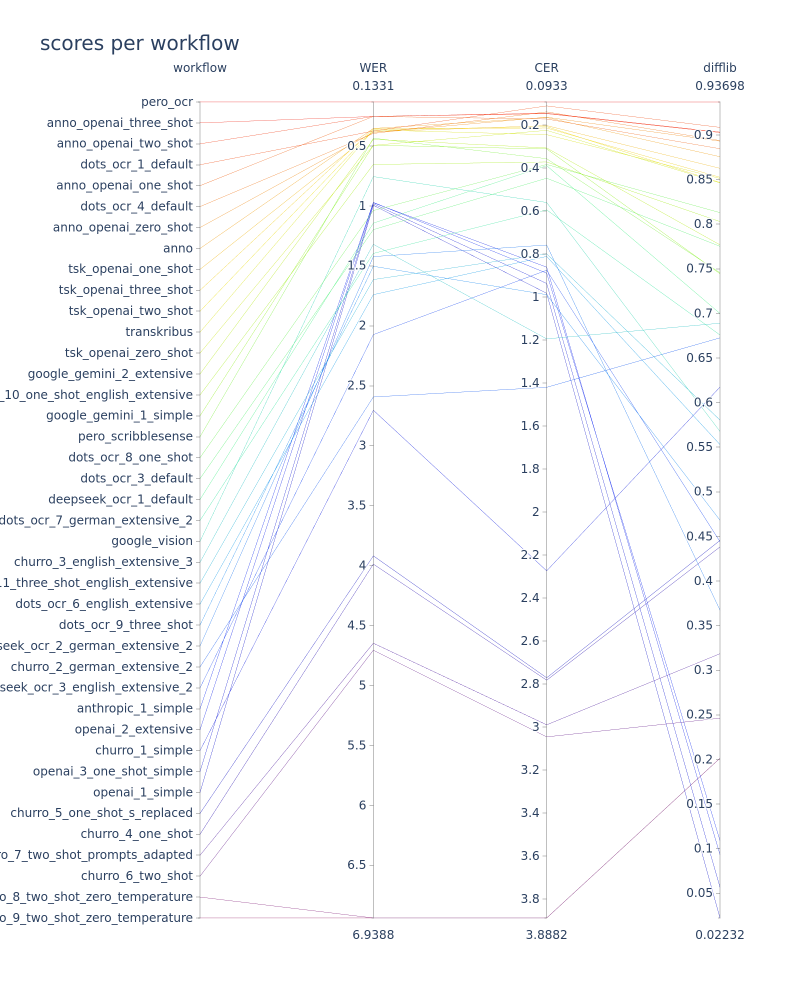
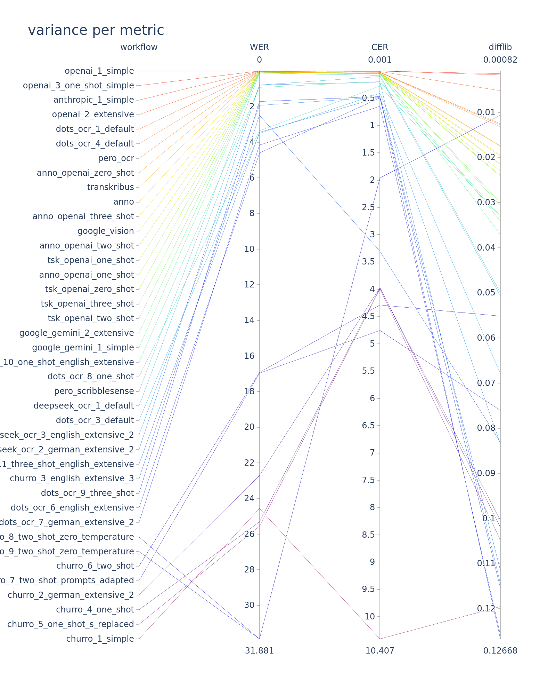
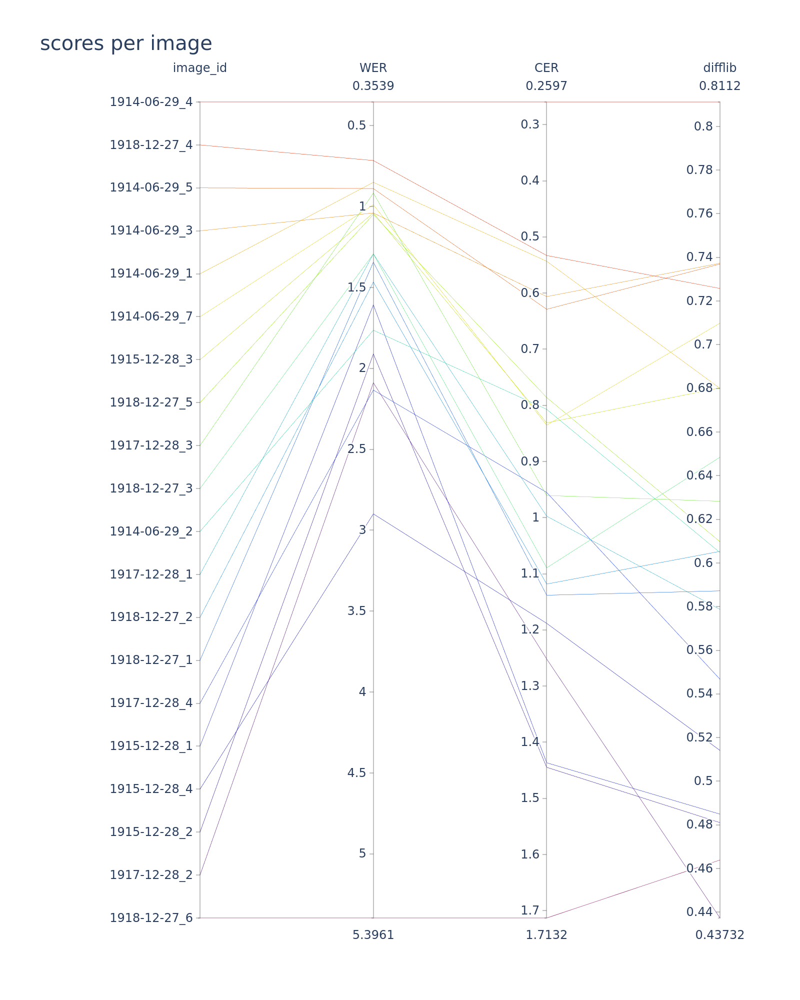

# evaluation of various OCR inferences in the context of the pressmint project

## contents

- [comparison results plot](#comparison-results-plot)
- [OCR workflows](#individual-ocr-workflows)
- [comparison results details](#comparison-results-details)
- [variance details](#variance-details)
- [results per image](#results-per-image)
- [all image results ranked](#all-image-results-ranked)

This repo contains the builds, inferences and evaluations of all used OCR models.

The notebookt at [./src/pressmint_ocr.ipynb](./src/pressmint_ocr.ipynb) contains all the evaluation
logic and those OCR workflows directly, which were delegatable to LLM APIs, i.e. the heavy lifiting
was outsourced (namely those of OpenAI, Antrhopic, and Google). Other OCR workflows involving open
source models, which were executed on the [https://www.clip.science/](https://www.clip.science/) HPC
are found under [./src](./src) and their results are only evaluated in the central notebook (namely
[churro](https://github.com/stanford-oval/Churro),
[dots.ocr](https://github.com/rednote-hilab/dots.ocr),
[deepseek-ocr](https://github.com/deepseek-ai/DeepSeek-OCR)). Models provided by
[https://pero-ocr.fit.vutbr.cz/](https://pero-ocr.fit.vutbr.cz/), and
[https://www.transkribus.org/](https://www.transkribus.org/) were tested separately through their
UI, but its results are persisted and evaulated here like the others.

## setup

To run the notebook, have docker installed (and docker compose, usually integrated into newer
versions of docker) and do:
```
docker compose up
```
Then open the jupyterlab notebook at http://localhost:8888/lab/tree/src/pressmint_ocr.ipynb

keys and tokens are necessary for their respective providers. This notebook assumes the keys to be
persisted into the [./data/keys/](./data/keys/) folder, where templates can be found. The json files
must be named `google_key.json` for the google API and `tokens.json` for OpenAI and Anthropic.

## comparison results plot

- workflow: described in following section
- WER: word error rate, lower = better
- CER: character error rate, lower = better
- difflib: python's native difflib, implementing "Gestalt pattern matching", higher = better

(Note that in this plot the axis for WER and CER are inverted so that better results are displayed 
consistently higher up.)



This plot shows the variance per metric and per ocr workflow:



This plot shows the results per image averaged across workflows



## notes on OCR models

- deepseek-ocr does not support few-shot learning; only one image per prompt.
- Llama vision is disallowed within the EU: https://huggingface.co/meta-llama/Llama-3.2-11B-Vision

## individual OCR workflows

The following is a list of all configurations and parameters of the evaluated models.

Their respective inference outputs are found at [./data/texts/](./data/texts/) respective their
workflow name.

### anno

This is the only "OCR workflow" that was not executed by us, but provided by
[https://anno.onb.ac.at/](https://anno.onb.ac.at/) and used as a comparision to evaluated against.

### anno_openai_one_shot

#TODO

### anno_openai_three_shot

#TODO

### anno_openai_two_shot

#TODO

### anno_openai_zero_shot

#TODO

### anthropic_1_simple

executed directly by [./src/pressmint_ocr.ipynb](./src/pressmint_ocr.ipynb) at section `# OCR
inferences`.

This prompt is shared directly between openai_1_simple, google_gemini_1_simple, anthropic_1_simple.

Very basic approach. Just throw a single prompt and image at AI.

```
prompt_simple = "Extrahiere den gesamten Text aus diesem Bild."
```

### anthropic_2_extensive

**note: this prompt crashed and returned no results**

executed directly by [./src/pressmint_ocr.ipynb](./src/pressmint_ocr.ipynb) at section `# OCR
inferences`.

This prompt is shared directly between openai_2_extensive, google_gemini_2_extensive,
anthropic_2_extensive.

Identical to simple workflows above, but with the prompt being a bit more extensive. Note 
that `anthropic_2_extensive` didn't work due to time-outs.
```
prompt_extensive = (
    "Das ist ein Scan einer deutschen historischen Zeitung aus dem frühen 20. Jahrhundert."
    "Bitte führe OCR darauf aus. "
    "Beachte dabei, dass die Schrift in Fraktur gehalten ist. "
    "Versuche keine Interpretationen zu machen bezüglich der Wörter, sondern transkripiere jeden Buchstaben wie du ihn siehst. "
    "Ohne irgendwelche Metabeschreibungen, nur den Text alleine."
)
```


### churro_1_simple

Code, configuration, and log at time of inference: 
[https://github.com/acdh-oeaw/pressmint-OCR-AI-evaluation/blob/e0de4ae339228a10c26b07538018d0a3f3b1a273/src/churro/](https://github.com/acdh-oeaw/pressmint-OCR-AI-evaluation/blob/e0de4ae339228a10c26b07538018d0a3f3b1a273/src/churro/)

Default prompt:

```
"Transcribe the entiretly of this historical documents to txt format."
```

### churro_2_german_extensive_2

Code, configuration, and log at time of inference: 
[https://github.com/acdh-oeaw/pressmint-OCR-AI-evaluation/blob/f6f4bcda1b75de39ac9d3f4564e3ff136855f8b5/src/churro/](https://github.com/acdh-oeaw/pressmint-OCR-AI-evaluation/blob/f6f4bcda1b75de39ac9d3f4564e3ff136855f8b5/src/churro/)

```
DEFAULT_SYSTEM_MESSAGE = (
    "Transkribiere den Text aus dem folgenden historischen Dokument. Hierbei handelt es sich um "
    "eine deutsche Zeitung aus dem frühen 20. Jahrhundert in Frakturschrift. Behalte die "
    "menschliche Leserichtung bei, also erkenne den Fluss in den Textblöcken. Der Output soll "
    "reiner Text sein, ohne spezielle Kategorisierung oder Strukturierung."
)
```

### churro_3_english_extensive_3

Code, configuration, and log at time of inference: 
[https://github.com/acdh-oeaw/pressmint-OCR-AI-evaluation/blob/f9f40ca545c242d32a37ece0f2116f3bb4cb9c27/src/churro/](https://github.com/acdh-oeaw/pressmint-OCR-AI-evaluation/blob/f9f40ca545c242d32a37ece0f2116f3bb4cb9c27/src/churro/)

```
DEFAULT_SYSTEM_MESSAGE = (
    "Transcribe the text of the following historic document. It is a german newspaper from the "
    "early 20th century, printed in 'Fraktur'. Keep the human reading order, meaning, that the "
    "natural flow of the text blocks must be respected. The output should only be plain text, "
    "without any categories or special structure."
)
```

### churro_4_one_shot

Code, configuration, and log at time of inference: 
[https://github.com/acdh-oeaw/pressmint-OCR-AI-evaluation/blob/de2543f3734cf11aac09515ac6ac22fc93585d6c/src/churro/](https://github.com/acdh-oeaw/pressmint-OCR-AI-evaluation/blob/de2543f3734cf11aac09515ac6ac22fc93585d6c/src/churro/)

- one shot with ground truth images

prompt and conversation:
```
DEFAULT_SYSTEM_MESSAGE = (
    "Transcribe the document following the example shown. Keep the human reading order and "
    "natural flow of text blocks. Output only plain text without any special structure."
)
# ...
for image_file_ground_truth, text_file_ground_truth in ground_truth_pair_list:
    # ...
    conversation.append(
        {"role": "user", "content": [{"type": "image", "image": image_ground_truth}]}
    )
# ...
conversation.append(
    {"role": "user", "content": [{"type": "image", "image": image_infer}]},
)

```

### churro_5_one_shot_s_replaced

Same data as churro_4_one_shot, but since it had transcribed 'ſ' instead of 's', in this dataset, 
they were replaced from 'ſ' to 's' with sed (note that this includes 's' which are supposed to be 
'ß').

### churro_6_two_shot

Code, configuration, and log at time of inference: 
[https://github.com/acdh-oeaw/pressmint-OCR-AI-evaluation/blob/14b546ef6ad9324af668c39b18714492a8116968/src/churro/](https://github.com/acdh-oeaw/pressmint-OCR-AI-evaluation/blob/14b546ef6ad9324af668c39b18714492a8116968/src/churro/)

Same prompt and code setup as `churro_4_one_shot`, but with two pairs of ground truth supplied.

### churro_7_two_shot_prompts_adapted

Code, configuration, and log at time of inference: 
[https://github.com/acdh-oeaw/pressmint-OCR-AI-evaluation/blob/fbcda001e9a630d869e57693d282143e9cf9dae7/src/churro/](https://github.com/acdh-oeaw/pressmint-OCR-AI-evaluation/blob/fbcda001e9a630d869e57693d282143e9cf9dae7/src/churro/)

same as `churro_6_two_shot` but with prompts and chat adapted:

```
DEFAULT_SYSTEM_MESSAGE = "Transcribe these documents."
# ...
for image_file_ground_truth, text_file_ground_truth in ground_truth_pair_list:
    # ...
    conversation.append({
        "role": "user",
        "content": [
            {"type": "text", "text": "transcribe this document:"},
            {"type": "image", "image": image_ground_truth},
        ]
    })
# ...
conversation.append({
    "role": "user",
    "content": [
        {"type": "text", "text": "transcribe this document:"},
        {"type": "image", "image": image_infer},
    ],
})
```

### churro_8_two_shot_zero_temperature

Code, configuration, and log at time of inference: 
[https://github.com/acdh-oeaw/pressmint-OCR-AI-evaluation/blob/b2e91e36a1fdbe0bcb40027acd3868bafa582e54/src/churro/](https://github.com/acdh-oeaw/pressmint-OCR-AI-evaluation/blob/b2e91e36a1fdbe0bcb40027acd3868bafa582e54/src/churro/)

Same as `churro_7_two_shot_prompts_adapted` but with temperature set to 0.

### churro_9_two_shot_zero_temperature

Code, configuration, and log at time of inference: 
[https://github.com/acdh-oeaw/pressmint-OCR-AI-evaluation/blob/18dd2a3e1c2ff366b9da8c9db7bca53e6abe20dd/src/churro/](https://github.com/acdh-oeaw/pressmint-OCR-AI-evaluation/blob/18dd2a3e1c2ff366b9da8c9db7bca53e6abe20dd/src/churro/)

Identical to `churro_8_two_shot_zero_temperature`, to check if results are the same.

### deepseek_ocr_1_default

Code, configuration, and log at time of inference: 
[https://github.com/acdh-oeaw/pressmint-OCR-AI-evaluation/blob/787dbbfac14d314e75233d4b243dc2dbbd4fba53/src/deepseek_ocr/](https://github.com/acdh-oeaw/pressmint-OCR-AI-evaluation/blob/787dbbfac14d314e75233d4b243dc2dbbd4fba53/src/deepseek_ocr/)

Default prompt:

```
"<image>\n<|grounding|>Convert the document to markdown. "
```

### deepseek_ocr_2_german_extensive_2

Code, configuration, and log at time of inference: 
[https://github.com/acdh-oeaw/pressmint-OCR-AI-evaluation/blob/ae4ae6a9ef9b45f61829193cd243f5908a72954e/src/deepseek_ocr/](https://github.com/acdh-oeaw/pressmint-OCR-AI-evaluation/blob/ae4ae6a9ef9b45f61829193cd243f5908a72954e/src/deepseek_ocr/)

```
PROMPT = (
    "<image>\n<|grounding|>Transkribiere den Text aus dem folgenden historischen Dokument. Hierbei "
    "handelt es sich um eine deutsche Zeitung aus dem frühen 20. Jahrhundert in Frakturschrift. "
    "Behalte die menschliche Leserichtung bei, also erkenne den Fluss in den Textblöcken. Der "
    "Output soll reiner Text sein, ohne spezielle Kategorisierung oder Strukturierung."
)
```

### deepseek_ocr_3_english_extensive_2

Code, configuration, and log at time of inference: 
[https://github.com/acdh-oeaw/pressmint-OCR-AI-evaluation/blob/a2ab3101d2cbaa922935808d0af41c4719f86796/src/deepseek_ocr/](https://github.com/acdh-oeaw/pressmint-OCR-AI-evaluation/blob/a2ab3101d2cbaa922935808d0af41c4719f86796/src/deepseek_ocr/)

```
PROMPT = (
    "<image>\n<|grounding|>Transcribe the text of the following historic document. It is a german "
    "newspaper from the early 20th century, printed in 'Fraktur'. Keep the human reading order, "
    "meaning, that the natural flow of the text blocks must be respected. The output should only "
    "be plain text, without any categories or special structure."
)
```

### dots_ocr_1_default

Code, configuration, and log at time of inference: 
[https://github.com/acdh-oeaw/pressmint-OCR-AI-evaluation/blob/616a2b8596b6fb9a7081ddcf48e99e47798111b0/src/dots_ocr/](https://github.com/acdh-oeaw/pressmint-OCR-AI-evaluation/blob/616a2b8596b6fb9a7081ddcf48e99e47798111b0/src/dots_ocr/)

Default setup of dots.ocr with the first of the four default prompts:
```
Please output the layout information from the PDF image, including each layout element's bbox, its category, and the corresponding text content within the bbox.

1. Bbox format: [x1, y1, x2, y2]

2. Layout Categories: The possible categories are ['Caption', 'Footnote', 'Formula', 'List-item', 'Page-footer', 'Page-header', 'Picture', 'Section-header', 'Table', 'Text', 'Title'].

3. Text Extraction & Formatting Rules:
    - Picture: For the 'Picture' category, the text field should be omitted.
    - Formula: Format its text as LaTeX.
    - Table: Format its text as HTML.
    - All Others (Text, Title, etc.): Format their text as Markdown.

4. Constraints:
    - The output text must be the original text from the image, with no translation.
    - All layout elements must be sorted according to human reading order.

5. Final Output: The entire output must be a single JSON object.
```

### dots_ocr_2_default

Code, configuration, and log at time of inference: 
[https://github.com/acdh-oeaw/pressmint-OCR-AI-evaluation/blob/616a2b8596b6fb9a7081ddcf48e99e47798111b0/src/dots_ocr/](https://github.com/acdh-oeaw/pressmint-OCR-AI-evaluation/blob/616a2b8596b6fb9a7081ddcf48e99e47798111b0/src/dots_ocr/)

**Discarded.**

The results concerned only the bounding boxes, but without texts.

```
"""
Please output the layout information from this PDF image, including each layout's bbox and its category. 
The bbox should be in the format [x1, y1, x2, y2]. The layout categories for the PDF document include 
['Caption', 'Footnote', 'Formula', 'List-item', 'Page-footer', 'Page-header', 'Picture', 'Section-header', 'Table', 'Text', 'Title']. 
Do not output the corresponding text. The layout result should be in JSON format.
"""
```

### dots_ocr_3_default

Code, configuration, and log at time of inference: 
[https://github.com/acdh-oeaw/pressmint-OCR-AI-evaluation/blob/616a2b8596b6fb9a7081ddcf48e99e47798111b0/src/dots_ocr/](https://github.com/acdh-oeaw/pressmint-OCR-AI-evaluation/blob/616a2b8596b6fb9a7081ddcf48e99e47798111b0/src/dots_ocr/)

Default setup of dots.ocr with the third of the four default prompts:

```
Extract the text content from this image.
```


### dots_ocr_4_default

Code, configuration, and log at time of inference: 
[https://github.com/acdh-oeaw/pressmint-OCR-AI-evaluation/blob/616a2b8596b6fb9a7081ddcf48e99e47798111b0/src/dots_ocr/](https://github.com/acdh-oeaw/pressmint-OCR-AI-evaluation/blob/616a2b8596b6fb9a7081ddcf48e99e47798111b0/src/dots_ocr/)

Default setup of dots.ocr with the fourth of the four default prompts:

```
Extract text from the given bounding box on the image (format: [x1, y1, x2, y2]).\nBounding Box:\n
```

### dots_ocr_5_german_extensive

Code, configuration, and log at time of inference: 
[https://github.com/acdh-oeaw/pressmint-OCR-AI-evaluation/blob/caa71941735123e18f45e0c385d6d109d4699319/src/dots_ocr/](https://github.com/acdh-oeaw/pressmint-OCR-AI-evaluation/blob/caa71941735123e18f45e0c385d6d109d4699319/src/dots_ocr/)

**Discarded.**

Model ran through all images and infered, but the outputs were all empty.

```
"""
Das ist ein Scan einer deutschen historischen Zeitung aus dem frühen 20. Jahrhundert. 
Bitte führe OCR darauf aus, also extrahiere den Text und behalte dabei die Leserichtung bei.
Beachte auch, dass die Schrift in Fraktur gehalten ist. Der Output soll nur der Text alleine sein.
"""
```

### dots_ocr_6_english_extensive

Code, configuration, and log at time of inference: 
[https://github.com/acdh-oeaw/pressmint-OCR-AI-evaluation/blob/0cccb80204cf9f08642259ef15691a5aba0c91ae/src/dots_ocr/](https://github.com/acdh-oeaw/pressmint-OCR-AI-evaluation/blob/0cccb80204cf9f08642259ef15691a5aba0c91ae/src/dots_ocr/)

```
"""
This is a scan of a historic german newspaper from the early 20th century. Please do OCR on it, 
extract all the text and keep the reading order. Also keep in mind that the writing is in german 
'Fraktur'. The output should only be text."
"""
```

### dots_ocr_7_german_extensive_2

Code, configuration, and log at time of inference: 
[https://github.com/acdh-oeaw/pressmint-OCR-AI-evaluation/blob/f8f574102d1ae9fa01de9776c028908acf8ae562/src/dots_ocr/](https://github.com/acdh-oeaw/pressmint-OCR-AI-evaluation/blob/f8f574102d1ae9fa01de9776c028908acf8ae562/src/dots_ocr/)

```
PROMPT = (
    "Transkribiere den Text aus dem folgenden historischen Dokument. Hierbei handelt es sich um "
    "eine deutsche Zeitung aus dem frühen 20. Jahrhundert in Frakturschrift. Behalte die "
    "menschliche Leserichtung bei, also erkenne den Fluss in den Textblöcken. Der Output soll "
    "reiner Text sein, ohne spezielle Kategorisierung oder Strukturierung."
)
```

### dots_ocr_8_one_shot

Code, configuration, and log at time of inference: 
[https://github.com/acdh-oeaw/pressmint-OCR-AI-evaluation/blob/8649c0458779c18ab2a18f48355e430801cde5ce/src/dots_ocr/](https://github.com/acdh-oeaw/pressmint-OCR-AI-evaluation/blob/8649c0458779c18ab2a18f48355e430801cde5ce/src/dots_ocr/)

same system prompt as `dots_ocr_7_german_extensive_2`. One shot learning adapted in code like this:

```
messages = [
    {"role": "system", "content": PROMPT},
]
for image_file_ground_truth, text_file_ground_truth in ground_truth_pair_list:
    # ...
    messages.append({
        "role": "user",
        "content": [
            {"type": "text", "text": "transcribe this document:"},
            {"type": "image", "image": image_path_ground_truth},
        ]
    })
    messages.append(
        {"role": "assistant", "content": text_ground_truth}
    )
# ...
messages.append({
    "role": "user",
    "content": [
        {"type": "text", "text": "transcribe this document:"},
        {"type": "image", "image": image_path_infer},
    ],
})
```

### dots_ocr_9_three_shot

Code, configuration, and log at time of inference: 
[https://github.com/acdh-oeaw/pressmint-OCR-AI-evaluation/blob/de06b9454fd12a2506da4562777824504bf9c5c0/src/dots_ocr/](https://github.com/acdh-oeaw/pressmint-OCR-AI-evaluation/blob/de06b9454fd12a2506da4562777824504bf9c5c0/src/dots_ocr/)

Same setup as `dots_ocr_8_one_shot`, but with three pairs of ground truth data.

### dots_ocr_10_one_shot_english_extensive

Code, configuration, and log at time of inference: 
[https://github.com/acdh-oeaw/pressmint-OCR-AI-evaluation/blob/eb85fa698036e5408eb8ad4b7520bda95cfe9984/src/dots_ocr/](https://github.com/acdh-oeaw/pressmint-OCR-AI-evaluation/blob/eb85fa698036e5408eb8ad4b7520bda95cfe9984/src/dots_ocr/)

Same few-shot code as above, with slight configuration improvements, and system prompt in english:

```
PROMPT = (
    "You are an expert in historical German documents. Transcribe the text from "
    "German newspapers from the early 20th century written in Fraktur script. "
    "Follow these guidelines:\n"
    "- Follow the natural reading direction (left to right, top to bottom)\n"
    "- Recognize column layouts and logical text flow\n"
    "- Output only plain text without metadata or structural markup\n"
    "- Preserve paragraphs but add no additional formatting"
)
```

### dots_ocr_11_three_shot_english_extensive

Code, configuration, and log at time of inference: 
[https://github.com/acdh-oeaw/pressmint-OCR-AI-evaluation/blob/9e84b4470c2449cb17bab07343e7959c1b0cea9e/src/dots_ocr/](https://github.com/acdh-oeaw/pressmint-OCR-AI-evaluation/blob/9e84b4470c2449cb17bab07343e7959c1b0cea9e/src/dots_ocr/)

Same as `dots_ocr_10_one_shot_english_extensive` but with three ground truth samples.

### google_gemini_1_simple

executed directly by [./src/pressmint_ocr.ipynb](./src/pressmint_ocr.ipynb) at section `# OCR
inferences`.

This prompt is shared directly between openai_1_simple, google_gemini_1_simple, anthropic_1_simple.

Very basic approach. Just throw a single prompt and image at AI.

```
prompt_simple = "Extrahiere den gesamten Text aus diesem Bild."
```

### google_gemini_2_extensive

executed directly by [./src/pressmint_ocr.ipynb](./src/pressmint_ocr.ipynb) at section `# OCR
inferences`.

This prompt is shared directly between openai_2_extensive, google_gemini_2_extensive,
anthropic_2_extensive.

Identical to simple workflows above, but with the prompt being a bit more extensive. Note 
that `anthropic_2_extensive` didn't work due to time-outs.
```
prompt_extensive = (
    "Das ist ein Scan einer deutschen historischen Zeitung aus dem frühen 20. Jahrhundert."
    "Bitte führe OCR darauf aus. "
    "Beachte dabei, dass die Schrift in Fraktur gehalten ist. "
    "Versuche keine Interpretationen zu machen bezüglich der Wörter, sondern transkripiere jeden Buchstaben wie du ihn siehst. "
    "Ohne irgendwelche Metabeschreibungen, nur den Text alleine."
)
```

### google_gemini_3_one_shot_simple

**note: this prompt crashed and returned no results**

executed directly by [./src/pressmint_ocr.ipynb](./src/pressmint_ocr.ipynb) at section `# OCR
inferences`.

One Shot learning experiment, where an image with its gold data transcription is shown to the AI
beforehand, with these prompts:

```
prompt_one_shot_ground_truth = "Hier ist ein Beispielbild einer historischen Frakturschrift-Zeitung mit seiner korrekten Transkription:"
prompt_one_shot_explanation = "Bitte beschreibe das folgende ähnliche Bild, so gut wie möglich."
prompt_one_shot_ocr_inference = "Anhand von dem vorher gezeigten Beispielbild, extrahiere den Text aus dem folgenden Bild."
```

### google_vision

executed directly by [./src/pressmint_ocr.ipynb](./src/pressmint_ocr.ipynb) at section `# OCR
inferences`.

Google Cloud Vision API is not a LLM or Gemini, but an image analyser, which can be used for OCR
too.

### openai_1_simple

executed directly by [./src/pressmint_ocr.ipynb](./src/pressmint_ocr.ipynb) at section `# OCR
inferences`.

This prompt is shared directly between openai_1_simple, google_gemini_1_simple, anthropic_1_simple.

Very basic approach. Just throw a single prompt and image at AI.

```
prompt_simple = "Extrahiere den gesamten Text aus diesem Bild."
```

### openai_2_extensive

executed directly by [./src/pressmint_ocr.ipynb](./src/pressmint_ocr.ipynb) at section `# OCR
inferences`.

This prompt is shared directly between openai_2_extensive, google_gemini_2_extensive,
anthropic_2_extensive.

Identical to simple workflows above, but with the prompt being a bit more extensive. Note 
that `anthropic_2_extensive` didn't work due to time-outs.
```
prompt_extensive = (
    "Das ist ein Scan einer deutschen historischen Zeitung aus dem frühen 20. Jahrhundert."
    "Bitte führe OCR darauf aus. "
    "Beachte dabei, dass die Schrift in Fraktur gehalten ist. "
    "Versuche keine Interpretationen zu machen bezüglich der Wörter, sondern transkripiere jeden Buchstaben wie du ihn siehst. "
    "Ohne irgendwelche Metabeschreibungen, nur den Text alleine."
)
```

### openai_3_one_shot_simple

executed directly by [./src/pressmint_ocr.ipynb](./src/pressmint_ocr.ipynb) at section `# OCR
inferences`.

One Shot learning experiment, where an image with its gold data transcription is shown to the AI
beforehand, with these prompts:

```
prompt_one_shot_ground_truth = "Hier ist ein Beispielbild einer historischen Frakturschrift-Zeitung mit seiner korrekten Transkription:"
prompt_one_shot_explanation = "Bitte beschreibe das folgende ähnliche Bild, so gut wie möglich."
prompt_one_shot_ocr_inference = "Anhand von dem vorher gezeigten Beispielbild, extrahiere den Text aus dem folgenden Bild."
```

### pero_ocr

Inferred by running manually on https://pero-ocr.fit.vutbr.cz/.

### pero_scribblesense

Inferred by running manually on https://scribblesense.cz/.

### transrkibus

#TODO: gibt es hierzu Möglichkeiten den Workflow zu beschreiben (e.g. Konfigurationsparameter)?
Falls nicht, dann würde ein einfacher Satz mit Verweis und Link reichen.

### tsk_openai_one_shot

executed directly by [./src/pressmint_postprocessing.ipynb](./src/pressmint_postprocessing.ipynb).

#TODO

### tsk_openai_three_shot

executed directly by [./src/pressmint_postprocessing.ipynb](./src/pressmint_postprocessing.ipynb).

#TODO

### tsk_openai_two_shot

executed directly by [./src/pressmint_postprocessing.ipynb](./src/pressmint_postprocessing.ipynb).

#TODO

### tsk_openai_zero_shot

executed directly by [./src/pressmint_postprocessing.ipynb](./src/pressmint_postprocessing.ipynb).

#TODO

## comparison results details

|     | workflow                                 | image_id     |         WER |          CER |    difflib |
|----:|:-----------------------------------------|:-------------|------------:|-------------:|-----------:|
|   0 | anno                                     | 1914-06-29_1 |  0.300746   |  0.0891249   | 0.927337   |
|   1 | anno                                     | 1914-06-29_2 |  0.219292   |  0.0429944   | 0.965998   |
|   2 | anno                                     | 1914-06-29_3 |  0.130086   |  0.0248886   | 0.979545   |
|   3 | anno                                     | 1914-06-29_4 |  0.12885    |  0.0227116   | 0.980347   |
|   4 | anno                                     | 1914-06-29_5 |  0.179021   |  0.0326541   | 0.973684   |
|   5 | anno                                     | 1914-06-29_7 |  0.1771     |  0.0406416   | 0.970251   |
|   6 | anno                                     | 1915-12-28_1 |  0.218905   |  0.0836584   | 0.926895   |
|   7 | anno                                     | 1915-12-28_2 |  0.769446   |  0.627305    | 0.631292   |
|   8 | anno                                     | 1915-12-28_3 |  0.258993   |  0.0598589   | 0.95202    |
|   9 | anno                                     | 1915-12-28_4 |  0.444732   |  0.154068    | 0.865014   |
|  10 | anno                                     | 1917-12-28_1 |  0.196296   |  0.0735375   | 0.935992   |
|  11 | anno                                     | 1917-12-28_2 |  0.845309   |  0.709918    | 0.481758   |
|  12 | anno                                     | 1917-12-28_3 |  0.259978   |  0.0557485   | 0.955512   |
|  13 | anno                                     | 1917-12-28_4 |  0.586375   |  0.29414     | 0.769756   |
|  14 | anno                                     | 1918-12-27_1 |  0.312379   |  0.0818414   | 0.923912   |
|  15 | anno                                     | 1918-12-27_2 |  0.243472   |  0.0604731   | 0.948825   |
|  16 | anno                                     | 1918-12-27_3 |  0.254967   |  0.0709265   | 0.939721   |
|  17 | anno                                     | 1918-12-27_4 |  0.187313   |  0.0447538   | 0.964545   |
|  18 | anno                                     | 1918-12-27_5 |  0.783499   |  0.512721    | 0.611949   |
|  19 | anno                                     | 1918-12-27_6 |  0.576923   |  0.225356    | 0.808505   |
|  20 | anno                                     | average      |  0.353684   |  0.165366    | 0.875643   |
|  21 | anno_openai_one_shot                     | 1914-06-29_1 |  0.101906   |  0.050177    | 0.959899   |
|  22 | anno_openai_one_shot                     | 1914-06-29_2 |  0.0361718  |  0.0109594   | 0.99251    |
|  23 | anno_openai_one_shot                     | 1914-06-29_3 |  0.0221948  |  0.00798894  | 0.99494    |
|  24 | anno_openai_one_shot                     | 1914-06-29_4 |  0.0238843  |  0.00682882  | 0.995251   |
|  25 | anno_openai_one_shot                     | 1914-06-29_5 |  0.0237762  |  0.00818484  | 0.99532    |
|  26 | anno_openai_one_shot                     | 1914-06-29_7 |  0.0428336  |  0.0174488   | 0.989387   |
|  27 | anno_openai_one_shot                     | 1915-12-28_1 |  0.703151   |  0.540957    | 0.606336   |
|  28 | anno_openai_one_shot                     | 1915-12-28_2 |  0.690259   |  0.619792    | 0.640477   |
|  29 | anno_openai_one_shot                     | 1915-12-28_3 |  0.0680183  |  0.0308599   | 0.980436   |
|  30 | anno_openai_one_shot                     | 1915-12-28_4 |  0.184801   |  0.0938854   | 0.939345   |
|  31 | anno_openai_one_shot                     | 1917-12-28_1 |  0.102778   |  0.0646909   | 0.963906   |
|  32 | anno_openai_one_shot                     | 1917-12-28_2 |  0.837701   |  0.714622    | 0.49864    |
|  33 | anno_openai_one_shot                     | 1917-12-28_3 |  0.0900755  |  0.0343364   | 0.976465   |
|  34 | anno_openai_one_shot                     | 1917-12-28_4 |  0.438767   |  0.293559    | 0.815053   |
|  35 | anno_openai_one_shot                     | 1918-12-27_1 |  0.46325    |  0.0865473   | 0.94177    |
|  36 | anno_openai_one_shot                     | 1918-12-27_2 |  0.0585745  |  0.0271479   | 0.983798   |
|  37 | anno_openai_one_shot                     | 1918-12-27_3 |  0.0708609  |  0.0281949   | 0.980171   |
|  38 | anno_openai_one_shot                     | 1918-12-27_4 |  0.0313433  |  0.0114527   | 0.992941   |
|  39 | anno_openai_one_shot                     | 1918-12-27_5 |  0.614764   |  0.474595    | 0.652656   |
|  40 | anno_openai_one_shot                     | 1918-12-27_6 |  0.467366   |  0.323679    | 0.793051   |
|  41 | anno_openai_one_shot                     | average      |  0.253624   |  0.172295    | 0.884618   |
|  42 | anno_openai_three_shot                   | 1914-06-29_1 |  0.395195   |  0.0895296   | 0.941804   |
|  43 | anno_openai_three_shot                   | 1914-06-29_2 |  0.0301432  |  0.0107065   | 0.993274   |
|  44 | anno_openai_three_shot                   | 1914-06-29_3 |  0.0246609  |  0.00798894  | 0.995094   |
|  45 | anno_openai_three_shot                   | 1914-06-29_4 |  0.02577    |  0.00828666  | 0.99471    |
|  46 | anno_openai_three_shot                   | 1914-06-29_5 |  0.048951   |  0.00886691  | 0.993605   |
|  47 | anno_openai_three_shot                   | 1914-06-29_7 |  0.0313015  |  0.0158231   | 0.991597   |
|  48 | anno_openai_three_shot                   | 1915-12-28_1 |  0.11194    |  0.0544036   | 0.953121   |
|  49 | anno_openai_three_shot                   | 1915-12-28_2 |  0.697267   |  0.620731    | 0.640574   |
|  50 | anno_openai_three_shot                   | 1915-12-28_3 |  0.0614781  |  0.0255098   | 0.984844   |
|  51 | anno_openai_three_shot                   | 1915-12-28_4 |  0.163212   |  0.0955224   | 0.938701   |
|  52 | anno_openai_three_shot                   | 1917-12-28_1 |  0.433333   |  0.110804    | 0.941649   |
|  53 | anno_openai_three_shot                   | 1917-12-28_2 |  0.898563   |  0.69953     | 0.489335   |
|  54 | anno_openai_three_shot                   | 1917-12-28_3 |  0.0809061  |  0.0307999   | 0.979918   |
|  55 | anno_openai_three_shot                   | 1917-12-28_4 |  0.447689   |  0.313608    | 0.807169   |
|  56 | anno_openai_three_shot                   | 1918-12-27_1 |  0.125725   |  0.0612788   | 0.965017   |
|  57 | anno_openai_three_shot                   | 1918-12-27_2 |  0.0606916  |  0.0291799   | 0.983012   |
|  58 | anno_openai_three_shot                   | 1918-12-27_3 |  0.084106   |  0.0301118   | 0.979885   |
|  59 | anno_openai_three_shot                   | 1918-12-27_4 |  0.0552239  |  0.0193816   | 0.988634   |
|  60 | anno_openai_three_shot                   | 1918-12-27_5 |  0.610422   |  0.464843    | 0.662141   |
|  61 | anno_openai_three_shot                   | 1918-12-27_6 |  0.685315   |  0.217988    | 0.840525   |
|  62 | anno_openai_three_shot                   | average      |  0.253595   |  0.145745    | 0.90323    |
|  63 | anno_openai_two_shot                     | 1914-06-29_1 |  0.108534   |  0.0671725   | 0.96086    |
|  64 | anno_openai_two_shot                     | 1914-06-29_2 |  0.042954   |  0.0118024   | 0.992045   |
|  65 | anno_openai_two_shot                     | 1914-06-29_3 |  0.0215783  |  0.00745122  | 0.995554   |
|  66 | anno_openai_two_shot                     | 1914-06-29_4 |  0.0251414  |  0.00682882  | 0.995522   |
|  67 | anno_openai_two_shot                     | 1914-06-29_5 |  0.0363636  |  0.00946372  | 0.993828   |
|  68 | anno_openai_two_shot                     | 1914-06-29_7 |  0.0650741  |  0.0184242   | 0.988188   |
|  69 | anno_openai_two_shot                     | 1915-12-28_1 |  0.111111   |  0.0657976   | 0.9545     |
|  70 | anno_openai_two_shot                     | 1915-12-28_2 |  0.704275   |  0.619877    | 0.639114   |
|  71 | anno_openai_two_shot                     | 1915-12-28_3 |  0.0660562  |  0.0307824   | 0.980578   |
|  72 | anno_openai_two_shot                     | 1915-12-28_4 |  0.187392   |  0.101011    | 0.934889   |
|  73 | anno_openai_two_shot                     | 1917-12-28_1 |  0.436111   |  0.105275    | 0.944905   |
|  74 | anno_openai_two_shot                     | 1917-12-28_2 |  0.749789   |  0.700608    | 0.419298   |
|  75 | anno_openai_two_shot                     | 1917-12-28_3 |  0.0906149  |  0.0560057   | 0.967797   |
|  76 | anno_openai_two_shot                     | 1917-12-28_4 |  0.449311   |  0.308765    | 0.81223    |
|  77 | anno_openai_two_shot                     | 1918-12-27_1 |  0.39265    |  0.0875703   | 0.950858   |
|  78 | anno_openai_two_shot                     | 1918-12-27_2 |  0.0536344  |  0.0165      | 0.989705   |
|  79 | anno_openai_two_shot                     | 1918-12-27_3 |  0.276159   |  0.0429712   | 0.968243   |
|  80 | anno_openai_two_shot                     | 1918-12-27_4 |  0.038806   |  0.0175315   | 0.989386   |
|  81 | anno_openai_two_shot                     | 1918-12-27_5 |  0.800868   |  0.481414    | 0.711392   |
|  82 | anno_openai_two_shot                     | 1918-12-27_6 |  0.405594   |  0.193979    | 0.866201   |
|  83 | anno_openai_two_shot                     | average      |  0.253101   |  0.147461    | 0.902755   |
|  84 | anno_openai_zero_shot                    | 1914-06-29_1 |  0.415907   |  0.114112    | 0.932782   |
|  85 | anno_openai_zero_shot                    | 1914-06-29_2 |  0.0580256  |  0.0188838   | 0.987729   |
|  86 | anno_openai_zero_shot                    | 1914-06-29_3 |  0.0295931  |  0.0106775   | 0.993451   |
|  87 | anno_openai_zero_shot                    | 1914-06-29_4 |  0.374607   |  0.073429    | 0.951751   |
|  88 | anno_openai_zero_shot                    | 1914-06-29_5 |  0.0741259  |  0.0123625   | 0.99218    |
|  89 | anno_openai_zero_shot                    | 1914-06-29_7 |  0.339374   |  0.0630758   | 0.966185   |
|  90 | anno_openai_zero_shot                    | 1915-12-28_1 |  0.490879   |  0.124718    | 0.908194   |
|  91 | anno_openai_zero_shot                    | 1915-12-28_2 |  0.976875   |  0.642333    | 0.626298   |
|  92 | anno_openai_zero_shot                    | 1915-12-28_3 |  0.101373   |  0.0358998   | 0.976914   |
|  93 | anno_openai_zero_shot                    | 1915-12-28_4 |  0.455959   |  0.154742    | 0.86597    |
|  94 | anno_openai_zero_shot                    | 1917-12-28_1 |  0.443519   |  0.111689    | 0.939406   |
|  95 | anno_openai_zero_shot                    | 1917-12-28_2 |  0.788673   |  0.705998    | 0.496392   |
|  96 | anno_openai_zero_shot                    | 1917-12-28_3 |  0.16343    |  0.034465    | 0.97429    |
|  97 | anno_openai_zero_shot                    | 1917-12-28_4 |  0.491484   |  0.271574    | 0.814326   |
|  98 | anno_openai_zero_shot                    | 1918-12-27_1 |  0.467118   |  0.0921739   | 0.942191   |
|  99 | anno_openai_zero_shot                    | 1918-12-27_2 |  0.104446   |  0.0294237   | 0.981227   |
| 100 | anno_openai_zero_shot                    | 1918-12-27_3 |  0.412583   |  0.0775559   | 0.95454    |
| 101 | anno_openai_zero_shot                    | 1918-12-27_4 |  0.0604478  |  0.0199982   | 0.987491   |
| 102 | anno_openai_zero_shot                    | 1918-12-27_5 |  0.822581   |  0.483173    | 0.709392   |
| 103 | anno_openai_zero_shot                    | 1918-12-27_6 |  0.658508   |  0.203506    | 0.86132    |
| 104 | anno_openai_zero_shot                    | average      |  0.386475   |  0.163989    | 0.893101   |
| 105 | anthropic_1_simple                       | 1914-06-29_1 |  0.961889   |  0.866667    | 0.160021   |
| 106 | anthropic_1_simple                       | 1914-06-29_2 |  0.961567   |  0.88931     | 0.106752   |
| 107 | anthropic_1_simple                       | 1914-06-29_3 |  0.962392   |  0.835766    | 0.102127   |
| 108 | anthropic_1_simple                       | 1914-06-29_4 |  0.941546   |  0.754163    | 0.113854   |
| 109 | anthropic_1_simple                       | 1914-06-29_5 |  0.960839   |  0.873732    | 0.147232   |
| 110 | anthropic_1_simple                       | 1914-06-29_7 |  0.969522   |  0.898017    | 0.110125   |
| 111 | anthropic_1_simple                       | 1915-12-28_1 |  0.966833   |  0.866968    | 0.202405   |
| 112 | anthropic_1_simple                       | 1915-12-28_2 |  0.983181   |  0.922131    | 0.0680517  |
| 113 | anthropic_1_simple                       | 1915-12-28_3 |  0.984303   |  0.935877    | 0.0566802  |
| 114 | anthropic_1_simple                       | 1915-12-28_4 |  0.974093   |  0.906981    | 0.12326    |
| 115 | anthropic_1_simple                       | 1917-12-28_1 |  0.981481   |  0.91452     | 0.068806   |
| 116 | anthropic_1_simple                       | 1917-12-28_2 |  0.978867   |  0.903861    | 0.0787831  |
| 117 | anthropic_1_simple                       | 1917-12-28_3 |  0.986516   |  0.946566    | 0.0418542  |
| 118 | anthropic_1_simple                       | 1917-12-28_4 |  0.982157   |  0.926586    | 0.0701754  |
| 119 | anthropic_1_simple                       | 1918-12-27_1 |  0.970019   |  0.901483    | 0.11473    |
| 120 | anthropic_1_simple                       | 1918-12-27_2 |  0.948483   |  0.847029    | 0.178386   |
| 121 | anthropic_1_simple                       | 1918-12-27_3 |  0.980132   |  0.927396    | 0.0744296  |
| 122 | anthropic_1_simple                       | 1918-12-27_4 |  0.956716   |  0.883358    | 0.142206   |
| 123 | anthropic_1_simple                       | 1918-12-27_5 |  0.972705   |  0.889655    | 0.128019   |
| 124 | anthropic_1_simple                       | 1918-12-27_6 |  0.97669    |  0.898755    | 0.0962315  |
| 125 | anthropic_1_simple                       | average      |  0.969997   |  0.889441    | 0.109206   |
| 126 | churro_1_simple                          | 1914-06-29_1 |  0.533554   |  0.176227    | 0.868022   |
| 127 | churro_1_simple                          | 1914-06-29_2 |  0.478523   |  0.0785702   | 0.935781   |
| 128 | churro_1_simple                          | 1914-06-29_3 |  0.31381    |  0.0470886   | 0.966722   |
| 129 | churro_1_simple                          | 1914-06-29_4 |  0.323696   |  0.0602317   | 0.959934   |
| 130 | churro_1_simple                          | 1914-06-29_5 |  0.311888   |  0.0689743   | 0.944607   |
| 131 | churro_1_simple                          | 1914-06-29_7 |  0.219934   |  0.057982    | 0.954184   |
| 132 | churro_1_simple                          | 1915-12-28_1 |  5.8068     |  5.51468     | 0.145533   |
| 133 | churro_1_simple                          | 1915-12-28_2 | 11.0126     |  7.94766     | 0.0351503  |
| 134 | churro_1_simple                          | 1915-12-28_3 |  0.265533   |  3.46073     | 0.353653   |
| 135 | churro_1_simple                          | 1915-12-28_4 |  0.326425   |  0.0808859   | 0.936187   |
| 136 | churro_1_simple                          | 1917-12-28_1 |  0.480556   |  0.148291    | 0.893481   |
| 137 | churro_1_simple                          | 1917-12-28_2 |  1.09045    |  1.13583     | 0.498904   |
| 138 | churro_1_simple                          | 1917-12-28_3 |  1.8069     | 12.2775      | 0.132611   |
| 139 | churro_1_simple                          | 1917-12-28_4 |  0.626115   |  0.305182    | 0.808221   |
| 140 | churro_1_simple                          | 1918-12-27_1 |  0.300774   |  0.0501279   | 0.954093   |
| 141 | churro_1_simple                          | 1918-12-27_2 |  5.36768    |  5.0061      | 0.0130683  |
| 142 | churro_1_simple                          | 1918-12-27_3 |  2.97947    |  2.51518     | 0.430387   |
| 143 | churro_1_simple                          | 1918-12-27_4 |  0.680597   |  0.887235    | 0.674219   |
| 144 | churro_1_simple                          | 1918-12-27_5 |  0.226427   |  1.15214     | 0.6201     |
| 145 | churro_1_simple                          | 1918-12-27_6 | 20.9289     |  4.50381     | 0.224071   |
| 146 | churro_1_simple                          | average      |  2.70403    |  2.27372     | 0.617446   |
| 147 | churro_2_german_extensive_2              | 1914-06-29_1 |  0.309031   |  0.101062    | 0.915847   |
| 148 | churro_2_german_extensive_2              | 1914-06-29_2 |  0.341372   |  0.0622155   | 0.892892   |
| 149 | churro_2_german_extensive_2              | 1914-06-29_3 |  0.461776   |  0.077124    | 0.936985   |
| 150 | churro_2_german_extensive_2              | 1914-06-29_4 |  0.279698   |  0.0652958   | 0.948812   |
| 151 | churro_2_german_extensive_2              | 1914-06-29_5 |  0.488112   |  0.0864524   | 0.930287   |
| 152 | churro_2_german_extensive_2              | 1914-06-29_7 |  5.69769    |  5.84827     | 0.253052   |
| 153 | churro_2_german_extensive_2              | 1915-12-28_1 |  0.685738   |  0.36512     | 0.471829   |
| 154 | churro_2_german_extensive_2              | 1915-12-28_2 |  5.35879    |  4.29141     | 0.218212   |
| 155 | churro_2_german_extensive_2              | 1915-12-28_3 |  0.268803   |  0.0503993   | 0.956842   |
| 156 | churro_2_german_extensive_2              | 1915-12-28_4 |  2.82902    |  2.92778     | 0.384255   |
| 157 | churro_2_german_extensive_2              | 1917-12-28_1 |  0.761111   |  0.492646    | 0.624936   |
| 158 | churro_2_german_extensive_2              | 1917-12-28_2 |  0.842773   |  0.639063    | 0.563209   |
| 159 | churro_2_german_extensive_2              | 1917-12-28_3 |  0.355448   |  0.0610854   | 0.954735   |
| 160 | churro_2_german_extensive_2              | 1917-12-28_4 |  4.63909    |  4.14935     | 0.248417   |
| 161 | churro_2_german_extensive_2              | 1918-12-27_1 |  0.294971   |  0.0483887   | 0.955578   |
| 162 | churro_2_german_extensive_2              | 1918-12-27_2 |  6.03952    |  4.33805     | 0.127829   |
| 163 | churro_2_german_extensive_2              | 1918-12-27_3 |  0.453642   |  0.0771565   | 0.934948   |
| 164 | churro_2_german_extensive_2              | 1918-12-27_4 |  0.238806   |  0.0472205   | 0.95977    |
| 165 | churro_2_german_extensive_2              | 1918-12-27_5 |  0.108561   |  0.0211892   | 0.983751   |
| 166 | churro_2_german_extensive_2              | 1918-12-27_6 | 21.4103     |  4.65396     | 0.18983    |
| 167 | churro_2_german_extensive_2              | average      |  2.59321    |  1.42016     | 0.672601   |
| 168 | churro_3_english_extensive_3             | 1914-06-29_1 |  0.256007   |  0.0451189   | 0.959716   |
| 169 | churro_3_english_extensive_3             | 1914-06-29_2 |  0.55162    |  0.0982128   | 0.92442    |
| 170 | churro_3_english_extensive_3             | 1914-06-29_3 |  0.363748   |  0.0555385   | 0.958147   |
| 171 | churro_3_english_extensive_3             | 1914-06-29_4 |  0.290383   |  0.0658329   | 0.947405   |
| 172 | churro_3_english_extensive_3             | 1914-06-29_5 |  0.493706   |  0.0919942   | 0.927858   |
| 173 | churro_3_english_extensive_3             | 1914-06-29_7 |  0.249588   |  0.0793324   | 0.940185   |
| 174 | churro_3_english_extensive_3             | 1915-12-28_1 |  0.728856   |  0.403921    | 0.469562   |
| 175 | churro_3_english_extensive_3             | 1915-12-28_2 |  3.64471    |  2.45458     | 0.131703   |
| 176 | churro_3_english_extensive_3             | 1915-12-28_3 |  0.268149   |  0.0452043   | 0.958772   |
| 177 | churro_3_english_extensive_3             | 1915-12-28_4 |  3.79447    |  4.07607     | 0.30882    |
| 178 | churro_3_english_extensive_3             | 1917-12-28_1 |  0.689815   |  0.476059    | 0.724821   |
| 179 | churro_3_english_extensive_3             | 1917-12-28_2 |  0.996619   |  0.991768    | 0.397735   |
| 180 | churro_3_english_extensive_3             | 1917-12-28_3 |  0.450378   |  0.0799897   | 0.935644   |
| 181 | churro_3_english_extensive_3             | 1917-12-28_4 |  0.626926   |  0.307215    | 0.807862   |
| 182 | churro_3_english_extensive_3             | 1918-12-27_1 |  5.26596    |  4.54946     | 0.282316   |
| 183 | churro_3_english_extensive_3             | 1918-12-27_2 |  1.0247     |  1.7421      | 0.482313   |
| 184 | churro_3_english_extensive_3             | 1918-12-27_3 |  4.68079    |  6.71565     | 0.222228   |
| 185 | churro_3_english_extensive_3             | 1918-12-27_4 |  0.247015   |  0.0531231   | 0.956698   |
| 186 | churro_3_english_extensive_3             | 1918-12-27_5 |  0.168734   |  0.307501    | 0.859057   |
| 187 | churro_3_english_extensive_3             | 1918-12-27_6 |  1.61072    |  1.2608      | 0.585403   |
| 188 | churro_3_english_extensive_3             | average      |  1.32015    |  1.19497     | 0.689033   |
| 189 | churro_4_one_shot                        | 1914-06-29_1 |  0.195526   |  0.0627213   | 0.957821   |
| 190 | churro_4_one_shot                        | 1914-06-29_2 |  4.62095    |  4.13741     | 0.297995   |
| 191 | churro_4_one_shot                        | 1914-06-29_3 |  5.45993    |  4.3572      | 0.250256   |
| 192 | churro_4_one_shot                        | 1914-06-29_4 |  0.516028   |  0.316888    | 0.732514   |
| 193 | churro_4_one_shot                        | 1914-06-29_5 |  0.343357   |  0.121579    | 0.917895   |
| 194 | churro_4_one_shot                        | 1914-06-29_7 |  0.231466   |  0.0634009   | 0.951549   |
| 195 | churro_4_one_shot                        | 1915-12-28_1 |  7.07214    |  5.80825     | 0.214717   |
| 196 | churro_4_one_shot                        | 1915-12-28_2 |  5.56202    |  4.32992     | 0.216813   |
| 197 | churro_4_one_shot                        | 1915-12-28_3 |  0.555265   |  2.65046     | 0.399558   |
| 198 | churro_4_one_shot                        | 1915-12-28_4 |  5.43092    |  4.28849     | 0.0641032  |
| 199 | churro_4_one_shot                        | 1917-12-28_1 |  0.467593   |  0.439124    | 0.735414   |
| 200 | churro_4_one_shot                        | 1917-12-28_2 |  4.64074    |  3.99716     | 0.0224352  |
| 201 | churro_4_one_shot                        | 1917-12-28_3 |  0.26753    |  1.03832     | 0.629718   |
| 202 | churro_4_one_shot                        | 1917-12-28_4 |  3.76886    |  3.50324     | 0.352082   |
| 203 | churro_4_one_shot                        | 1918-12-27_1 |  5.26886    |  4.76379     | 0.270972   |
| 204 | churro_4_one_shot                        | 1918-12-27_2 |  6.12773    |  4.31212     | 0.176354   |
| 205 | churro_4_one_shot                        | 1918-12-27_3 |  4.99404    |  4.67332     | 0.284121   |
| 206 | churro_4_one_shot                        | 1918-12-27_4 |  0.157463   |  0.112237    | 0.937098   |
| 207 | churro_4_one_shot                        | 1918-12-27_5 |  0.939826   |  1.69529     | 0.338393   |
| 208 | churro_4_one_shot                        | 1918-12-27_6 | 23.12       |  4.97612     | 0.0155406  |
| 209 | churro_4_one_shot                        | average      |  3.98701    |  2.78235     | 0.438267   |
| 210 | churro_5_one_shot_s_replaced             | 1914-06-29_1 |  0.100249   |  0.0486596   | 0.972      |
| 211 | churro_5_one_shot_s_replaced             | 1914-06-29_2 |  4.48757    |  4.12502     | 0.304721   |
| 212 | churro_5_one_shot_s_replaced             | 1914-06-29_3 |  5.45993    |  4.3572      | 0.250256   |
| 213 | churro_5_one_shot_s_replaced             | 1914-06-29_4 |  0.370836   |  0.294407    | 0.754049   |
| 214 | churro_5_one_shot_s_replaced             | 1914-06-29_5 |  0.129371   |  0.0894364   | 0.951179   |
| 215 | churro_5_one_shot_s_replaced             | 1914-06-29_7 |  0.0840198  |  0.0382573   | 0.976928   |
| 216 | churro_5_one_shot_s_replaced             | 1915-12-28_1 |  7.07131    |  5.80805     | 0.21477    |
| 217 | churro_5_one_shot_s_replaced             | 1915-12-28_2 |  5.52698    |  4.32437     | 0.217779   |
| 218 | churro_5_one_shot_s_replaced             | 1915-12-28_3 |  0.551341   |  2.65        | 0.399768   |
| 219 | churro_5_one_shot_s_replaced             | 1915-12-28_4 |  5.40069    |  4.26143     | 0.0667473  |
| 220 | churro_5_one_shot_s_replaced             | 1917-12-28_1 |  0.439815   |  0.435364    | 0.739666   |
| 221 | churro_5_one_shot_s_replaced             | 1917-12-28_2 |  4.64074    |  3.99716     | 0.0224352  |
| 222 | churro_5_one_shot_s_replaced             | 1917-12-28_3 |  0.118123   |  1.01376     | 0.646798   |
| 223 | churro_5_one_shot_s_replaced             | 1917-12-28_4 |  3.74371    |  3.50015     | 0.353996   |
| 224 | churro_5_one_shot_s_replaced             | 1918-12-27_1 |  5.08027    |  4.73944     | 0.279775   |
| 225 | churro_5_one_shot_s_replaced             | 1918-12-27_2 |  6.12773    |  4.31212     | 0.17638    |
| 226 | churro_5_one_shot_s_replaced             | 1918-12-27_3 |  4.83907    |  4.65168     | 0.291411   |
| 227 | churro_5_one_shot_s_replaced             | 1918-12-27_4 |  0.15597    |  0.111884    | 0.937466   |
| 228 | churro_5_one_shot_s_replaced             | 1918-12-27_5 |  0.920596   |  1.68927     | 0.339087   |
| 229 | churro_5_one_shot_s_replaced             | 1918-12-27_6 | 23.12       |  4.97612     | 0.0155406  |
| 230 | churro_5_one_shot_s_replaced             | average      |  3.91842    |  2.77119     | 0.445538   |
| 231 | churro_6_two_shot                        | 1914-06-29_1 |  1          |  0.967122    | 0.0280839  |
| 232 | churro_6_two_shot                        | 1914-06-29_2 |  2.46873    |  1.70958     | 0.0593512  |
| 233 | churro_6_two_shot                        | 1914-06-29_3 | 10.4901     |  2.97189     | 0.172401   |
| 234 | churro_6_two_shot                        | 1914-06-29_4 |  0.529227   |  0.292181    | 0.794257   |
| 235 | churro_6_two_shot                        | 1914-06-29_5 |  1.01958    |  0.649416    | 0.692972   |
| 236 | churro_6_two_shot                        | 1914-06-29_7 |  1.44893    |  1.19031     | 0.329041   |
| 237 | churro_6_two_shot                        | 1915-12-28_1 |  3.90216    |  5.37949     | 0.0156619  |
| 238 | churro_6_two_shot                        | 1915-12-28_2 |  3.79537    |  3.63055     | 0.202086   |
| 239 | churro_6_two_shot                        | 1915-12-28_3 | 11.0844     |  3.04047     | 0.171017   |
| 240 | churro_6_two_shot                        | 1915-12-28_4 | 16.2988     |  3.71478     | 0.100783   |
| 241 | churro_6_two_shot                        | 1917-12-28_1 |  0.490741   |  0.407829    | 0.671701   |
| 242 | churro_6_two_shot                        | 1917-12-28_2 |  6.22992    |  4.95698     | 0.040111   |
| 243 | churro_6_two_shot                        | 1917-12-28_3 |  4.16828    |  3.51492     | 0.0696682  |
| 244 | churro_6_two_shot                        | 1917-12-28_4 |  1.05028    |  0.812494    | 0.307404   |
| 245 | churro_6_two_shot                        | 1918-12-27_1 |  5.30174    |  5.68215     | 0.16531    |
| 246 | churro_6_two_shot                        | 1918-12-27_2 |  4.50247    |  3.73104     | 0.214903   |
| 247 | churro_6_two_shot                        | 1918-12-27_3 |  4.92715    |  4.70519     | 0.0339146  |
| 248 | churro_6_two_shot                        | 1918-12-27_4 |  5.01045    |  4.91084     | 0.221828   |
| 249 | churro_6_two_shot                        | 1918-12-27_5 |  1.11849    |  0.867806    | 0.545977   |
| 250 | churro_6_two_shot                        | 1918-12-27_6 |  9.26923    |  7.78176     | 0.0893103  |
| 251 | churro_6_two_shot                        | average      |  4.7053     |  3.04584     | 0.246289   |
| 252 | churro_7_two_shot_prompts_adapted        | 1914-06-29_1 | 13.3471     |  3.74122     | 0.188567   |
| 253 | churro_7_two_shot_prompts_adapted        | 1914-06-29_2 | 12.3067     |  2.99562     | 0.287675   |
| 254 | churro_7_two_shot_prompts_adapted        | 1914-06-29_3 |  4.91677    |  3.91719     | 0.206038   |
| 255 | churro_7_two_shot_prompts_adapted        | 1914-06-29_4 |  0.47643    |  0.27415     | 0.786714   |
| 256 | churro_7_two_shot_prompts_adapted        | 1914-06-29_5 |  5.4014     |  4.65735     | 0.0828377  |
| 257 | churro_7_two_shot_prompts_adapted        | 1914-06-29_7 |  5.77512    |  5.35136     | 0.0442905  |
| 258 | churro_7_two_shot_prompts_adapted        | 1915-12-28_1 |  1.07463    |  0.709916    | 0.638014   |
| 259 | churro_7_two_shot_prompts_adapted        | 1915-12-28_2 |  4.94324    |  3.99539     | 0.110532   |
| 260 | churro_7_two_shot_prompts_adapted        | 1915-12-28_3 |  3.97776    |  3.38381     | 0.17587    |
| 261 | churro_7_two_shot_prompts_adapted        | 1915-12-28_4 |  0.772021   |  0.552817    | 0.421942   |
| 262 | churro_7_two_shot_prompts_adapted        | 1917-12-28_1 |  4.47685    |  4.16245     | 0.214631   |
| 263 | churro_7_two_shot_prompts_adapted        | 1917-12-28_2 |  0.800507   |  0.665229    | 0.290938   |
| 264 | churro_7_two_shot_prompts_adapted        | 1917-12-28_3 |  3.04531    |  2.81057     | 0.147818   |
| 265 | churro_7_two_shot_prompts_adapted        | 1917-12-28_4 |  0.604217   |  0.35138     | 0.736386   |
| 266 | churro_7_two_shot_prompts_adapted        | 1918-12-27_1 |  0.37234    |  0.0959591   | 0.933704   |
| 267 | churro_7_two_shot_prompts_adapted        | 1918-12-27_2 |  6.06634    |  4.66626     | 0.0212083  |
| 268 | churro_7_two_shot_prompts_adapted        | 1918-12-27_3 |  4.35232    |  3.99257     | 0.103496   |
| 269 | churro_7_two_shot_prompts_adapted        | 1918-12-27_4 |  0.638806   |  0.378645    | 0.690599   |
| 270 | churro_7_two_shot_prompts_adapted        | 1918-12-27_5 |  5.67308    |  4.60613     | 0.281807   |
| 271 | churro_7_two_shot_prompts_adapted        | 1918-12-27_6 | 13.9207     |  8.48869     | 0.0084385  |
| 272 | churro_7_two_shot_prompts_adapted        | average      |  4.64709    |  2.98984     | 0.318575   |
| 273 | churro_8_two_shot_zero_temperature       | 1914-06-29_1 |  0.705054   |  2.24401     | 0.274152   |
| 274 | churro_8_two_shot_zero_temperature       | 1914-06-29_2 | 12.6534     |  2.98247     | 0.310032   |
| 275 | churro_8_two_shot_zero_temperature       | 1914-06-29_3 |  0.885327   |  0.662237    | 0.440485   |
| 276 | churro_8_two_shot_zero_temperature       | 1914-06-29_4 |  0.664991   |  1.68304     | 0.305335   |
| 277 | churro_8_two_shot_zero_temperature       | 1914-06-29_5 |  4.82378    |  4.54011     | 0.273494   |
| 278 | churro_8_two_shot_zero_temperature       | 1914-06-29_7 |  6.10873    |  5.98764     | 0.0652144  |
| 279 | churro_8_two_shot_zero_temperature       | 1915-12-28_1 |  5.46683    |  5.87672     | 0.192247   |
| 280 | churro_8_two_shot_zero_temperature       | 1915-12-28_2 |  5.5494     |  4.5362      | 0.108235   |
| 281 | churro_8_two_shot_zero_temperature       | 1915-12-28_3 |  3.85415    |  3.58696     | 0.305356   |
| 282 | churro_8_two_shot_zero_temperature       | 1915-12-28_4 | 14.6287     |  3.68811     | 0.247563   |
| 283 | churro_8_two_shot_zero_temperature       | 1917-12-28_1 |  7.19537    |  6.34247     | 0.0459047  |
| 284 | churro_8_two_shot_zero_temperature       | 1917-12-28_2 | 15.2122     |  5.46629     | 0.177915   |
| 285 | churro_8_two_shot_zero_temperature       | 1917-12-28_3 |  3.56203    |  2.91249     | 0.175989   |
| 286 | churro_8_two_shot_zero_temperature       | 1917-12-28_4 | 15.4477     |  3.66421     | 0.117972   |
| 287 | churro_8_two_shot_zero_temperature       | 1918-12-27_1 |  3.51838    |  4.35407     | 0.0120488  |
| 288 | churro_8_two_shot_zero_temperature       | 1918-12-27_2 |  4.4573     |  3.93701     | 0.222349   |
| 289 | churro_8_two_shot_zero_temperature       | 1918-12-27_3 |  3.92848    |  3.6353      | 0.141568   |
| 290 | churro_8_two_shot_zero_temperature       | 1918-12-27_4 |  3.37239    |  3.07048     | 0.281663   |
| 291 | churro_8_two_shot_zero_temperature       | 1918-12-27_5 |  5.0794     |  3.92353     | 0.150843   |
| 292 | churro_8_two_shot_zero_temperature       | 1918-12-27_6 | 21.662      |  4.67162     | 0.180373   |
| 293 | churro_8_two_shot_zero_temperature       | average      |  6.93878    |  3.88825     | 0.201437   |
| 294 | churro_9_two_shot_zero_temperature       | 1914-06-29_1 |  0.705054   |  2.24401     | 0.274152   |
| 295 | churro_9_two_shot_zero_temperature       | 1914-06-29_2 | 12.6534     |  2.98247     | 0.310032   |
| 296 | churro_9_two_shot_zero_temperature       | 1914-06-29_3 |  0.885327   |  0.662237    | 0.440485   |
| 297 | churro_9_two_shot_zero_temperature       | 1914-06-29_4 |  0.664991   |  1.68304     | 0.305335   |
| 298 | churro_9_two_shot_zero_temperature       | 1914-06-29_5 |  4.82378    |  4.54011     | 0.273494   |
| 299 | churro_9_two_shot_zero_temperature       | 1914-06-29_7 |  6.10873    |  5.98764     | 0.0652144  |
| 300 | churro_9_two_shot_zero_temperature       | 1915-12-28_1 |  5.46683    |  5.87672     | 0.192247   |
| 301 | churro_9_two_shot_zero_temperature       | 1915-12-28_2 |  5.5494     |  4.5362      | 0.108235   |
| 302 | churro_9_two_shot_zero_temperature       | 1915-12-28_3 |  3.85415    |  3.58696     | 0.305356   |
| 303 | churro_9_two_shot_zero_temperature       | 1915-12-28_4 | 14.6287     |  3.68811     | 0.247563   |
| 304 | churro_9_two_shot_zero_temperature       | 1917-12-28_1 |  7.19537    |  6.34247     | 0.0459047  |
| 305 | churro_9_two_shot_zero_temperature       | 1917-12-28_2 | 15.2122     |  5.46629     | 0.177915   |
| 306 | churro_9_two_shot_zero_temperature       | 1917-12-28_3 |  3.56203    |  2.91249     | 0.175989   |
| 307 | churro_9_two_shot_zero_temperature       | 1917-12-28_4 | 15.4477     |  3.66421     | 0.117972   |
| 308 | churro_9_two_shot_zero_temperature       | 1918-12-27_1 |  3.51838    |  4.35407     | 0.0120488  |
| 309 | churro_9_two_shot_zero_temperature       | 1918-12-27_2 |  4.4573     |  3.93701     | 0.222349   |
| 310 | churro_9_two_shot_zero_temperature       | 1918-12-27_3 |  3.92848    |  3.6353      | 0.141568   |
| 311 | churro_9_two_shot_zero_temperature       | 1918-12-27_4 |  3.37239    |  3.07048     | 0.281663   |
| 312 | churro_9_two_shot_zero_temperature       | 1918-12-27_5 |  5.0794     |  3.92353     | 0.150843   |
| 313 | churro_9_two_shot_zero_temperature       | 1918-12-27_6 | 21.662      |  4.67162     | 0.180373   |
| 314 | churro_9_two_shot_zero_temperature       | average      |  6.93878    |  3.88825     | 0.201437   |
| 315 | deepseek_ocr_1_default                   | 1914-06-29_1 |  0.815244   |  0.207284    | 0.855559   |
| 316 | deepseek_ocr_1_default                   | 1914-06-29_2 |  0.583271   |  0.125358    | 0.905741   |
| 317 | deepseek_ocr_1_default                   | 1914-06-29_3 |  0.603576   |  0.127823    | 0.908716   |
| 318 | deepseek_ocr_1_default                   | 1914-06-29_4 |  0.461974   |  0.0794905   | 0.935043   |
| 319 | deepseek_ocr_1_default                   | 1914-06-29_5 |  0.66993    |  0.127121    | 0.905066   |
| 320 | deepseek_ocr_1_default                   | 1914-06-29_7 |  0.526359   |  0.163       | 0.883      |
| 321 | deepseek_ocr_1_default                   | 1915-12-28_1 |  0.890547   |  0.187538    | 0.856519   |
| 322 | deepseek_ocr_1_default                   | 1915-12-28_2 |  1.66013    |  0.585212    | 0.563911   |
| 323 | deepseek_ocr_1_default                   | 1915-12-28_3 |  0.545455   |  0.123905    | 0.90059    |
| 324 | deepseek_ocr_1_default                   | 1915-12-28_4 |  3.70725    |  0.560327    | 0.509446   |
| 325 | deepseek_ocr_1_default                   | 1917-12-28_1 |  1.27963    |  0.570386    | 0.602334   |
| 326 | deepseek_ocr_1_default                   | 1917-12-28_2 |  0.627219   |  0.394159    | 0.691943   |
| 327 | deepseek_ocr_1_default                   | 1917-12-28_3 |  0.68123    |  0.344329    | 0.742817   |
| 328 | deepseek_ocr_1_default                   | 1917-12-28_4 |  2.98865    |  1.27186     | 0.123346   |
| 329 | deepseek_ocr_1_default                   | 1918-12-27_1 |  0.775629   |  0.202762    | 0.837181   |
| 330 | deepseek_ocr_1_default                   | 1918-12-27_2 |  0.880028   |  0.599122    | 0.34967    |
| 331 | deepseek_ocr_1_default                   | 1918-12-27_3 |  0.813245   |  0.386981    | 0.619905   |
| 332 | deepseek_ocr_1_default                   | 1918-12-27_4 |  0.909701   |  0.183949    | 0.848251   |
| 333 | deepseek_ocr_1_default                   | 1918-12-27_5 |  2.67308    |  1.12963     | 0.336905   |
| 334 | deepseek_ocr_1_default                   | 1918-12-27_6 |  0.777389   |  0.417937    | 0.621929   |
| 335 | deepseek_ocr_1_default                   | average      |  1.14348    |  0.389409    | 0.699894   |
| 336 | deepseek_ocr_2_german_extensive_2        | 1914-06-29_1 |  1          |  1           | 0          |
| 337 | deepseek_ocr_2_german_extensive_2        | 1914-06-29_2 |  3.26225    |  1.88029     | 0.243739   |
| 338 | deepseek_ocr_2_german_extensive_2        | 1914-06-29_3 |  0.493218   |  0.101475    | 0.917959   |
| 339 | deepseek_ocr_2_german_extensive_2        | 1914-06-29_4 |  0.583909   |  0.180618    | 0.883448   |
| 340 | deepseek_ocr_2_german_extensive_2        | 1914-06-29_5 |  0.525874   |  0.113394    | 0.912624   |
| 341 | deepseek_ocr_2_german_extensive_2        | 1914-06-29_7 |  0.546952   |  0.21513     | 0.844804   |
| 342 | deepseek_ocr_2_german_extensive_2        | 1915-12-28_1 |  1          |  1           | 0          |
| 343 | deepseek_ocr_2_german_extensive_2        | 1915-12-28_2 |  1.90399    |  0.596141    | 0.552754   |
| 344 | deepseek_ocr_2_german_extensive_2        | 1915-12-28_3 |  1.73316    |  0.381019    | 0.737336   |
| 345 | deepseek_ocr_2_german_extensive_2        | 1915-12-28_4 |  3.88428    |  0.586904    | 0.520543   |
| 346 | deepseek_ocr_2_german_extensive_2        | 1917-12-28_1 |  1          |  1           | 0          |
| 347 | deepseek_ocr_2_german_extensive_2        | 1917-12-28_2 |  0.78022    |  0.4559      | 0.587285   |
| 348 | deepseek_ocr_2_german_extensive_2        | 1917-12-28_3 |  2.35545    |  0.727816    | 0.285069   |
| 349 | deepseek_ocr_2_german_extensive_2        | 1917-12-28_4 |  1.58962    |  1.27564     | 0.278401   |
| 350 | deepseek_ocr_2_german_extensive_2        | 1918-12-27_1 |  1          |  1           | 0          |
| 351 | deepseek_ocr_2_german_extensive_2        | 1918-12-27_2 |  1.30416    |  0.749329    | 0.055926   |
| 352 | deepseek_ocr_2_german_extensive_2        | 1918-12-27_3 |  0.954305   |  0.716214    | 0.102545   |
| 353 | deepseek_ocr_2_german_extensive_2        | 1918-12-27_4 |  1          |  1           | 0          |
| 354 | deepseek_ocr_2_german_extensive_2        | 1918-12-27_5 |  1.52109    |  0.737884    | 0.0880882  |
| 355 | deepseek_ocr_2_german_extensive_2        | 1918-12-27_6 |  2.00699    |  1.44944     | 0.337644   |
| 356 | deepseek_ocr_2_german_extensive_2        | average      |  1.42227    |  0.75836     | 0.367408   |
| 357 | deepseek_ocr_3_english_extensive_2       | 1914-06-29_1 |  1.15493    |  0.741426    | 0.0709268  |
| 358 | deepseek_ocr_3_english_extensive_2       | 1914-06-29_2 |  2.49058    |  1.41873     | 0.456818   |
| 359 | deepseek_ocr_3_english_extensive_2       | 1914-06-29_3 |  0.766338   |  0.307344    | 0.832255   |
| 360 | deepseek_ocr_3_english_extensive_2       | 1914-06-29_4 |  0.522942   |  0.123456    | 0.912195   |
| 361 | deepseek_ocr_3_english_extensive_2       | 1914-06-29_5 |  4.55175    |  2.27334     | 0.0315592  |
| 362 | deepseek_ocr_3_english_extensive_2       | 1914-06-29_7 |  0.744646   |  0.315054    | 0.818439   |
| 363 | deepseek_ocr_3_english_extensive_2       | 1915-12-28_1 |  0.997512   |  0.966537    | 0.0341304  |
| 364 | deepseek_ocr_3_english_extensive_2       | 1915-12-28_2 |  1.66643    |  0.588712    | 0.562515   |
| 365 | deepseek_ocr_3_english_extensive_2       | 1915-12-28_3 |  1.51799    |  0.927037    | 0.535906   |
| 366 | deepseek_ocr_3_english_extensive_2       | 1915-12-28_4 |  4.04404    |  0.572075    | 0.512285   |
| 367 | deepseek_ocr_3_english_extensive_2       | 1917-12-28_1 |  5.00185    |  2.98961     | 0.0316029  |
| 368 | deepseek_ocr_3_english_extensive_2       | 1917-12-28_2 |  4.32122    |  1.43953     | 0.408446   |
| 369 | deepseek_ocr_3_english_extensive_2       | 1917-12-28_3 |  0.650485   |  0.290766    | 0.702167   |
| 370 | deepseek_ocr_3_english_extensive_2       | 1917-12-28_4 |  2.14112    |  1.0092      | 0.228306   |
| 371 | deepseek_ocr_3_english_extensive_2       | 1918-12-27_1 |  1.23694    |  0.223223    | 0.832773   |
| 372 | deepseek_ocr_3_english_extensive_2       | 1918-12-27_2 |  0.89626    |  0.728521    | 0.410984   |
| 373 | deepseek_ocr_3_english_extensive_2       | 1918-12-27_3 |  3.02848    |  0.579952    | 0.545857   |
| 374 | deepseek_ocr_3_english_extensive_2       | 1918-12-27_4 |  2.44776    |  0.417056    | 0.630295   |
| 375 | deepseek_ocr_3_english_extensive_2       | 1918-12-27_5 |  2.29342    |  0.703937    | 0.24962    |
| 376 | deepseek_ocr_3_english_extensive_2       | 1918-12-27_6 |  0.98951    |  0.897993    | 0.0760943  |
| 377 | deepseek_ocr_3_english_extensive_2       | average      |  2.07321    |  0.875675    | 0.444159   |
| 378 | dots_ocr_1_default                       | 1914-06-29_1 |  0.169014   |  0.0246839   | 0.980757   |
| 379 | dots_ocr_1_default                       | 1914-06-29_2 |  0.363979   |  0.0427415   | 0.749493   |
| 380 | dots_ocr_1_default                       | 1914-06-29_3 |  0.176942   |  0.0185896   | 0.984184   |
| 381 | dots_ocr_1_default                       | 1914-06-29_4 |  0.314896   |  0.0319957   | 0.973942   |
| 382 | dots_ocr_1_default                       | 1914-06-29_5 |  0.330769   |  0.0386222   | 0.970483   |
| 383 | dots_ocr_1_default                       | 1914-06-29_7 |  0.297364   |  0.0303457   | 0.974981   |
| 384 | dots_ocr_1_default                       | 1915-12-28_2 |  0.683952   |  0.515967    | 0.609749   |
| 385 | dots_ocr_1_default                       | 1915-12-28_3 |  0.168738   |  0.0211677   | 0.982243   |
| 386 | dots_ocr_1_default                       | 1915-12-28_4 |  0.402418   |  0.0805007   | 0.944396   |
| 387 | dots_ocr_1_default                       | 1917-12-28_1 |  0.350926   |  0.0472188   | 0.963049   |
| 388 | dots_ocr_1_default                       | 1917-12-28_2 |  0.764159   |  0.453156    | 0.667783   |
| 389 | dots_ocr_1_default                       | 1917-12-28_3 |  0.324164   |  0.0344007   | 0.970282   |
| 390 | dots_ocr_1_default                       | 1917-12-28_4 |  0.42498    |  0.195835    | 0.885436   |
| 391 | dots_ocr_1_default                       | 1918-12-27_1 |  0.377176   |  0.0477749   | 0.963655   |
| 392 | dots_ocr_1_default                       | 1918-12-27_2 |  0.372618   |  0.0463302   | 0.963461   |
| 393 | dots_ocr_1_default                       | 1918-12-27_3 |  0.339735   |  0.0449681   | 0.964603   |
| 394 | dots_ocr_1_default                       | 1918-12-27_4 |  0.368657   |  0.057528    | 0.960182   |
| 395 | dots_ocr_1_default                       | 1918-12-27_5 |  0.383375   |  0.0501503   | 0.959637   |
| 396 | dots_ocr_1_default                       | 1918-12-27_6 |  0.518648   |  0.335747    | 0.793388   |
| 397 | dots_ocr_1_default                       | average      |  0.375395   |  0.111459    | 0.908511   |
| 398 | dots_ocr_3_default                       | 1914-06-29_1 |  0.261806   |  0.0911482   | 0.946566   |
| 399 | dots_ocr_3_default                       | 1914-06-29_2 |  0.406179   |  0.0444276   | 0.74979    |
| 400 | dots_ocr_3_default                       | 1914-06-29_3 |  0.251541   |  0.0579966   | 0.964511   |
| 401 | dots_ocr_3_default                       | 1914-06-29_4 |  0.329353   |  0.0324561   | 0.973716   |
| 402 | dots_ocr_3_default                       | 1914-06-29_5 |  0.394406   |  0.0821042   | 0.948318   |
| 403 | dots_ocr_3_default                       | 1914-06-29_7 |  0.308896   |  0.0387992   | 0.970842   |
| 404 | dots_ocr_3_default                       | 1915-12-28_1 |  1.00746    |  0.710532    | 0.67722    |
| 405 | dots_ocr_3_default                       | 1915-12-28_2 |  0.711282   |  0.522029    | 0.605594   |
| 406 | dots_ocr_3_default                       | 1915-12-28_3 |  0.360366   |  0.0451268   | 0.966623   |
| 407 | dots_ocr_3_default                       | 1915-12-28_4 |  4.58463    |  0.985364    | 0.639641   |
| 408 | dots_ocr_3_default                       | 1917-12-28_1 |  0.714815   |  0.418445    | 0.464886   |
| 409 | dots_ocr_3_default                       | 1917-12-28_2 |  2.67794    |  2.09026     | 0.0393549  |
| 410 | dots_ocr_3_default                       | 1917-12-28_3 |  0.334951   |  0.0374228   | 0.968922   |
| 411 | dots_ocr_3_default                       | 1917-12-28_4 |  0.539335   |  0.174818    | 0.891038   |
| 412 | dots_ocr_3_default                       | 1918-12-27_1 |  1.47776    |  1.73903     | 0.510826   |
| 413 | dots_ocr_3_default                       | 1918-12-27_2 |  0.405787   |  0.0516947   | 0.961521   |
| 414 | dots_ocr_3_default                       | 1918-12-27_3 |  0.362252   |  0.0485623   | 0.963858   |
| 415 | dots_ocr_3_default                       | 1918-12-27_4 |  0.386567   |  0.0486301   | 0.965678   |
| 416 | dots_ocr_3_default                       | 1918-12-27_5 |  0.400124   |  0.0542562   | 0.958533   |
| 417 | dots_ocr_3_default                       | 1918-12-27_6 |  8.03613    |  1.68089     | 0.336787   |
| 418 | dots_ocr_3_default                       | average      |  1.19758    |  0.4477      | 0.775211   |
| 419 | dots_ocr_4_default                       | 1914-06-29_1 |  0.22121    |  0.0783005   | 0.952744   |
| 420 | dots_ocr_4_default                       | 1914-06-29_2 |  0.364732   |  0.0425729   | 0.749683   |
| 421 | dots_ocr_4_default                       | 1914-06-29_3 |  0.175092   |  0.0194346   | 0.983414   |
| 422 | dots_ocr_4_default                       | 1914-06-29_4 |  0.315525   |  0.0321492   | 0.973827   |
| 423 | dots_ocr_4_default                       | 1914-06-29_5 |  0.332168   |  0.0387075   | 0.970439   |
| 424 | dots_ocr_4_default                       | 1914-06-29_7 |  0.537891   |  0.369026    | 0.767751   |
| 425 | dots_ocr_4_default                       | 1915-12-28_2 |  0.688157   |  0.520833    | 0.606607   |
| 426 | dots_ocr_4_default                       | 1915-12-28_3 |  0.169392   |  0.0281461   | 0.978773   |
| 427 | dots_ocr_4_default                       | 1915-12-28_4 |  0.405872   |  0.0859894   | 0.941663   |
| 428 | dots_ocr_4_default                       | 1917-12-28_1 |  0.392593   |  0.0989716   | 0.938645   |
| 429 | dots_ocr_4_default                       | 1917-12-28_2 |  0.765004   |  0.460212    | 0.657528   |
| 430 | dots_ocr_4_default                       | 1917-12-28_3 |  0.345739   |  0.0376157   | 0.967144   |
| 431 | dots_ocr_4_default                       | 1917-12-28_4 |  0.435523   |  0.206199    | 0.880985   |
| 432 | dots_ocr_4_default                       | 1918-12-27_1 |  0.412959   |  0.0875703   | 0.943946   |
| 433 | dots_ocr_4_default                       | 1918-12-27_2 |  0.375441   |  0.0494188   | 0.962087   |
| 434 | dots_ocr_4_default                       | 1918-12-27_3 |  0.348344   |  0.0478435   | 0.963207   |
| 435 | dots_ocr_4_default                       | 1918-12-27_4 |  0.36194    |  0.0471324   | 0.965334   |
| 436 | dots_ocr_4_default                       | 1918-12-27_5 |  0.386476   |  0.0505169   | 0.958515   |
| 437 | dots_ocr_4_default                       | 1918-12-27_6 |  0.481352   |  0.345401    | 0.81918    |
| 438 | dots_ocr_4_default                       | average      |  0.395548   |  0.139265    | 0.893762   |
| 439 | dots_ocr_6_english_extensive             | 1914-06-29_1 |  1          |  1           | 0          |
| 440 | dots_ocr_6_english_extensive             | 1914-06-29_2 |  1          |  1           | 0          |
| 441 | dots_ocr_6_english_extensive             | 1914-06-29_3 |  0.250308   |  0.0858043   | 0.948473   |
| 442 | dots_ocr_6_english_extensive             | 1914-06-29_4 |  0.0911376  |  0.0117394   | 0.990112   |
| 443 | dots_ocr_6_english_extensive             | 1914-06-29_5 |  0.393706   |  0.0812516   | 0.948919   |
| 444 | dots_ocr_6_english_extensive             | 1914-06-29_7 |  0.512356   |  0.328492    | 0.797508   |
| 445 | dots_ocr_6_english_extensive             | 1915-12-28_1 |  2.58789    |  1.93051     | 0.42068    |
| 446 | dots_ocr_6_english_extensive             | 1915-12-28_2 |  0.717589   |  0.522199    | 0.605174   |
| 447 | dots_ocr_6_english_extensive             | 1915-12-28_3 |  0.177894   |  0.0241917   | 0.981474   |
| 448 | dots_ocr_6_english_extensive             | 1915-12-28_4 |  5.38083    |  1.42937     | 0.46491    |
| 449 | dots_ocr_6_english_extensive             | 1917-12-28_1 |  0.928704   |  0.658963    | 0.353409   |
| 450 | dots_ocr_6_english_extensive             | 1917-12-28_2 |  1.93491    |  2.08928     | 0.0100266  |
| 451 | dots_ocr_6_english_extensive             | 1917-12-28_3 |  1.26645    |  0.838606    | 0.679016   |
| 452 | dots_ocr_6_english_extensive             | 1917-12-28_4 |  5.85645    |  1.3199      | 0.253474   |
| 453 | dots_ocr_6_english_extensive             | 1918-12-27_1 |  2.75629    |  2.0356      | 0.317725   |
| 454 | dots_ocr_6_english_extensive             | 1918-12-27_2 |  0.160198   |  0.0332439   | 0.976297   |
| 455 | dots_ocr_6_english_extensive             | 1918-12-27_3 |  0.147682   |  0.0379393   | 0.974624   |
| 456 | dots_ocr_6_english_extensive             | 1918-12-27_4 |  0.743284   |  0.450533    | 0.588584   |
| 457 | dots_ocr_6_english_extensive             | 1918-12-27_5 |  0.870347   |  0.668304    | 0.413298   |
| 458 | dots_ocr_6_english_extensive             | 1918-12-27_6 |  8.02564    |  1.68407     | 0.33527    |
| 459 | dots_ocr_6_english_extensive             | average      |  1.74008    |  0.8115      | 0.552949   |
| 460 | dots_ocr_7_german_extensive_2            | 1914-06-29_1 |  0.247722   |  0.0804249   | 0.951428   |
| 461 | dots_ocr_7_german_extensive_2            | 1914-06-29_2 |  0.406933   |  0.0448491   | 0.74959    |
| 462 | dots_ocr_7_german_extensive_2            | 1914-06-29_3 |  0.329223   |  0.0291135   | 0.973868   |
| 463 | dots_ocr_7_german_extensive_2            | 1914-06-29_4 |  0.329353   |  0.0323793   | 0.973755   |
| 464 | dots_ocr_7_german_extensive_2            | 1914-06-29_5 |  0.395804   |  0.0819337   | 0.948525   |
| 465 | dots_ocr_7_german_extensive_2            | 1914-06-29_7 |  0.311367   |  0.0393411   | 0.970402   |
| 466 | dots_ocr_7_german_extensive_2            | 1915-12-28_1 |  0.994196   |  0.709095    | 0.678387   |
| 467 | dots_ocr_7_german_extensive_2            | 1915-12-28_2 |  0.853539   |  0.52792     | 0.62589    |
| 468 | dots_ocr_7_german_extensive_2            | 1915-12-28_3 |  0.156965   |  0.0222532   | 0.983581   |
| 469 | dots_ocr_7_german_extensive_2            | 1915-12-28_4 |  3.28584    |  2.53808     | 0.0149629  |
| 470 | dots_ocr_7_german_extensive_2            | 1917-12-28_1 |  3.00278    |  2.60655     | 0.0158535  |
| 471 | dots_ocr_7_german_extensive_2            | 1917-12-28_2 |  0.742181   |  0.651901    | 0.407204   |
| 472 | dots_ocr_7_german_extensive_2            | 1917-12-28_3 |  0.380798   |  0.0766461   | 0.947396   |
| 473 | dots_ocr_7_german_extensive_2            | 1917-12-28_4 |  5.70154    |  1.2584      | 0.278823   |
| 474 | dots_ocr_7_german_extensive_2            | 1918-12-27_1 |  0.996132   |  0.994987    | 0.00561388 |
| 475 | dots_ocr_7_german_extensive_2            | 1918-12-27_2 |  0.39379    |  0.0516134   | 0.961277   |
| 476 | dots_ocr_7_german_extensive_2            | 1918-12-27_3 |  0.364238   |  0.046885    | 0.964995   |
| 477 | dots_ocr_7_german_extensive_2            | 1918-12-27_4 |  0.387313   |  0.0475729   | 0.966511   |
| 478 | dots_ocr_7_german_extensive_2            | 1918-12-27_5 |  0.584367   |  0.371508    | 0.764633   |
| 479 | dots_ocr_7_german_extensive_2            | 1918-12-27_6 |  8.05478    |  1.68966     | 0.333866   |
| 480 | dots_ocr_7_german_extensive_2            | average      |  1.39594    |  0.595056    | 0.675828   |
| 481 | dots_ocr_8_one_shot                      | 1914-06-29_1 |  0.246893   |  0.0813354   | 0.950922   |
| 482 | dots_ocr_8_one_shot                      | 1914-06-29_2 |  0.392615   |  0.0371775   | 0.752352   |
| 483 | dots_ocr_8_one_shot                      | 1914-06-29_3 |  0.197904   |  0.0224305   | 0.981988   |
| 484 | dots_ocr_8_one_shot                      | 1914-06-29_4 |  0.089252   |  0.011586    | 0.990343   |
| 485 | dots_ocr_8_one_shot                      | 1914-06-29_5 |  0.415385   |  0.0770739   | 0.947904   |
| 486 | dots_ocr_8_one_shot                      | 1914-06-29_7 |  0.248764   |  0.0548391   | 0.955722   |
| 487 | dots_ocr_8_one_shot                      | 1915-12-28_1 |  0.450249   |  0.377951    | 0.800907   |
| 488 | dots_ocr_8_one_shot                      | 1915-12-28_2 |  0.709881   |  0.522114    | 0.604868   |
| 489 | dots_ocr_8_one_shot                      | 1915-12-28_3 |  0.125572   |  0.32085     | 0.8567     |
| 490 | dots_ocr_8_one_shot                      | 1915-12-28_4 |  4.26166    |  0.943765    | 0.65138    |
| 491 | dots_ocr_8_one_shot                      | 1917-12-28_1 |  0.226852   |  0.0793984   | 0.954894   |
| 492 | dots_ocr_8_one_shot                      | 1917-12-28_2 |  0.612849   |  0.453352    | 0.666699   |
| 493 | dots_ocr_8_one_shot                      | 1917-12-28_3 |  0.710356   |  0.455183    | 0.68332    |
| 494 | dots_ocr_8_one_shot                      | 1917-12-28_4 |  0.553122   |  0.289685    | 0.835604   |
| 495 | dots_ocr_8_one_shot                      | 1918-12-27_1 |  2.61219    |  1.93678     | 0.484045   |
| 496 | dots_ocr_8_one_shot                      | 1918-12-27_2 |  0.390967   |  0.0499065   | 0.962803   |
| 497 | dots_ocr_8_one_shot                      | 1918-12-27_3 |  0.141722   |  0.0275559   | 0.979491   |
| 498 | dots_ocr_8_one_shot                      | 1918-12-27_4 |  0.144776   |  0.0230817   | 0.983599   |
| 499 | dots_ocr_8_one_shot                      | 1918-12-27_5 |  0.439826   |  0.262556    | 0.873166   |
| 500 | dots_ocr_8_one_shot                      | 1918-12-27_6 |  7.79604    |  1.64825     | 0.34252    |
| 501 | dots_ocr_8_one_shot                      | average      |  1.03834    |  0.383743    | 0.812961   |
| 502 | dots_ocr_9_three_shot                    | 1914-06-29_1 |  1.76139    |  1.4867      | 0.51928    |
| 503 | dots_ocr_9_three_shot                    | 1914-06-29_2 |  0.392615   |  0.0359973   | 0.753037   |
| 504 | dots_ocr_9_three_shot                    | 1914-06-29_3 |  0.0758323  |  0.0111384   | 0.99094    |
| 505 | dots_ocr_9_three_shot                    | 1914-06-29_4 |  0.105594   |  0.0250902   | 0.979895   |
| 506 | dots_ocr_9_three_shot                    | 1914-06-29_5 |  0.175524   |  0.0725552   | 0.957182   |
| 507 | dots_ocr_9_three_shot                    | 1914-06-29_7 |  0.227348   |  0.60052     | 0.757934   |
| 508 | dots_ocr_9_three_shot                    | 1915-12-28_1 |  2.35821    |  1.97783     | 0.331951   |
| 509 | dots_ocr_9_three_shot                    | 1915-12-28_2 |  1.9047     |  1.50726     | 0.0590271  |
| 510 | dots_ocr_9_three_shot                    | 1915-12-28_3 |  2.65468    |  1.65969     | 0.0133414  |
| 511 | dots_ocr_9_three_shot                    | 1915-12-28_4 |  1.52159    |  1.49812     | 0.189929   |
| 512 | dots_ocr_9_three_shot                    | 1917-12-28_1 |  2.37778    |  2.13768     | 0.356999   |
| 513 | dots_ocr_9_three_shot                    | 1917-12-28_2 |  3.31868    |  1.95913     | 0.0241246  |
| 514 | dots_ocr_9_three_shot                    | 1917-12-28_3 |  1.53398    |  1.0299      | 0.165712   |
| 515 | dots_ocr_9_three_shot                    | 1917-12-28_4 |  5.60422    |  1.2555      | 0.273911   |
| 516 | dots_ocr_9_three_shot                    | 1918-12-27_1 |  1.29304    |  0.901688    | 0.0163512  |
| 517 | dots_ocr_9_three_shot                    | 1918-12-27_2 |  0.386733   |  0.0539706   | 0.960985   |
| 518 | dots_ocr_9_three_shot                    | 1918-12-27_3 |  1.00331    |  0.765016    | 0.709259   |
| 519 | dots_ocr_9_three_shot                    | 1918-12-27_4 |  0.996269   |  1.20712     | 0.0167432  |
| 520 | dots_ocr_9_three_shot                    | 1918-12-27_5 |  0.691067   |  0.728866    | 0.721003   |
| 521 | dots_ocr_9_three_shot                    | 1918-12-27_6 |  1.68531    |  0.875127    | 0.567128   |
| 522 | dots_ocr_9_three_shot                    | average      |  1.50339    |  0.989444    | 0.468237   |
| 523 | dots_ocr_10_one_shot_english_extensive   | 1914-06-29_1 |  0.144159   |  0.500455    | 0.79307    |
| 524 | dots_ocr_10_one_shot_english_extensive   | 1914-06-29_2 |  0.390354   |  0.0363345   | 0.752353   |
| 525 | dots_ocr_10_one_shot_english_extensive   | 1914-06-29_3 |  0.197904   |  0.0225073   | 0.981912   |
| 526 | dots_ocr_10_one_shot_english_extensive   | 1914-06-29_4 |  0.0917662  |  0.0120463   | 0.989804   |
| 527 | dots_ocr_10_one_shot_english_extensive   | 1914-06-29_5 |  0.413986   |  0.0764771   | 0.948198   |
| 528 | dots_ocr_10_one_shot_english_extensive   | 1914-06-29_7 |  0.214992   |  0.0218923   | 0.980511   |
| 529 | dots_ocr_10_one_shot_english_extensive   | 1915-12-28_1 |  0.447761   |  0.902895    | 0.630906   |
| 530 | dots_ocr_10_one_shot_english_extensive   | 1915-12-28_2 |  0.711282   |  0.521346    | 0.605405   |
| 531 | dots_ocr_10_one_shot_english_extensive   | 1915-12-28_3 |  0.146501   |  0.325114    | 0.854419   |
| 532 | dots_ocr_10_one_shot_english_extensive   | 1915-12-28_4 |  4.54404    |  0.968512    | 0.642943   |
| 533 | dots_ocr_10_one_shot_english_extensive   | 1917-12-28_1 |  1.69352    |  1.47761     | 0.462332   |
| 534 | dots_ocr_10_one_shot_english_extensive   | 1917-12-28_2 |  0.853762   |  0.480988    | 0.571781   |
| 535 | dots_ocr_10_one_shot_english_extensive   | 1917-12-28_3 |  0.667745   |  0.31668     | 0.711526   |
| 536 | dots_ocr_10_one_shot_english_extensive   | 1917-12-28_4 |  0.52717    |  0.222857    | 0.876818   |
| 537 | dots_ocr_10_one_shot_english_extensive   | 1918-12-27_1 |  0.243714   |  0.0705882   | 0.957402   |
| 538 | dots_ocr_10_one_shot_english_extensive   | 1918-12-27_2 |  0.391673   |  0.0452735   | 0.964912   |
| 539 | dots_ocr_10_one_shot_english_extensive   | 1918-12-27_3 |  0.360265   |  0.0485623   | 0.963947   |
| 540 | dots_ocr_10_one_shot_english_extensive   | 1918-12-27_4 |  0.145522   |  0.0229936   | 0.983638   |
| 541 | dots_ocr_10_one_shot_english_extensive   | 1918-12-27_5 |  0.238834   |  0.0692866   | 0.942133   |
| 542 | dots_ocr_10_one_shot_english_extensive   | 1918-12-27_6 |  0.658508   |  1.30132     | 0.445243   |
| 543 | dots_ocr_10_one_shot_english_extensive   | average      |  0.654173   |  0.372187    | 0.802963   |
| 544 | dots_ocr_11_three_shot_english_extensive | 1914-06-29_1 |  2.07125    |  1.67203     | 0.392576   |
| 545 | dots_ocr_11_three_shot_english_extensive | 1914-06-29_2 |  0.392615   |  0.0383578   | 0.751655   |
| 546 | dots_ocr_11_three_shot_english_extensive | 1914-06-29_3 |  0.49815    |  0.383623    | 0.788911   |
| 547 | dots_ocr_11_three_shot_english_extensive | 1914-06-29_4 |  0.0942803  |  0.0154224   | 0.988323   |
| 548 | dots_ocr_11_three_shot_english_extensive | 1914-06-29_5 |  0.215385   |  0.0657345   | 0.959962   |
| 549 | dots_ocr_11_three_shot_english_extensive | 1914-06-29_7 |  0.235585   |  0.0422673   | 0.967354   |
| 550 | dots_ocr_11_three_shot_english_extensive | 1915-12-28_1 |  0.930348   |  0.803018    | 0.672044   |
| 551 | dots_ocr_11_three_shot_english_extensive | 1915-12-28_2 |  0.615978   |  0.512637    | 0.658543   |
| 552 | dots_ocr_11_three_shot_english_extensive | 1915-12-28_3 |  1.51406    |  1.05939     | 0.448973   |
| 553 | dots_ocr_11_three_shot_english_extensive | 1915-12-28_4 |  4.22625    |  0.943091    | 0.653467   |
| 554 | dots_ocr_11_three_shot_english_extensive | 1917-12-28_1 |  2.78611    |  2.0261      | 0.0278748  |
| 555 | dots_ocr_11_three_shot_english_extensive | 1917-12-28_2 |  4.00338    |  1.70306     | 0.00748604 |
| 556 | dots_ocr_11_three_shot_english_extensive | 1917-12-28_3 |  1.29666    |  0.922518    | 0.262593   |
| 557 | dots_ocr_11_three_shot_english_extensive | 1917-12-28_4 |  1.85969    |  1.60077     | 0.288835   |
| 558 | dots_ocr_11_three_shot_english_extensive | 1918-12-27_1 |  2.15957    |  1.67887     | 0.0285284  |
| 559 | dots_ocr_11_three_shot_english_extensive | 1918-12-27_2 |  0.241355   |  0.0976185   | 0.916762   |
| 560 | dots_ocr_11_three_shot_english_extensive | 1918-12-27_3 |  0.143709   |  0.0277955   | 0.979282   |
| 561 | dots_ocr_11_three_shot_english_extensive | 1918-12-27_4 |  0.147015   |  0.0234341   | 0.983197   |
| 562 | dots_ocr_11_three_shot_english_extensive | 1918-12-27_5 |  1.11166    |  0.721021    | 0.491698   |
| 563 | dots_ocr_11_three_shot_english_extensive | 1918-12-27_6 |  7.73893    |  1.65295     | 0.340164   |
| 564 | dots_ocr_11_three_shot_english_extensive | average      |  1.6141     |  0.799486    | 0.580411   |
| 565 | google_gemini_1_simple                   | 1914-06-29_1 |  0.401823   |  0.11998     | 0.92941    |
| 566 | google_gemini_1_simple                   | 1914-06-29_2 |  0.139412   |  0.047041    | 0.965049   |
| 567 | google_gemini_1_simple                   | 1914-06-29_3 |  0.540074   |  0.298049    | 0.763571   |
| 568 | google_gemini_1_simple                   | 1914-06-29_4 |  0.0923947  |  0.0158828   | 0.988275   |
| 569 | google_gemini_1_simple                   | 1914-06-29_5 |  0.114685   |  0.0303521   | 0.980803   |
| 570 | google_gemini_1_simple                   | 1914-06-29_7 |  0.679572   |  0.381923    | 0.758004   |
| 571 | google_gemini_1_simple                   | 1915-12-28_1 |  0.483416   |  0.38257     | 0.692284   |
| 572 | google_gemini_1_simple                   | 1915-12-28_2 |  0.419762   |  0.351008    | 0.800367   |
| 573 | google_gemini_1_simple                   | 1915-12-28_3 |  0.537606   |  0.387454    | 0.745255   |
| 574 | google_gemini_1_simple                   | 1915-12-28_4 |  0.698618   |  0.501107    | 0.659753   |
| 575 | google_gemini_1_simple                   | 1917-12-28_1 |  0.559259   |  0.405728    | 0.682426   |
| 576 | google_gemini_1_simple                   | 1917-12-28_2 |  0.150465   |  0.0370443   | 0.973069   |
| 577 | google_gemini_1_simple                   | 1917-12-28_3 |  0.658576   |  0.355646    | 0.706513   |
| 578 | google_gemini_1_simple                   | 1917-12-28_4 |  0.510138   |  0.219758    | 0.447802   |
| 579 | google_gemini_1_simple                   | 1918-12-27_1 |  0.158607   |  0.0351918   | 0.976234   |
| 580 | google_gemini_1_simple                   | 1918-12-27_2 |  0.904728   |  0.800618    | 0.227156   |
| 581 | google_gemini_1_simple                   | 1918-12-27_3 |  0.744371   |  0.427875    | 0.658235   |
| 582 | google_gemini_1_simple                   | 1918-12-27_4 |  0.642537   |  0.467184    | 0.639584   |
| 583 | google_gemini_1_simple                   | 1918-12-27_5 |  0.586228   |  0.307134    | 0.761032   |
| 584 | google_gemini_1_simple                   | 1918-12-27_6 |  0.861305   |  0.658028    | 0.534312   |
| 585 | google_gemini_1_simple                   | average      |  0.494179   |  0.311479    | 0.744457   |
| 586 | google_gemini_2_extensive                | 1914-06-29_1 |  0.116819   |  0.0209408   | 0.983407   |
| 587 | google_gemini_2_extensive                | 1914-06-29_2 |  0.743783   |  0.456331    | 0.671674   |
| 588 | google_gemini_2_extensive                | 1914-06-29_3 |  0.466708   |  0.328315    | 0.806858   |
| 589 | google_gemini_2_extensive                | 1914-06-29_4 |  0.540541   |  0.407427    | 0.751628   |
| 590 | google_gemini_2_extensive                | 1914-06-29_5 |  0.101399   |  0.0286469   | 0.980581   |
| 591 | google_gemini_2_extensive                | 1914-06-29_7 |  0.329489   |  0.256963    | 0.869047   |
| 592 | google_gemini_2_extensive                | 1915-12-28_1 |  0.725539   |  0.548347    | 0.543732   |
| 593 | google_gemini_2_extensive                | 1915-12-28_2 |  0.201822   |  0.136697    | 0.922991   |
| 594 | google_gemini_2_extensive                | 1915-12-28_3 |  0.11707    |  0.0177561   | 0.986986   |
| 595 | google_gemini_2_extensive                | 1915-12-28_4 |  0.643351   |  0.470871    | 0.492901   |
| 596 | google_gemini_2_extensive                | 1917-12-28_1 |  0.486111   |  0.319252    | 0.80688    |
| 597 | google_gemini_2_extensive                | 1917-12-28_2 |  0.156382   |  0.0672285   | 0.956714   |
| 598 | google_gemini_2_extensive                | 1917-12-28_3 |  1.09871    |  0.888503    | 0.475078   |
| 599 | google_gemini_2_extensive                | 1917-12-28_4 |  0.426602   |  0.232833    | 0.858192   |
| 600 | google_gemini_2_extensive                | 1918-12-27_1 |  0.766925   |  0.576675    | 0.582611   |
| 601 | google_gemini_2_extensive                | 1918-12-27_2 |  0.697248   |  0.533366    | 0.428552   |
| 602 | google_gemini_2_extensive                | 1918-12-27_3 |  0.537086   |  0.432668    | 0.731799   |
| 603 | google_gemini_2_extensive                | 1918-12-27_4 |  0.0641791  |  0.0120694   | 0.990421   |
| 604 | google_gemini_2_extensive                | 1918-12-27_5 |  0.17804    |  0.0582154   | 0.964532   |
| 605 | google_gemini_2_extensive                | 1918-12-27_6 |  0.493007   |  0.349593    | 0.732338   |
| 606 | google_gemini_2_extensive                | average      |  0.44454    |  0.307135    | 0.776846   |
| 607 | google_vision                            | 1914-06-29_1 |  0.685998   |  0.493576    | 0.658921   |
| 608 | google_vision                            | 1914-06-29_2 |  0.894499   |  0.685888    | 0.471246   |
| 609 | google_vision                            | 1914-06-29_3 |  0.954994   |  0.725918    | 0.390786   |
| 610 | google_vision                            | 1914-06-29_4 |  0.783155   |  0.61866     | 0.647705   |
| 611 | google_vision                            | 1914-06-29_5 |  0.425874   |  0.312985    | 0.837852   |
| 612 | google_vision                            | 1914-06-29_7 |  0.974465   |  0.714317    | 0.353195   |
| 613 | google_vision                            | 1915-12-28_1 |  0.798507   |  0.565079    | 0.588478   |
| 614 | google_vision                            | 1915-12-28_2 |  0.583041   |  0.434597    | 0.735363   |
| 615 | google_vision                            | 1915-12-28_3 |  0.590582   |  0.417306    | 0.717829   |
| 616 | google_vision                            | 1915-12-28_4 |  0.717617   |  0.522581    | 0.637145   |
| 617 | google_vision                            | 1917-12-28_1 |  0.573148   |  0.389804    | 0.666925   |
| 618 | google_vision                            | 1917-12-28_2 |  0.831784   |  0.641513    | 0.379067   |
| 619 | google_vision                            | 1917-12-28_3 |  0.874865   |  0.660237    | 0.494623   |
| 620 | google_vision                            | 1917-12-28_4 |  0.450933   |  0.280291    | 0.79145    |
| 621 | google_vision                            | 1918-12-27_1 |  0.905222   |  0.680818    | 0.448791   |
| 622 | google_vision                            | 1918-12-27_2 |  1.00988    |  0.774608    | 0.414578   |
| 623 | google_vision                            | 1918-12-27_3 |  0.639073   |  0.471486    | 0.707138   |
| 624 | google_vision                            | 1918-12-27_4 |  0.840299   |  0.640825    | 0.459222   |
| 625 | google_vision                            | 1918-12-27_5 |  0.823821   |  0.600191    | 0.395568   |
| 626 | google_vision                            | 1918-12-27_6 |  0.750583   |  0.580666    | 0.558541   |
| 627 | google_vision                            | average      |  0.755417   |  0.560567    | 0.567721   |
| 628 | openai_1_simple                          | 1914-06-29_1 |  0.995857   |  0.984522    | 0.0187232  |
| 629 | openai_1_simple                          | 1914-06-29_2 |  0.997739   |  0.994436    | 0.00905357 |
| 630 | openai_1_simple                          | 1914-06-29_3 |  0.996301   |  0.989937    | 0.0139913  |
| 631 | openai_1_simple                          | 1914-06-29_4 |  0.9956     |  0.986266    | 0.02028    |
| 632 | openai_1_simple                          | 1914-06-29_5 |  0.993706   |  0.98508     | 0.0258671  |
| 633 | openai_1_simple                          | 1914-06-29_7 |  0.996705   |  0.993714    | 0.0111984  |
| 634 | openai_1_simple                          | 1915-12-28_1 |  0.970978   |  0.882673    | 0.143601   |
| 635 | openai_1_simple                          | 1915-12-28_2 |  0.997197   |  0.995048    | 0.007476   |
| 636 | openai_1_simple                          | 1915-12-28_3 |  0.996076   |  0.985423    | 0.0194071  |
| 637 | openai_1_simple                          | 1915-12-28_4 |  0.997409   |  0.993645    | 0.00765404 |
| 638 | openai_1_simple                          | 1917-12-28_1 |  0.991667   |  0.98098     | 0.0221306  |
| 639 | openai_1_simple                          | 1917-12-28_2 |  0.994083   |  0.98285     | 0.0209878  |
| 640 | openai_1_simple                          | 1917-12-28_3 |  0.997303   |  0.99582     | 0.00499424 |
| 641 | openai_1_simple                          | 1917-12-28_4 |  0.996756   |  0.985278    | 0.0198511  |
| 642 | openai_1_simple                          | 1918-12-27_1 |  0.994197   |  0.979028    | 0.0268322  |
| 643 | openai_1_simple                          | 1918-12-27_2 |  0.996471   |  0.994392    | 0.00889033 |
| 644 | openai_1_simple                          | 1918-12-27_3 |  0.993377   |  0.984185    | 0.0223235  |
| 645 | openai_1_simple                          | 1918-12-27_4 |  0.99403    |  0.984407    | 0.0241068  |
| 646 | openai_1_simple                          | 1918-12-27_5 |  0.996898   |  0.986216    | 0.0112806  |
| 647 | openai_1_simple                          | 1918-12-27_6 |  0.997669   |  0.993521    | 0.00782236 |
| 648 | openai_1_simple                          | average      |  0.994501   |  0.982871    | 0.0223236  |
| 649 | openai_2_extensive                       | 1914-06-29_1 |  0.964374   |  0.792413    | 0.137827   |
| 650 | openai_2_extensive                       | 1914-06-29_2 |  0.998493   |  0.995279    | 0.00755097 |
| 651 | openai_2_extensive                       | 1914-06-29_3 |  0.968557   |  0.823782    | 0.125099   |
| 652 | openai_2_extensive                       | 1914-06-29_4 |  0.9956     |  0.988261    | 0.0162256  |
| 653 | openai_2_extensive                       | 1914-06-29_5 |  0.999301   |  0.812516    | 0.0366873  |
| 654 | openai_2_extensive                       | 1914-06-29_7 |  0.939868   |  0.741736    | 0.10222    |
| 655 | openai_2_extensive                       | 1915-12-28_1 |  0.97927    |  0.827859    | 0.129297   |
| 656 | openai_2_extensive                       | 1915-12-28_2 |  0.920112   |  0.699283    | 0.252545   |
| 657 | openai_2_extensive                       | 1915-12-28_3 |  0.948332   |  0.798558    | 0.190487   |
| 658 | openai_2_extensive                       | 1915-12-28_4 |  0.968912   |  0.758305    | 0.160772   |
| 659 | openai_2_extensive                       | 1917-12-28_1 |  1          |  0.99624     | 0.0061674  |
| 660 | openai_2_extensive                       | 1917-12-28_2 |  0.993238   |  0.976676    | 0.0319831  |
| 661 | openai_2_extensive                       | 1917-12-28_3 |  0.967098   |  0.794432    | 0.0970834  |
| 662 | openai_2_extensive                       | 1917-12-28_4 |  0.996756   |  0.992639    | 0.0109594  |
| 663 | openai_2_extensive                       | 1918-12-27_1 |  0.938104   |  0.826905    | 0.184087   |
| 664 | openai_2_extensive                       | 1918-12-27_2 |  0.976006   |  0.816224    | 0.101162   |
| 665 | openai_2_extensive                       | 1918-12-27_3 |  0.995364   |  0.983866    | 0.0224754  |
| 666 | openai_2_extensive                       | 1918-12-27_4 |  0.982836   |  0.877544    | 0.0783828  |
| 667 | openai_2_extensive                       | 1918-12-27_5 |  0.949132   |  0.733338    | 0.165217   |
| 668 | openai_2_extensive                       | 1918-12-27_6 |  0.996503   |  0.991616    | 0.011335   |
| 669 | openai_2_extensive                       | average      |  0.973893   |  0.861374    | 0.0933782  |
| 670 | openai_3_one_shot_simple                 | 1914-06-29_1 |  0.975973   |  0.922003    | 0.0757209  |
| 671 | openai_3_one_shot_simple                 | 1914-06-29_2 |  0.984175   |  0.955151    | 0.053026   |
| 672 | openai_3_one_shot_simple                 | 1914-06-29_3 |  1          |  0.996697    | 0.00199005 |
| 673 | openai_3_one_shot_simple                 | 1914-06-29_4 |  0.982401   |  0.939538    | 0.0207762  |
| 674 | openai_3_one_shot_simple                 | 1914-06-29_5 |  0.985315   |  0.948333    | 0.0597087  |
| 675 | openai_3_one_shot_simple                 | 1914-06-29_7 |  0.974465   |  0.908421    | 0.0633085  |
| 676 | openai_3_one_shot_simple                 | 1915-12-28_1 |  0.965174   |  0.884213    | 0.1296     |
| 677 | openai_3_one_shot_simple                 | 1915-12-28_2 |  0.995095   |  0.988388    | 0.0167103  |
| 678 | openai_3_one_shot_simple                 | 1915-12-28_3 |  1          |  0.997364    | 0.00355652 |
| 679 | openai_3_one_shot_simple                 | 1915-12-28_4 |  0.999136   |  0.940876    | 0.0224475  |
| 680 | openai_3_one_shot_simple                 | 1917-12-28_1 |  0.968519   |  0.884883    | 0.1155     |
| 681 | openai_3_one_shot_simple                 | 1917-12-28_2 |  0.97126    |  0.899647    | 0.0775628  |
| 682 | openai_3_one_shot_simple                 | 1917-12-28_3 |  0.983279   |  0.94438     | 0.0576911  |
| 683 | openai_3_one_shot_simple                 | 1917-12-28_4 |  0.96837    |  0.886295    | 0.104096   |
| 684 | openai_3_one_shot_simple                 | 1918-12-27_1 |  0.972921   |  0.925422    | 0.0710305  |
| 685 | openai_3_one_shot_simple                 | 1918-12-27_2 |  0.981651   |  0.945379    | 0.0444035  |
| 686 | openai_3_one_shot_simple                 | 1918-12-27_3 |  0.996689   |  0.984265    | 0.0216981  |
| 687 | openai_3_one_shot_simple                 | 1918-12-27_4 |  0.976866   |  0.915866    | 0.082642   |
| 688 | openai_3_one_shot_simple                 | 1918-12-27_5 |  0.996278   |  0.987609    | 0.0108617  |
| 689 | openai_3_one_shot_simple                 | 1918-12-27_6 |  0.977855   |  0.889482    | 0.103684   |
| 690 | openai_3_one_shot_simple                 | average      |  0.982771   |  0.937211    | 0.0568007  |
| 691 | pero_ocr                                 | 1914-06-29_1 |  0.0886495  |  0.0471421   | 0.970696   |
| 692 | pero_ocr                                 | 1914-06-29_2 |  0.0248681  |  0.00750295  | 0.995572   |
| 693 | pero_ocr                                 | 1914-06-29_3 |  0.027127   |  0.011753    | 0.991315   |
| 694 | pero_ocr                                 | 1914-06-29_4 |  0.0201131  |  0.0145784   | 0.992481   |
| 695 | pero_ocr                                 | 1914-06-29_5 |  0.00769231 |  0.000937846 | 0.999403   |
| 696 | pero_ocr                                 | 1914-06-29_7 |  0.0222405  |  0.00801994  | 0.995121   |
| 697 | pero_ocr                                 | 1915-12-28_1 |  0.0762852  |  0.0381852   | 0.976603   |
| 698 | pero_ocr                                 | 1915-12-28_2 |  0.0350385  |  0.0237363   | 0.987491   |
| 699 | pero_ocr                                 | 1915-12-28_3 |  0.028123   |  0.00674575  | 0.995805   |
| 700 | pero_ocr                                 | 1915-12-28_4 |  0.603627   |  0.47713     | 0.679785   |
| 701 | pero_ocr                                 | 1917-12-28_1 |  0.0675926  |  0.0363817   | 0.978101   |
| 702 | pero_ocr                                 | 1917-12-28_2 |  0.537616   |  0.486672    | 0.634696   |
| 703 | pero_ocr                                 | 1917-12-28_3 |  0.0539374  |  0.0317001   | 0.982987   |
| 704 | pero_ocr                                 | 1917-12-28_4 |  0.171127   |  0.0614044   | 0.95286    |
| 705 | pero_ocr                                 | 1918-12-27_1 |  0.0696325  |  0.0384655   | 0.978686   |
| 706 | pero_ocr                                 | 1918-12-27_2 |  0.0345801  |  0.00658376  | 0.995156   |
| 707 | pero_ocr                                 | 1918-12-27_3 |  0.0463576  |  0.0260383   | 0.985854   |
| 708 | pero_ocr                                 | 1918-12-27_4 |  0.0686567  |  0.0569113   | 0.971101   |
| 709 | pero_ocr                                 | 1918-12-27_5 |  0.0471464  |  0.00931153  | 0.993654   |
| 710 | pero_ocr                                 | 1918-12-27_6 |  0.631702   |  0.475864    | 0.68218    |
| 711 | pero_ocr                                 | average      |  0.133106   |  0.0932532   | 0.936977   |
| 712 | pero_scribblesense                       | 1914-06-29_1 |  0.0836785  |  0.0426909   | 0.974564   |
| 713 | pero_scribblesense                       | 1914-06-29_2 |  0.0263753  |  0.00927331  | 0.994477   |
| 714 | pero_scribblesense                       | 1914-06-29_3 |  0.545623   |  0.471194    | 0.733945   |
| 715 | pero_scribblesense                       | 1914-06-29_4 |  0.00439975 |  0.000613826 | 0.999348   |
| 716 | pero_scribblesense                       | 1914-06-29_5 |  0.00909091 |  0.0024725   | 0.998594   |
| 717 | pero_scribblesense                       | 1914-06-29_7 |  0.0247117  |  0.0128969   | 0.992574   |
| 718 | pero_scribblesense                       | 1915-12-28_1 |  0.752073   |  0.695853    | 0.624737   |
| 719 | pero_scribblesense                       | 1915-12-28_2 |  0.51857    |  0.453296    | 0.623154   |
| 720 | pero_scribblesense                       | 1915-12-28_3 |  0.746239   |  0.578429    | 0.65238    |
| 721 | pero_scribblesense                       | 1915-12-28_4 |  0.670984   |  0.510833    | 0.391256   |
| 722 | pero_scribblesense                       | 1917-12-28_1 |  0.746296   |  0.566405    | 0.568996   |
| 723 | pero_scribblesense                       | 1917-12-28_2 |  0.764159   |  0.681889    | 0.626416   |
| 724 | pero_scribblesense                       | 1917-12-28_3 |  0.633225   |  0.559606    | 0.633985   |
| 725 | pero_scribblesense                       | 1917-12-28_4 |  1.00324    |  0.818983    | 0.30235    |
| 726 | pero_scribblesense                       | 1918-12-27_1 |  0.222437   |  0.193555    | 0.901514   |
| 727 | pero_scribblesense                       | 1918-12-27_2 |  0.0430487  |  0.0114606   | 0.992882   |
| 728 | pero_scribblesense                       | 1918-12-27_3 |  0.623179   |  0.507268    | 0.684692   |
| 729 | pero_scribblesense                       | 1918-12-27_4 |  0.0238806  |  0.00933838  | 0.994846   |
| 730 | pero_scribblesense                       | 1918-12-27_5 |  0.361663   |  0.297236    | 0.822145   |
| 731 | pero_scribblesense                       | 1918-12-27_6 |  0.903263   |  0.71532     | 0.398989   |
| 732 | pero_scribblesense                       | average      |  0.435307   |  0.356931    | 0.745592   |
| 733 | transkribus                              | 1914-06-29_1 |  0.263463   |  0.121396    | 0.925798   |
| 734 | transkribus                              | 1914-06-29_2 |  0.706104   |  0.655539    | 0.670269   |
| 735 | transkribus                              | 1914-06-29_3 |  0.15783    |  0.0750499   | 0.959288   |
| 736 | transkribus                              | 1914-06-29_4 |  0.121936   |  0.0524822   | 0.971701   |
| 737 | transkribus                              | 1914-06-29_5 |  0.766434   |  0.617614    | 0.629737   |
| 738 | transkribus                              | 1914-06-29_7 |  0.4514     |  0.333586    | 0.801892   |
| 739 | transkribus                              | 1915-12-28_1 |  0.819237   |  0.607165    | 0.545237   |
| 740 | transkribus                              | 1915-12-28_2 |  0.74562    |  0.577698    | 0.661389   |
| 741 | transkribus                              | 1915-12-28_3 |  0.306736   |  0.206482    | 0.890066   |
| 742 | transkribus                              | 1915-12-28_4 |  0.637306   |  0.506307    | 0.674967   |
| 743 | transkribus                              | 1917-12-28_1 |  0.305556   |  0.161672    | 0.902228   |
| 744 | transkribus                              | 1917-12-28_2 |  0.234996   |  0.103391    | 0.940797   |
| 745 | transkribus                              | 1917-12-28_3 |  0.21575    |  0.111883    | 0.940464   |
| 746 | transkribus                              | 1917-12-28_4 |  0.344688   |  0.17724     | 0.87753    |
| 747 | transkribus                              | 1918-12-27_1 |  0.240812   |  0.115601    | 0.922462   |
| 748 | transkribus                              | 1918-12-27_2 |  0.167255   |  0.0633992   | 0.965295   |
| 749 | transkribus                              | 1918-12-27_3 |  0.12649    |  0.049361    | 0.97221    |
| 750 | transkribus                              | 1918-12-27_4 |  0.131343   |  0.0591137   | 0.968104   |
| 751 | transkribus                              | 1918-12-27_5 |  0.256203   |  0.139013    | 0.924406   |
| 752 | transkribus                              | 1918-12-27_6 |  0.325175   |  0.167048    | 0.882608   |
| 753 | transkribus                              | average      |  0.366217   |  0.245052    | 0.851322   |
| 754 | tsk_openai_one_shot                      | 1914-06-29_1 |  0.173157   |  0.0890238   | 0.938776   |
| 755 | tsk_openai_one_shot                      | 1914-06-29_2 |  0.661643   |  0.635222    | 0.680176   |
| 756 | tsk_openai_one_shot                      | 1914-06-29_3 |  0.348335   |  0.0649869   | 0.955876   |
| 757 | tsk_openai_one_shot                      | 1914-06-29_4 |  0.0483972  |  0.022865    | 0.987689   |
| 758 | tsk_openai_one_shot                      | 1914-06-29_5 |  0.75035    |  0.619405    | 0.629935   |
| 759 | tsk_openai_one_shot                      | 1914-06-29_7 |  0.318781   |  0.29392     | 0.849882   |
| 760 | tsk_openai_one_shot                      | 1915-12-28_1 |  0.692371   |  0.450421    | 0.424515   |
| 761 | tsk_openai_one_shot                      | 1915-12-28_2 |  0.544499   |  0.461578    | 0.700484   |
| 762 | tsk_openai_one_shot                      | 1915-12-28_3 |  0.289732   |  0.0565248   | 0.962645   |
| 763 | tsk_openai_one_shot                      | 1915-12-28_4 |  0.572539   |  0.484738    | 0.671078   |
| 764 | tsk_openai_one_shot                      | 1917-12-28_1 |  0.437037   |  0.120535    | 0.934298   |
| 765 | tsk_openai_one_shot                      | 1917-12-28_2 |  0.442096   |  0.113877    | 0.935836   |
| 766 | tsk_openai_one_shot                      | 1917-12-28_3 |  0.139159   |  0.0453961   | 0.972132   |
| 767 | tsk_openai_one_shot                      | 1917-12-28_4 |  0.50365    |  0.156029    | 0.889973   |
| 768 | tsk_openai_one_shot                      | 1918-12-27_1 |  0.108317   |  0.032532    | 0.966627   |
| 769 | tsk_openai_one_shot                      | 1918-12-27_2 |  0.402964   |  0.0733155   | 0.961591   |
| 770 | tsk_openai_one_shot                      | 1918-12-27_3 |  0.372185   |  0.0543131   | 0.97255    |
| 771 | tsk_openai_one_shot                      | 1918-12-27_4 |  0.164179   |  0.0321558   | 0.977158   |
| 772 | tsk_openai_one_shot                      | 1918-12-27_5 |  0.385856   |  0.0802845   | 0.95542    |
| 773 | tsk_openai_one_shot                      | 1918-12-27_6 |  0.276224   |  0.172256    | 0.886185   |
| 774 | tsk_openai_one_shot                      | average      |  0.381574   |  0.202969    | 0.862641   |
| 775 | tsk_openai_three_shot                    | 1914-06-29_1 |  0.113505   |  0.0535154   | 0.968139   |
| 776 | tsk_openai_three_shot                    | 1914-06-29_2 |  0.685757   |  0.662367    | 0.338215   |
| 777 | tsk_openai_three_shot                    | 1914-06-29_3 |  0.343403   |  0.058688    | 0.969514   |
| 778 | tsk_openai_three_shot                    | 1914-06-29_4 |  0.0345695  |  0.0171104   | 0.990846   |
| 779 | tsk_openai_three_shot                    | 1914-06-29_5 |  0.741259   |  0.617444    | 0.629405   |
| 780 | tsk_openai_three_shot                    | 1914-06-29_7 |  0.414333   |  0.188794    | 0.898236   |
| 781 | tsk_openai_three_shot                    | 1915-12-28_1 |  0.597015   |  0.463252    | 0.677528   |
| 782 | tsk_openai_three_shot                    | 1915-12-28_2 |  0.639103   |  0.352374    | 0.82351    |
| 783 | tsk_openai_three_shot                    | 1915-12-28_3 |  0.089601   |  0.0481507   | 0.971476   |
| 784 | tsk_openai_three_shot                    | 1915-12-28_4 |  0.551813   |  0.469042    | 0.690011   |
| 785 | tsk_openai_three_shot                    | 1917-12-28_1 |  0.397222   |  0.097534    | 0.932669   |
| 786 | tsk_openai_three_shot                    | 1917-12-28_2 |  0.765004   |  0.544688    | 0.603737   |
| 787 | tsk_openai_three_shot                    | 1917-12-28_3 |  0.0895361  |  0.0587063   | 0.968667   |
| 788 | tsk_openai_three_shot                    | 1917-12-28_4 |  0.609895   |  0.335109    | 0.797886   |
| 789 | tsk_openai_three_shot                    | 1918-12-27_1 |  0.435203   |  0.0744757   | 0.9474     |
| 790 | tsk_openai_three_shot                    | 1918-12-27_2 |  0.137615   |  0.0401528   | 0.974029   |
| 791 | tsk_openai_three_shot                    | 1918-12-27_3 |  0.0324503  |  0.00950479  | 0.994293   |
| 792 | tsk_openai_three_shot                    | 1918-12-27_4 |  0.0537313  |  0.0180601   | 0.989425   |
| 793 | tsk_openai_three_shot                    | 1918-12-27_5 |  0.0905707  |  0.0308674   | 0.980814   |
| 794 | tsk_openai_three_shot                    | 1918-12-27_6 |  0.275058   |  0.145452    | 0.906033   |
| 795 | tsk_openai_three_shot                    | average      |  0.354832   |  0.214264    | 0.852592   |
| 796 | tsk_openai_two_shot                      | 1914-06-29_1 |  0.154101   |  0.0630248   | 0.961629   |
| 797 | tsk_openai_two_shot                      | 1914-06-29_2 |  0.657875   |  0.633114    | 0.681633   |
| 798 | tsk_openai_two_shot                      | 1914-06-29_3 |  0.434032   |  0.135658    | 0.884742   |
| 799 | tsk_openai_two_shot                      | 1914-06-29_4 |  0.211816   |  0.0613826   | 0.964944   |
| 800 | tsk_openai_two_shot                      | 1914-06-29_5 |  0.758042   |  0.618893    | 0.578639   |
| 801 | tsk_openai_two_shot                      | 1914-06-29_7 |  0.585667   |  0.351035    | 0.707624   |
| 802 | tsk_openai_two_shot                      | 1915-12-28_1 |  0.740464   |  0.590433    | 0.319729   |
| 803 | tsk_openai_two_shot                      | 1915-12-28_2 |  0.676244   |  0.444501    | 0.69262    |
| 804 | tsk_openai_two_shot                      | 1915-12-28_3 |  0.0961413  |  0.0484609   | 0.973639   |
| 805 | tsk_openai_two_shot                      | 1915-12-28_4 |  0.543178   |  0.434954    | 0.671174   |
| 806 | tsk_openai_two_shot                      | 1917-12-28_1 |  0.169444   |  0.0876921   | 0.939608   |
| 807 | tsk_openai_two_shot                      | 1917-12-28_2 |  0.0777684  |  0.0322423   | 0.981203   |
| 808 | tsk_openai_two_shot                      | 1917-12-28_3 |  0.0760518  |  0.0302855   | 0.981736   |
| 809 | tsk_openai_two_shot                      | 1917-12-28_4 |  0.263585   |  0.138789    | 0.899626   |
| 810 | tsk_openai_two_shot                      | 1918-12-27_1 |  0.490329   |  0.101074    | 0.933401   |
| 811 | tsk_openai_two_shot                      | 1918-12-27_2 |  0.0733945  |  0.0452735   | 0.975461   |
| 812 | tsk_openai_two_shot                      | 1918-12-27_3 |  0.0523179  |  0.0251597   | 0.986662   |
| 813 | tsk_openai_two_shot                      | 1918-12-27_4 |  0.39403    |  0.0645758   | 0.967361   |
| 814 | tsk_openai_two_shot                      | 1918-12-27_5 |  0.385236   |  0.084537    | 0.951582   |
| 815 | tsk_openai_two_shot                      | 1918-12-27_6 |  0.473193   |  0.164507    | 0.88188    |
| 816 | tsk_openai_two_shot                      | average      |  0.365646   |  0.20778     | 0.846745   |
| 817 | tsk_openai_zero_shot                     | 1914-06-29_1 |  0.460646   |  0.114112    | 0.921613   |
| 818 | tsk_openai_zero_shot                     | 1914-06-29_2 |  0.689525   |  0.642978    | 0.676622   |
| 819 | tsk_openai_zero_shot                     | 1914-06-29_3 |  0.363748   |  0.0831157   | 0.956313   |
| 820 | tsk_openai_zero_shot                     | 1914-06-29_4 |  0.360151   |  0.0673675   | 0.965979   |
| 821 | tsk_openai_zero_shot                     | 1914-06-29_5 |  0.931469   |  0.643022    | 0.551414   |
| 822 | tsk_openai_zero_shot                     | 1914-06-29_7 |  0.588138   |  0.352119    | 0.708821   |
| 823 | tsk_openai_zero_shot                     | 1915-12-28_1 |  0.940299   |  0.610655    | 0.422616   |
| 824 | tsk_openai_zero_shot                     | 1915-12-28_2 |  0.564821   |  0.329833    | 0.762341   |
| 825 | tsk_openai_zero_shot                     | 1915-12-28_3 |  0.323741   |  0.186865    | 0.901577   |
| 826 | tsk_openai_zero_shot                     | 1915-12-28_4 |  0.590674   |  0.483871    | 0.674143   |
| 827 | tsk_openai_zero_shot                     | 1917-12-28_1 |  0.450926   |  0.110251    | 0.930192   |
| 828 | tsk_openai_zero_shot                     | 1917-12-28_2 |  0.459003   |  0.120345    | 0.935328   |
| 829 | tsk_openai_zero_shot                     | 1917-12-28_3 |  0.319849   |  0.054784    | 0.96383    |
| 830 | tsk_openai_zero_shot                     | 1917-12-28_4 |  0.540957   |  0.175012    | 0.881972   |
| 831 | tsk_openai_zero_shot                     | 1918-12-27_1 |  0.44294    |  0.0827621   | 0.946104   |
| 832 | tsk_openai_zero_shot                     | 1918-12-27_2 |  0.40367    |  0.0806307   | 0.954663   |
| 833 | tsk_openai_zero_shot                     | 1918-12-27_3 |  0.381457   |  0.0647764   | 0.966612   |
| 834 | tsk_openai_zero_shot                     | 1918-12-27_4 |  0.0455224  |  0.0176196   | 0.990103   |
| 835 | tsk_openai_zero_shot                     | 1918-12-27_5 |  0.391439   |  0.0870298   | 0.950606   |
| 836 | tsk_openai_zero_shot                     | 1918-12-27_6 |  0.63986    |  0.196138    | 0.866033   |
| 837 | tsk_openai_zero_shot                     | average      |  0.494442   |  0.225164    | 0.846344   |

## variance details

|    | workflow                                 |          WER |          CER |     difflib |
|---:|:-----------------------------------------|-------------:|-------------:|------------:|
|  0 | openai_1_simple                          |  3.18084e-05 |  0.000554207 | 0.000819787 |
|  1 | openai_3_one_shot_simple                 |  0.000126178 |  0.00142979  | 0.0014163   |
|  2 | anthropic_1_simple                       |  0.000145944 |  0.0017523   | 0.00168487  |
|  3 | openai_2_extensive                       |  0.000558672 |  0.0101955   | 0.00519017  |
|  4 | dots_ocr_1_default                       |  0.0216434   |  0.0218655   | 0.0125143   |
|  5 | dots_ocr_4_default                       |  0.0210313   |  0.0242097   | 0.0127726   |
|  6 | pero_ocr                                 |  0.0384002   |  0.0266707   | 0.0131929   |
|  7 | anno_openai_zero_shot                    |  0.0732308   |  0.040752    | 0.0174154   |
|  8 | transkribus                              |  0.0524274   |  0.044862    | 0.0175118   |
|  9 | anno                                     |  0.0503312   |  0.0412315   | 0.0194777   |
| 10 | anno_openai_three_shot                   |  0.0739355   |  0.0426104   | 0.019754    |
| 11 | google_vision                            |  0.0270091   |  0.0187263   | 0.0214782   |
| 12 | anno_openai_two_shot                     |  0.0645045   |  0.042495    | 0.0215495   |
| 13 | tsk_openai_one_shot                      |  0.0377984   |  0.0408419   | 0.0230435   |
| 14 | anno_openai_one_shot                     |  0.0735825   |  0.0518668   | 0.0239435   |
| 15 | tsk_openai_zero_shot                     |  0.0404482   |  0.0418141   | 0.0242087   |
| 16 | tsk_openai_three_shot                    |  0.0650918   |  0.0478371   | 0.0300658   |
| 17 | tsk_openai_two_shot                      |  0.056476    |  0.0443848   | 0.0306844   |
| 18 | google_gemini_2_extensive                |  0.0764847   |  0.0542079   | 0.034029    |
| 19 | google_gemini_1_simple                   |  0.0592162   |  0.0447279   | 0.0370746   |
| 20 | dots_ocr_10_one_shot_english_extensive   |  0.921542    |  0.19459     | 0.0329177   |
| 21 | dots_ocr_8_one_shot                      |  3.35222     |  0.276249    | 0.0332043   |
| 22 | pero_scribblesense                       |  0.11466     |  0.0813024   | 0.0499676   |
| 23 | deepseek_ocr_1_default                   |  0.789478    |  0.102477    | 0.0506142   |
| 24 | dots_ocr_3_default                       |  3.50479     |  0.41004     | 0.0678949   |
| 25 | deepseek_ocr_3_english_extensive_2       |  1.92857     |  0.478833    | 0.083486    |
| 26 | deepseek_ocr_2_german_extensive_2        |  0.784932    |  0.20325     | 0.114429    |
| 27 | dots_ocr_11_three_shot_english_extensive |  3.44579     |  0.479353    | 0.111478    |
| 28 | churro_3_english_extensive_3             |  2.48805     |  3.30548     | 0.0831249   |
| 29 | dots_ocr_9_three_shot                    |  1.71351     |  0.469051    | 0.126682    |
| 30 | dots_ocr_6_english_extensive             |  4.60007     |  0.493562    | 0.115397    |
| 31 | dots_ocr_7_german_extensive_2            |  4.15668     |  0.647965    | 0.125839    |
| 32 | churro_8_two_shot_zero_temperature       | 31.8808      |  1.9607      | 0.0106076   |
| 33 | churro_9_two_shot_zero_temperature       | 31.8808      |  1.9607      | 0.0106076   |
| 34 | churro_6_two_shot                        | 16.9183      |  4.28797     | 0.0551378   |
| 35 | churro_7_two_shot_prompts_adapted        | 16.9607      |  4.75457     | 0.0760576   |
| 36 | churro_2_german_extensive_2              | 22.7073      |  3.96909     | 0.101941    |
| 37 | churro_4_one_shot                        | 25.3097      |  3.97971     | 0.100435    |
| 38 | churro_5_one_shot_s_replaced             | 25.5503      |  3.99469     | 0.104769    |
| 39 | churro_1_simple                          | 24.5595      | 10.4073      | 0.119504    |

## results per image

|    | image_id     |      WER |      CER |   difflib |
|---:|:-------------|---------:|---------:|----------:|
|  0 | 1914-06-29_4 | 0.353928 | 0.259704 |  0.811202 |
|  1 | 1918-12-27_4 | 0.715616 | 0.533083 |  0.725767 |
|  2 | 1914-06-29_5 | 0.888934 | 0.628918 |  0.736957 |
|  3 | 1914-06-29_3 | 1.03975  | 0.606322 |  0.737323 |
|  4 | 1914-06-29_1 | 0.850186 | 0.543376 |  0.680003 |
|  5 | 1914-06-29_7 | 0.989044 | 0.835345 |  0.709894 |
|  6 | 1915-12-28_3 | 1.03901  | 0.83118  |  0.680218 |
|  7 | 1918-12-27_5 | 1.04904  | 0.786042 |  0.609744 |
|  8 | 1917-12-28_3 | 0.916572 | 0.960557 |  0.628264 |
|  9 | 1918-12-27_3 | 1.29275  | 1.08944  |  0.648469 |
| 10 | 1914-06-29_2 | 1.76417  | 0.807079 |  0.604751 |
| 11 | 1917-12-28_1 | 1.29248  | 0.997387 |  0.578728 |
| 12 | 1918-12-27_2 | 1.46669  | 1.11832  |  0.605305 |
| 13 | 1918-12-27_1 | 1.3435   | 1.13824  |  0.587204 |
| 14 | 1917-12-28_4 | 2.13396  | 0.95515  |  0.546714 |
| 15 | 1915-12-28_1 | 1.60745  | 1.43663  |  0.484914 |
| 16 | 1915-12-28_4 | 2.89909  | 1.18828  |  0.514095 |
| 17 | 1915-12-28_2 | 1.91079  | 1.44472  |  0.481026 |
| 18 | 1917-12-28_2 | 2.08861  | 1.25173  |  0.437321 |
| 19 | 1918-12-27_6 | 5.39612  | 1.71315  |  0.463897 |

## all image results ranked

|     | workflow                                 | image_id     |         WER |          CER |    difflib |
|----:|:-----------------------------------------|:-------------|------------:|-------------:|-----------:|
|   0 | pero_scribblesense                       | 1914-06-29_4 |  0.00439975 |  0.000613826 | 0.999348   |
|   1 | pero_ocr                                 | 1914-06-29_5 |  0.00769231 |  0.000937846 | 0.999403   |
|   2 | pero_scribblesense                       | 1914-06-29_5 |  0.00909091 |  0.0024725   | 0.998594   |
|   3 | pero_ocr                                 | 1915-12-28_3 |  0.028123   |  0.00674575  | 0.995805   |
|   4 | anno_openai_two_shot                     | 1914-06-29_3 |  0.0215783  |  0.00745122  | 0.995554   |
|   5 | pero_ocr                                 | 1914-06-29_2 |  0.0248681  |  0.00750295  | 0.995572   |
|   6 | anno_openai_two_shot                     | 1914-06-29_4 |  0.0251414  |  0.00682882  | 0.995522   |
|   7 | anno_openai_one_shot                     | 1914-06-29_4 |  0.0238843  |  0.00682882  | 0.995251   |
|   8 | anno_openai_one_shot                     | 1914-06-29_5 |  0.0237762  |  0.00818484  | 0.99532    |
|   9 | pero_ocr                                 | 1914-06-29_7 |  0.0222405  |  0.00801994  | 0.995121   |
|  10 | anno_openai_three_shot                   | 1914-06-29_3 |  0.0246609  |  0.00798894  | 0.995094   |
|  11 | anno_openai_one_shot                     | 1914-06-29_3 |  0.0221948  |  0.00798894  | 0.99494    |
|  12 | pero_ocr                                 | 1918-12-27_2 |  0.0345801  |  0.00658376  | 0.995156   |
|  13 | pero_scribblesense                       | 1918-12-27_4 |  0.0238806  |  0.00933838  | 0.994846   |
|  14 | anno_openai_three_shot                   | 1914-06-29_4 |  0.02577    |  0.00828666  | 0.99471    |
|  15 | pero_scribblesense                       | 1914-06-29_2 |  0.0263753  |  0.00927331  | 0.994477   |
|  16 | tsk_openai_three_shot                    | 1918-12-27_3 |  0.0324503  |  0.00950479  | 0.994293   |
|  17 | anno_openai_two_shot                     | 1914-06-29_5 |  0.0363636  |  0.00946372  | 0.993828   |
|  18 | anno_openai_zero_shot                    | 1914-06-29_3 |  0.0295931  |  0.0106775   | 0.993451   |
|  19 | anno_openai_three_shot                   | 1914-06-29_2 |  0.0301432  |  0.0107065   | 0.993274   |
|  20 | pero_ocr                                 | 1918-12-27_5 |  0.0471464  |  0.00931153  | 0.993654   |
|  21 | anno_openai_three_shot                   | 1914-06-29_5 |  0.048951   |  0.00886691  | 0.993605   |
|  22 | anno_openai_one_shot                     | 1918-12-27_4 |  0.0313433  |  0.0114527   | 0.992941   |
|  23 | pero_scribblesense                       | 1914-06-29_7 |  0.0247117  |  0.0128969   | 0.992574   |
|  24 | pero_ocr                                 | 1914-06-29_4 |  0.0201131  |  0.0145784   | 0.992481   |
|  25 | pero_scribblesense                       | 1918-12-27_2 |  0.0430487  |  0.0114606   | 0.992882   |
|  26 | anno_openai_one_shot                     | 1914-06-29_2 |  0.0361718  |  0.0109594   | 0.99251    |
|  27 | anno_openai_two_shot                     | 1914-06-29_2 |  0.042954   |  0.0118024   | 0.992045   |
|  28 | pero_ocr                                 | 1914-06-29_3 |  0.027127   |  0.011753    | 0.991315   |
|  29 | anno_openai_three_shot                   | 1914-06-29_7 |  0.0313015  |  0.0158231   | 0.991597   |
|  30 | anno_openai_zero_shot                    | 1914-06-29_5 |  0.0741259  |  0.0123625   | 0.99218    |
|  31 | tsk_openai_three_shot                    | 1914-06-29_4 |  0.0345695  |  0.0171104   | 0.990846   |
|  32 | dots_ocr_9_three_shot                    | 1914-06-29_3 |  0.0758323  |  0.0111384   | 0.99094    |
|  33 | tsk_openai_zero_shot                     | 1918-12-27_4 |  0.0455224  |  0.0176196   | 0.990103   |
|  34 | google_gemini_2_extensive                | 1918-12-27_4 |  0.0641791  |  0.0120694   | 0.990421   |
|  35 | anno_openai_two_shot                     | 1918-12-27_4 |  0.038806   |  0.0175315   | 0.989386   |
|  36 | anno_openai_one_shot                     | 1914-06-29_7 |  0.0428336  |  0.0174488   | 0.989387   |
|  37 | anno_openai_two_shot                     | 1918-12-27_2 |  0.0536344  |  0.0165      | 0.989705   |
|  38 | tsk_openai_three_shot                    | 1918-12-27_4 |  0.0537313  |  0.0180601   | 0.989425   |
|  39 | dots_ocr_8_one_shot                      | 1914-06-29_4 |  0.089252   |  0.011586    | 0.990343   |
|  40 | dots_ocr_6_english_extensive             | 1914-06-29_4 |  0.0911376  |  0.0117394   | 0.990112   |
|  41 | dots_ocr_10_one_shot_english_extensive   | 1914-06-29_4 |  0.0917662  |  0.0120463   | 0.989804   |
|  42 | anno_openai_three_shot                   | 1918-12-27_4 |  0.0552239  |  0.0193816   | 0.988634   |
|  43 | pero_ocr                                 | 1915-12-28_2 |  0.0350385  |  0.0237363   | 0.987491   |
|  44 | anno_openai_two_shot                     | 1914-06-29_7 |  0.0650741  |  0.0184242   | 0.988188   |
|  45 | tsk_openai_one_shot                      | 1914-06-29_4 |  0.0483972  |  0.022865    | 0.987689   |
|  46 | anno_openai_zero_shot                    | 1914-06-29_2 |  0.0580256  |  0.0188838   | 0.987729   |
|  47 | anno_openai_zero_shot                    | 1918-12-27_4 |  0.0604478  |  0.0199982   | 0.987491   |
|  48 | dots_ocr_11_three_shot_english_extensive | 1914-06-29_4 |  0.0942803  |  0.0154224   | 0.988323   |
|  49 | google_gemini_1_simple                   | 1914-06-29_4 |  0.0923947  |  0.0158828   | 0.988275   |
|  50 | tsk_openai_two_shot                      | 1918-12-27_3 |  0.0523179  |  0.0251597   | 0.986662   |
|  51 | pero_ocr                                 | 1918-12-27_3 |  0.0463576  |  0.0260383   | 0.985854   |
|  52 | google_gemini_2_extensive                | 1915-12-28_3 |  0.11707    |  0.0177561   | 0.986986   |
|  53 | anno_openai_three_shot                   | 1915-12-28_3 |  0.0614781  |  0.0255098   | 0.984844   |
|  54 | anno_openai_one_shot                     | 1918-12-27_2 |  0.0585745  |  0.0271479   | 0.983798   |
|  55 | pero_ocr                                 | 1917-12-28_3 |  0.0539374  |  0.0317001   | 0.982987   |
|  56 | anno_openai_three_shot                   | 1918-12-27_2 |  0.0606916  |  0.0291799   | 0.983012   |
|  57 | churro_2_german_extensive_2              | 1918-12-27_5 |  0.108561   |  0.0211892   | 0.983751   |
|  58 | google_gemini_2_extensive                | 1914-06-29_1 |  0.116819   |  0.0209408   | 0.983407   |
|  59 | tsk_openai_two_shot                      | 1917-12-28_3 |  0.0760518  |  0.0302855   | 0.981736   |
|  60 | dots_ocr_10_one_shot_english_extensive   | 1918-12-27_4 |  0.145522   |  0.0229936   | 0.983638   |
|  61 | dots_ocr_8_one_shot                      | 1918-12-27_4 |  0.144776   |  0.0230817   | 0.983599   |
|  62 | anno_openai_two_shot                     | 1915-12-28_3 |  0.0660562  |  0.0307824   | 0.980578   |
|  63 | tsk_openai_two_shot                      | 1917-12-28_2 |  0.0777684  |  0.0322423   | 0.981203   |
|  64 | dots_ocr_1_default                       | 1914-06-29_3 |  0.176942   |  0.0185896   | 0.984184   |
|  65 | anno_openai_one_shot                     | 1915-12-28_3 |  0.0680183  |  0.0308599   | 0.980436   |
|  66 | dots_ocr_7_german_extensive_2            | 1915-12-28_3 |  0.156965   |  0.0222532   | 0.983581   |
|  67 | dots_ocr_11_three_shot_english_extensive | 1918-12-27_4 |  0.147015   |  0.0234341   | 0.983197   |
|  68 | anno_openai_one_shot                     | 1918-12-27_3 |  0.0708609  |  0.0281949   | 0.980171   |
|  69 | tsk_openai_three_shot                    | 1918-12-27_5 |  0.0905707  |  0.0308674   | 0.980814   |
|  70 | anno_openai_zero_shot                    | 1918-12-27_2 |  0.104446   |  0.0294237   | 0.981227   |
|  71 | dots_ocr_4_default                       | 1914-06-29_3 |  0.175092   |  0.0194346   | 0.983414   |
|  72 | anno_openai_three_shot                   | 1917-12-28_3 |  0.0809061  |  0.0307999   | 0.979918   |
|  73 | google_gemini_2_extensive                | 1914-06-29_5 |  0.101399   |  0.0286469   | 0.980581   |
|  74 | anno_openai_three_shot                   | 1918-12-27_3 |  0.084106   |  0.0301118   | 0.979885   |
|  75 | google_gemini_1_simple                   | 1914-06-29_5 |  0.114685   |  0.0303521   | 0.980803   |
|  76 | dots_ocr_9_three_shot                    | 1914-06-29_4 |  0.105594   |  0.0250902   | 0.979895   |
|  77 | dots_ocr_1_default                       | 1915-12-28_3 |  0.168738   |  0.0211677   | 0.982243   |
|  78 | anno                                     | 1914-06-29_4 |  0.12885    |  0.0227116   | 0.980347   |
|  79 | pero_ocr                                 | 1918-12-27_1 |  0.0696325  |  0.0384655   | 0.978686   |
|  80 | pero_ocr                                 | 1917-12-28_1 |  0.0675926  |  0.0363817   | 0.978101   |
|  81 | anno                                     | 1914-06-29_3 |  0.130086   |  0.0248886   | 0.979545   |
|  82 | dots_ocr_6_english_extensive             | 1915-12-28_3 |  0.177894   |  0.0241917   | 0.981474   |
|  83 | dots_ocr_8_one_shot                      | 1914-06-29_3 |  0.197904   |  0.0224305   | 0.981988   |
|  84 | dots_ocr_10_one_shot_english_extensive   | 1914-06-29_3 |  0.197904   |  0.0225073   | 0.981912   |
|  85 | dots_ocr_1_default                       | 1914-06-29_1 |  0.169014   |  0.0246839   | 0.980757   |
|  86 | dots_ocr_8_one_shot                      | 1918-12-27_3 |  0.141722   |  0.0275559   | 0.979491   |
|  87 | dots_ocr_11_three_shot_english_extensive | 1918-12-27_3 |  0.143709   |  0.0277955   | 0.979282   |
|  88 | pero_ocr                                 | 1915-12-28_1 |  0.0762852  |  0.0381852   | 0.976603   |
|  89 | churro_5_one_shot_s_replaced             | 1914-06-29_7 |  0.0840198  |  0.0382573   | 0.976928   |
|  90 | anno_openai_one_shot                     | 1917-12-28_3 |  0.0900755  |  0.0343364   | 0.976465   |
|  91 | anno_openai_zero_shot                    | 1915-12-28_3 |  0.101373   |  0.0358998   | 0.976914   |
|  92 | dots_ocr_10_one_shot_english_extensive   | 1914-06-29_7 |  0.214992   |  0.0218923   | 0.980511   |
|  93 | dots_ocr_4_default                       | 1915-12-28_3 |  0.169392   |  0.0281461   | 0.978773   |
|  94 | tsk_openai_two_shot                      | 1918-12-27_2 |  0.0733945  |  0.0452735   | 0.975461   |
|  95 | pero_scribblesense                       | 1914-06-29_1 |  0.0836785  |  0.0426909   | 0.974564   |
|  96 | tsk_openai_one_shot                      | 1918-12-27_4 |  0.164179   |  0.0321558   | 0.977158   |
|  97 | dots_ocr_6_english_extensive             | 1918-12-27_2 |  0.160198   |  0.0332439   | 0.976297   |
|  98 | google_gemini_1_simple                   | 1918-12-27_1 |  0.158607   |  0.0351918   | 0.976234   |
|  99 | tsk_openai_two_shot                      | 1915-12-28_3 |  0.0961413  |  0.0484609   | 0.973639   |
| 100 | dots_ocr_6_english_extensive             | 1918-12-27_3 |  0.147682   |  0.0379393   | 0.974624   |
| 101 | tsk_openai_three_shot                    | 1918-12-27_2 |  0.137615   |  0.0401528   | 0.974029   |
| 102 | anno_openai_zero_shot                    | 1917-12-28_3 |  0.16343    |  0.034465    | 0.97429    |
| 103 | churro_5_one_shot_s_replaced             | 1914-06-29_1 |  0.100249   |  0.0486596   | 0.972      |
| 104 | tsk_openai_three_shot                    | 1915-12-28_3 |  0.089601   |  0.0481507   | 0.971476   |
| 105 | google_gemini_1_simple                   | 1917-12-28_2 |  0.150465   |  0.0370443   | 0.973069   |
| 106 | pero_ocr                                 | 1918-12-27_4 |  0.0686567  |  0.0569113   | 0.971101   |
| 107 | anno                                     | 1914-06-29_5 |  0.179021   |  0.0326541   | 0.973684   |
| 108 | pero_ocr                                 | 1914-06-29_1 |  0.0886495  |  0.0471421   | 0.970696   |
| 109 | transkribus                              | 1918-12-27_3 |  0.12649    |  0.049361    | 0.97221    |
| 110 | tsk_openai_one_shot                      | 1917-12-28_3 |  0.139159   |  0.0453961   | 0.972132   |
| 111 | transkribus                              | 1914-06-29_4 |  0.121936   |  0.0524822   | 0.971701   |
| 112 | tsk_openai_three_shot                    | 1917-12-28_3 |  0.0895361  |  0.0587063   | 0.968667   |
| 113 | dots_ocr_1_default                       | 1914-06-29_7 |  0.297364   |  0.0303457   | 0.974981   |
| 114 | anno_openai_two_shot                     | 1917-12-28_3 |  0.0906149  |  0.0560057   | 0.967797   |
| 115 | tsk_openai_one_shot                      | 1918-12-27_1 |  0.108317   |  0.032532    | 0.966627   |
| 116 | anno                                     | 1914-06-29_7 |  0.1771     |  0.0406416   | 0.970251   |
| 117 | tsk_openai_three_shot                    | 1914-06-29_1 |  0.113505   |  0.0535154   | 0.968139   |
| 118 | dots_ocr_1_default                       | 1914-06-29_4 |  0.314896   |  0.0319957   | 0.973942   |
| 119 | transkribus                              | 1918-12-27_4 |  0.131343   |  0.0591137   | 0.968104   |
| 120 | dots_ocr_4_default                       | 1914-06-29_4 |  0.315525   |  0.0321492   | 0.973827   |
| 121 | dots_ocr_7_german_extensive_2            | 1914-06-29_3 |  0.329223   |  0.0291135   | 0.973868   |
| 122 | dots_ocr_7_german_extensive_2            | 1914-06-29_4 |  0.329353   |  0.0323793   | 0.973755   |
| 123 | dots_ocr_3_default                       | 1914-06-29_4 |  0.329353   |  0.0324561   | 0.973716   |
| 124 | google_gemini_1_simple                   | 1914-06-29_2 |  0.139412   |  0.047041    | 0.965049   |
| 125 | anno_openai_three_shot                   | 1918-12-27_1 |  0.125725   |  0.0612788   | 0.965017   |
| 126 | dots_ocr_3_default                       | 1914-06-29_7 |  0.308896   |  0.0387992   | 0.970842   |
| 127 | anno_openai_one_shot                     | 1917-12-28_1 |  0.102778   |  0.0646909   | 0.963906   |
| 128 | dots_ocr_7_german_extensive_2            | 1914-06-29_7 |  0.311367   |  0.0393411   | 0.970402   |
| 129 | dots_ocr_11_three_shot_english_extensive | 1914-06-29_7 |  0.235585   |  0.0422673   | 0.967354   |
| 130 | dots_ocr_1_default                       | 1917-12-28_3 |  0.324164   |  0.0344007   | 0.970282   |
| 131 | dots_ocr_1_default                       | 1914-06-29_5 |  0.330769   |  0.0386222   | 0.970483   |
| 132 | anno                                     | 1914-06-29_2 |  0.219292   |  0.0429944   | 0.965998   |
| 133 | dots_ocr_4_default                       | 1914-06-29_5 |  0.332168   |  0.0387075   | 0.970439   |
| 134 | transkribus                              | 1918-12-27_2 |  0.167255   |  0.0633992   | 0.965295   |
| 135 | anno_openai_two_shot                     | 1918-12-27_3 |  0.276159   |  0.0429712   | 0.968243   |
| 136 | anno                                     | 1918-12-27_4 |  0.187313   |  0.0447538   | 0.964545   |
| 137 | google_gemini_2_extensive                | 1918-12-27_5 |  0.17804    |  0.0582154   | 0.964532   |
| 138 | tsk_openai_one_shot                      | 1918-12-27_3 |  0.372185   |  0.0543131   | 0.97255    |
| 139 | anno_openai_one_shot                     | 1914-06-29_1 |  0.101906   |  0.050177    | 0.959899   |
| 140 | dots_ocr_3_default                       | 1917-12-28_3 |  0.334951   |  0.0374228   | 0.968922   |
| 141 | tsk_openai_two_shot                      | 1914-06-29_4 |  0.211816   |  0.0613826   | 0.964944   |
| 142 | anno_openai_two_shot                     | 1914-06-29_1 |  0.108534   |  0.0671725   | 0.96086    |
| 143 | tsk_openai_three_shot                    | 1914-06-29_3 |  0.343403   |  0.058688    | 0.969514   |
| 144 | tsk_openai_two_shot                      | 1914-06-29_1 |  0.154101   |  0.0630248   | 0.961629   |
| 145 | churro_1_simple                          | 1914-06-29_3 |  0.31381    |  0.0470886   | 0.966722   |
| 146 | dots_ocr_4_default                       | 1917-12-28_3 |  0.345739   |  0.0376157   | 0.967144   |
| 147 | dots_ocr_3_default                       | 1914-06-29_3 |  0.251541   |  0.0579966   | 0.964511   |
| 148 | dots_ocr_3_default                       | 1915-12-28_3 |  0.360366   |  0.0451268   | 0.966623   |
| 149 | anno_openai_zero_shot                    | 1914-06-29_7 |  0.339374   |  0.0630758   | 0.966185   |
| 150 | transkribus                              | 1914-06-29_3 |  0.15783    |  0.0750499   | 0.959288   |
| 151 | dots_ocr_1_default                       | 1918-12-27_3 |  0.339735   |  0.0449681   | 0.964603   |
| 152 | dots_ocr_7_german_extensive_2            | 1918-12-27_4 |  0.387313   |  0.0475729   | 0.966511   |
| 153 | dots_ocr_4_default                       | 1918-12-27_4 |  0.36194    |  0.0471324   | 0.965334   |
| 154 | churro_2_german_extensive_2              | 1918-12-27_4 |  0.238806   |  0.0472205   | 0.95977    |
| 155 | tsk_openai_zero_shot                     | 1917-12-28_3 |  0.319849   |  0.054784    | 0.96383    |
| 156 | tsk_openai_one_shot                      | 1915-12-28_3 |  0.289732   |  0.0565248   | 0.962645   |
| 157 | dots_ocr_7_german_extensive_2            | 1918-12-27_3 |  0.364238   |  0.046885    | 0.964995   |
| 158 | dots_ocr_11_three_shot_english_extensive | 1914-06-29_5 |  0.215385   |  0.0657345   | 0.959962   |
| 159 | tsk_openai_two_shot                      | 1918-12-27_4 |  0.39403    |  0.0645758   | 0.967361   |
| 160 | dots_ocr_3_default                       | 1918-12-27_4 |  0.386567   |  0.0486301   | 0.965678   |
| 161 | churro_3_english_extensive_3             | 1914-06-29_1 |  0.256007   |  0.0451189   | 0.959716   |
| 162 | tsk_openai_zero_shot                     | 1914-06-29_4 |  0.360151   |  0.0673675   | 0.965979   |
| 163 | tsk_openai_zero_shot                     | 1918-12-27_3 |  0.381457   |  0.0647764   | 0.966612   |
| 164 | google_gemini_2_extensive                | 1917-12-28_2 |  0.156382   |  0.0672285   | 0.956714   |
| 165 | dots_ocr_10_one_shot_english_extensive   | 1918-12-27_3 |  0.360265   |  0.0485623   | 0.963947   |
| 166 | anno_openai_two_shot                     | 1915-12-28_1 |  0.111111   |  0.0657976   | 0.9545     |
| 167 | dots_ocr_10_one_shot_english_extensive   | 1918-12-27_2 |  0.391673   |  0.0452735   | 0.964912   |
| 168 | churro_4_one_shot                        | 1914-06-29_1 |  0.195526   |  0.0627213   | 0.957821   |
| 169 | dots_ocr_4_default                       | 1918-12-27_3 |  0.348344   |  0.0478435   | 0.963207   |
| 170 | dots_ocr_3_default                       | 1918-12-27_3 |  0.362252   |  0.0485623   | 0.963858   |
| 171 | dots_ocr_1_default                       | 1917-12-28_1 |  0.350926   |  0.0472188   | 0.963049   |
| 172 | anno_openai_three_shot                   | 1915-12-28_1 |  0.11194    |  0.0544036   | 0.953121   |
| 173 | dots_ocr_9_three_shot                    | 1914-06-29_5 |  0.175524   |  0.0725552   | 0.957182   |
| 174 | dots_ocr_1_default                       | 1918-12-27_2 |  0.372618   |  0.0463302   | 0.963461   |
| 175 | churro_3_english_extensive_3             | 1915-12-28_3 |  0.268149   |  0.0452043   | 0.958772   |
| 176 | dots_ocr_1_default                       | 1918-12-27_1 |  0.377176   |  0.0477749   | 0.963655   |
| 177 | dots_ocr_8_one_shot                      | 1918-12-27_2 |  0.390967   |  0.0499065   | 0.962803   |
| 178 | dots_ocr_4_default                       | 1918-12-27_2 |  0.375441   |  0.0494188   | 0.962087   |
| 179 | churro_3_english_extensive_3             | 1918-12-27_4 |  0.247015   |  0.0531231   | 0.956698   |
| 180 | dots_ocr_10_one_shot_english_extensive   | 1918-12-27_1 |  0.243714   |  0.0705882   | 0.957402   |
| 181 | churro_2_german_extensive_2              | 1915-12-28_3 |  0.268803   |  0.0503993   | 0.956842   |
| 182 | churro_1_simple                          | 1914-06-29_4 |  0.323696   |  0.0602317   | 0.959934   |
| 183 | dots_ocr_8_one_shot                      | 1914-06-29_7 |  0.248764   |  0.0548391   | 0.955722   |
| 184 | pero_ocr                                 | 1917-12-28_4 |  0.171127   |  0.0614044   | 0.95286    |
| 185 | dots_ocr_7_german_extensive_2            | 1918-12-27_2 |  0.39379    |  0.0516134   | 0.961277   |
| 186 | churro_1_simple                          | 1914-06-29_7 |  0.219934   |  0.057982    | 0.954184   |
| 187 | dots_ocr_9_three_shot                    | 1918-12-27_2 |  0.386733   |  0.0539706   | 0.960985   |
| 188 | dots_ocr_3_default                       | 1918-12-27_2 |  0.405787   |  0.0516947   | 0.961521   |
| 189 | anno                                     | 1917-12-28_3 |  0.259978   |  0.0557485   | 0.955512   |
| 190 | dots_ocr_1_default                       | 1918-12-27_4 |  0.368657   |  0.057528    | 0.960182   |
| 191 | dots_ocr_1_default                       | 1918-12-27_5 |  0.383375   |  0.0501503   | 0.959637   |
| 192 | churro_2_german_extensive_2              | 1918-12-27_1 |  0.294971   |  0.0483887   | 0.955578   |
| 193 | dots_ocr_8_one_shot                      | 1917-12-28_1 |  0.226852   |  0.0793984   | 0.954894   |
| 194 | churro_5_one_shot_s_replaced             | 1914-06-29_5 |  0.129371   |  0.0894364   | 0.951179   |
| 195 | tsk_openai_one_shot                      | 1918-12-27_2 |  0.402964   |  0.0733155   | 0.961591   |
| 196 | churro_3_english_extensive_3             | 1914-06-29_3 |  0.363748   |  0.0555385   | 0.958147   |
| 197 | dots_ocr_4_default                       | 1918-12-27_5 |  0.386476   |  0.0505169   | 0.958515   |
| 198 | churro_1_simple                          | 1918-12-27_1 |  0.300774   |  0.0501279   | 0.954093   |
| 199 | dots_ocr_3_default                       | 1918-12-27_5 |  0.400124   |  0.0542562   | 0.958533   |
| 200 | dots_ocr_4_default                       | 1914-06-29_1 |  0.22121    |  0.0783005   | 0.952744   |
| 201 | churro_4_one_shot                        | 1914-06-29_7 |  0.231466   |  0.0634009   | 0.951549   |
| 202 | anno                                     | 1915-12-28_3 |  0.258993   |  0.0598589   | 0.95202    |
| 203 | tsk_openai_one_shot                      | 1914-06-29_3 |  0.348335   |  0.0649869   | 0.955876   |
| 204 | churro_2_german_extensive_2              | 1917-12-28_3 |  0.355448   |  0.0610854   | 0.954735   |
| 205 | dots_ocr_7_german_extensive_2            | 1914-06-29_1 |  0.247722   |  0.0804249   | 0.951428   |
| 206 | tsk_openai_zero_shot                     | 1914-06-29_3 |  0.363748   |  0.0831157   | 0.956313   |
| 207 | dots_ocr_8_one_shot                      | 1914-06-29_1 |  0.246893   |  0.0813354   | 0.950922   |
| 208 | anno                                     | 1918-12-27_2 |  0.243472   |  0.0604731   | 0.948825   |
| 209 | tsk_openai_one_shot                      | 1918-12-27_5 |  0.385856   |  0.0802845   | 0.95542    |
| 210 | churro_2_german_extensive_2              | 1914-06-29_4 |  0.279698   |  0.0652958   | 0.948812   |
| 211 | dots_ocr_6_english_extensive             | 1914-06-29_3 |  0.250308   |  0.0858043   | 0.948473   |
| 212 | tsk_openai_zero_shot                     | 1918-12-27_2 |  0.40367    |  0.0806307   | 0.954663   |
| 213 | anno_openai_zero_shot                    | 1918-12-27_3 |  0.412583   |  0.0775559   | 0.95454    |
| 214 | anno_openai_zero_shot                    | 1914-06-29_4 |  0.374607   |  0.073429    | 0.951751   |
| 215 | churro_3_english_extensive_3             | 1914-06-29_4 |  0.290383   |  0.0658329   | 0.947405   |
| 216 | tsk_openai_two_shot                      | 1918-12-27_5 |  0.385236   |  0.084537    | 0.951582   |
| 217 | dots_ocr_3_default                       | 1914-06-29_1 |  0.261806   |  0.0911482   | 0.946566   |
| 218 | anno_openai_two_shot                     | 1918-12-27_1 |  0.39265    |  0.0875703   | 0.950858   |
| 219 | tsk_openai_zero_shot                     | 1918-12-27_5 |  0.391439   |  0.0870298   | 0.950606   |
| 220 | dots_ocr_10_one_shot_english_extensive   | 1918-12-27_5 |  0.238834   |  0.0692866   | 0.942133   |
| 221 | churro_1_simple                          | 1914-06-29_5 |  0.311888   |  0.0689743   | 0.944607   |
| 222 | dots_ocr_6_english_extensive             | 1914-06-29_5 |  0.393706   |  0.0812516   | 0.948919   |
| 223 | tsk_openai_two_shot                      | 1917-12-28_1 |  0.169444   |  0.0876921   | 0.939608   |
| 224 | dots_ocr_7_german_extensive_2            | 1914-06-29_5 |  0.395804   |  0.0819337   | 0.948525   |
| 225 | dots_ocr_7_german_extensive_2            | 1917-12-28_3 |  0.380798   |  0.0766461   | 0.947396   |
| 226 | dots_ocr_3_default                       | 1914-06-29_5 |  0.394406   |  0.0821042   | 0.948318   |
| 227 | dots_ocr_10_one_shot_english_extensive   | 1914-06-29_5 |  0.413986   |  0.0764771   | 0.948198   |
| 228 | tsk_openai_one_shot                      | 1914-06-29_1 |  0.173157   |  0.0890238   | 0.938776   |
| 229 | anno_openai_three_shot                   | 1915-12-28_4 |  0.163212   |  0.0955224   | 0.938701   |
| 230 | anno_openai_one_shot                     | 1915-12-28_4 |  0.184801   |  0.0938854   | 0.939345   |
| 231 | dots_ocr_8_one_shot                      | 1914-06-29_5 |  0.415385   |  0.0770739   | 0.947904   |
| 232 | pero_ocr                                 | average      |  0.133106   |  0.0932532   | 0.936977   |
| 233 | churro_3_english_extensive_3             | 1914-06-29_7 |  0.249588   |  0.0793324   | 0.940185   |
| 234 | anno                                     | 1918-12-27_3 |  0.254967   |  0.0709265   | 0.939721   |
| 235 | tsk_openai_three_shot                    | 1918-12-27_1 |  0.435203   |  0.0744757   | 0.9474     |
| 236 | transkribus                              | 1917-12-28_2 |  0.234996   |  0.103391    | 0.940797   |
| 237 | transkribus                              | 1917-12-28_3 |  0.21575    |  0.111883    | 0.940464   |
| 238 | churro_5_one_shot_s_replaced             | 1918-12-27_4 |  0.15597    |  0.111884    | 0.937466   |
| 239 | anno                                     | 1917-12-28_1 |  0.196296   |  0.0735375   | 0.935992   |
| 240 | churro_4_one_shot                        | 1918-12-27_4 |  0.157463   |  0.112237    | 0.937098   |
| 241 | dots_ocr_1_default                       | 1915-12-28_4 |  0.402418   |  0.0805007   | 0.944396   |
| 242 | tsk_openai_zero_shot                     | 1918-12-27_1 |  0.44294    |  0.0827621   | 0.946104   |
| 243 | dots_ocr_4_default                       | 1918-12-27_1 |  0.412959   |  0.0875703   | 0.943946   |
| 244 | anno_openai_two_shot                     | 1915-12-28_4 |  0.187392   |  0.101011    | 0.934889   |
| 245 | anno_openai_two_shot                     | 1917-12-28_1 |  0.436111   |  0.105275    | 0.944905   |
| 246 | anno_openai_three_shot                   | 1914-06-29_1 |  0.395195   |  0.0895296   | 0.941804   |
| 247 | dots_ocr_4_default                       | 1915-12-28_4 |  0.405872   |  0.0859894   | 0.941663   |
| 248 | churro_1_simple                          | 1915-12-28_4 |  0.326425   |  0.0808859   | 0.936187   |
| 249 | anno_openai_one_shot                     | 1918-12-27_1 |  0.46325    |  0.0865473   | 0.94177    |
| 250 | anno_openai_zero_shot                    | 1918-12-27_1 |  0.467118   |  0.0921739   | 0.942191   |
| 251 | anno_openai_three_shot                   | 1917-12-28_1 |  0.433333   |  0.110804    | 0.941649   |
| 252 | dots_ocr_4_default                       | 1917-12-28_1 |  0.392593   |  0.0989716   | 0.938645   |
| 253 | anno_openai_zero_shot                    | 1917-12-28_1 |  0.443519   |  0.111689    | 0.939406   |
| 254 | churro_2_german_extensive_2              | 1914-06-29_3 |  0.461776   |  0.077124    | 0.936985   |
| 255 | anno                                     | 1915-12-28_1 |  0.218905   |  0.0836584   | 0.926895   |
| 256 | churro_7_two_shot_prompts_adapted        | 1918-12-27_1 |  0.37234    |  0.0959591   | 0.933704   |
| 257 | churro_3_english_extensive_3             | 1917-12-28_3 |  0.450378   |  0.0799897   | 0.935644   |
| 258 | churro_2_german_extensive_2              | 1918-12-27_3 |  0.453642   |  0.0771565   | 0.934948   |
| 259 | churro_1_simple                          | 1914-06-29_2 |  0.478523   |  0.0785702   | 0.935781   |
| 260 | deepseek_ocr_1_default                   | 1914-06-29_4 |  0.461974   |  0.0794905   | 0.935043   |
| 261 | tsk_openai_three_shot                    | 1917-12-28_1 |  0.397222   |  0.097534    | 0.932669   |
| 262 | tsk_openai_one_shot                      | 1917-12-28_2 |  0.442096   |  0.113877    | 0.935836   |
| 263 | anno                                     | 1914-06-29_1 |  0.300746   |  0.0891249   | 0.927337   |
| 264 | tsk_openai_zero_shot                     | 1917-12-28_2 |  0.459003   |  0.120345    | 0.935328   |
| 265 | tsk_openai_one_shot                      | 1917-12-28_1 |  0.437037   |  0.120535    | 0.934298   |
| 266 | anno_openai_zero_shot                    | 1914-06-29_1 |  0.415907   |  0.114112    | 0.932782   |
| 267 | transkribus                              | 1914-06-29_1 |  0.263463   |  0.121396    | 0.925798   |
| 268 | tsk_openai_two_shot                      | 1918-12-27_1 |  0.490329   |  0.101074    | 0.933401   |
| 269 | anno                                     | 1918-12-27_1 |  0.312379   |  0.0818414   | 0.923912   |
| 270 | google_gemini_2_extensive                | 1915-12-28_2 |  0.201822   |  0.136697    | 0.922991   |
| 271 | transkribus                              | 1918-12-27_1 |  0.240812   |  0.115601    | 0.922462   |
| 272 | google_gemini_1_simple                   | 1914-06-29_1 |  0.401823   |  0.11998     | 0.92941    |
| 273 | churro_2_german_extensive_2              | 1914-06-29_5 |  0.488112   |  0.0864524   | 0.930287   |
| 274 | transkribus                              | 1918-12-27_5 |  0.256203   |  0.139013    | 0.924406   |
| 275 | tsk_openai_zero_shot                     | 1917-12-28_1 |  0.450926   |  0.110251    | 0.930192   |
| 276 | churro_3_english_extensive_3             | 1914-06-29_5 |  0.493706   |  0.0919942   | 0.927858   |
| 277 | dots_ocr_11_three_shot_english_extensive | 1918-12-27_2 |  0.241355   |  0.0976185   | 0.916762   |
| 278 | churro_2_german_extensive_2              | 1914-06-29_1 |  0.309031   |  0.101062    | 0.915847   |
| 279 | churro_4_one_shot                        | 1914-06-29_5 |  0.343357   |  0.121579    | 0.917895   |
| 280 | churro_3_english_extensive_3             | 1914-06-29_2 |  0.55162    |  0.0982128   | 0.92442    |
| 281 | tsk_openai_zero_shot                     | 1914-06-29_1 |  0.460646   |  0.114112    | 0.921613   |
| 282 | deepseek_ocr_2_german_extensive_2        | 1914-06-29_3 |  0.493218   |  0.101475    | 0.917959   |
| 283 | dots_ocr_1_default                       | average      |  0.375395   |  0.111459    | 0.908511   |
| 284 | tsk_openai_three_shot                    | 1918-12-27_6 |  0.275058   |  0.145452    | 0.906033   |
| 285 | deepseek_ocr_2_german_extensive_2        | 1914-06-29_5 |  0.525874   |  0.113394    | 0.912624   |
| 286 | anno_openai_three_shot                   | average      |  0.253595   |  0.145745    | 0.90323    |
| 287 | anno_openai_two_shot                     | average      |  0.253101   |  0.147461    | 0.902755   |
| 288 | deepseek_ocr_3_english_extensive_2       | 1914-06-29_4 |  0.522942   |  0.123456    | 0.912195   |
| 289 | tsk_openai_two_shot                      | 1917-12-28_4 |  0.263585   |  0.138789    | 0.899626   |
| 290 | anno_openai_zero_shot                    | 1915-12-28_1 |  0.490879   |  0.124718    | 0.908194   |
| 291 | pero_scribblesense                       | 1918-12-27_1 |  0.222437   |  0.193555    | 0.901514   |
| 292 | transkribus                              | 1917-12-28_1 |  0.305556   |  0.161672    | 0.902228   |
| 293 | churro_2_german_extensive_2              | 1914-06-29_2 |  0.341372   |  0.0622155   | 0.892892   |
| 294 | tsk_openai_zero_shot                     | 1915-12-28_3 |  0.323741   |  0.186865    | 0.901577   |
| 295 | deepseek_ocr_1_default                   | 1914-06-29_3 |  0.603576   |  0.127823    | 0.908716   |
| 296 | deepseek_ocr_1_default                   | 1914-06-29_2 |  0.583271   |  0.125358    | 0.905741   |
| 297 | deepseek_ocr_1_default                   | 1915-12-28_3 |  0.545455   |  0.123905    | 0.90059    |
| 298 | deepseek_ocr_1_default                   | 1914-06-29_5 |  0.66993    |  0.127121    | 0.905066   |
| 299 | dots_ocr_4_default                       | average      |  0.395548   |  0.139265    | 0.893762   |
| 300 | tsk_openai_three_shot                    | 1914-06-29_7 |  0.414333   |  0.188794    | 0.898236   |
| 301 | anno_openai_zero_shot                    | average      |  0.386475   |  0.163989    | 0.893101   |
| 302 | churro_1_simple                          | 1917-12-28_1 |  0.480556   |  0.148291    | 0.893481   |
| 303 | tsk_openai_one_shot                      | 1918-12-27_6 |  0.276224   |  0.172256    | 0.886185   |
| 304 | transkribus                              | 1915-12-28_3 |  0.306736   |  0.206482    | 0.890066   |
| 305 | anno_openai_one_shot                     | average      |  0.253624   |  0.172295    | 0.884618   |
| 306 | tsk_openai_one_shot                      | 1917-12-28_4 |  0.50365    |  0.156029    | 0.889973   |
| 307 | transkribus                              | 1918-12-27_6 |  0.325175   |  0.167048    | 0.882608   |
| 308 | tsk_openai_two_shot                      | 1914-06-29_3 |  0.434032   |  0.135658    | 0.884742   |
| 309 | dots_ocr_3_default                       | 1917-12-28_4 |  0.539335   |  0.174818    | 0.891038   |
| 310 | dots_ocr_1_default                       | 1917-12-28_4 |  0.42498    |  0.195835    | 0.885436   |
| 311 | transkribus                              | 1917-12-28_4 |  0.344688   |  0.17724     | 0.87753    |
| 312 | tsk_openai_two_shot                      | 1918-12-27_6 |  0.473193   |  0.164507    | 0.88188    |
| 313 | deepseek_ocr_1_default                   | 1914-06-29_7 |  0.526359   |  0.163       | 0.883      |
| 314 | anno                                     | average      |  0.353684   |  0.165366    | 0.875643   |
| 315 | dots_ocr_4_default                       | 1917-12-28_4 |  0.435523   |  0.206199    | 0.880985   |
| 316 | tsk_openai_zero_shot                     | 1917-12-28_4 |  0.540957   |  0.175012    | 0.881972   |
| 317 | deepseek_ocr_2_german_extensive_2        | 1914-06-29_4 |  0.583909   |  0.180618    | 0.883448   |
| 318 | dots_ocr_10_one_shot_english_extensive   | 1917-12-28_4 |  0.52717    |  0.222857    | 0.876818   |
| 319 | google_gemini_2_extensive                | 1914-06-29_7 |  0.329489   |  0.256963    | 0.869047   |
| 320 | anno_openai_zero_shot                    | 1915-12-28_4 |  0.455959   |  0.154742    | 0.86597    |
| 321 | anno                                     | 1915-12-28_4 |  0.444732   |  0.154068    | 0.865014   |
| 322 | anno_openai_two_shot                     | 1918-12-27_6 |  0.405594   |  0.193979    | 0.866201   |
| 323 | dots_ocr_8_one_shot                      | 1918-12-27_5 |  0.439826   |  0.262556    | 0.873166   |
| 324 | churro_1_simple                          | 1914-06-29_1 |  0.533554   |  0.176227    | 0.868022   |
| 325 | tsk_openai_one_shot                      | average      |  0.381574   |  0.202969    | 0.862641   |
| 326 | churro_3_english_extensive_3             | 1918-12-27_5 |  0.168734   |  0.307501    | 0.859057   |
| 327 | dots_ocr_8_one_shot                      | 1915-12-28_3 |  0.125572   |  0.32085     | 0.8567     |
| 328 | tsk_openai_zero_shot                     | 1918-12-27_6 |  0.63986    |  0.196138    | 0.866033   |
| 329 | dots_ocr_10_one_shot_english_extensive   | 1915-12-28_3 |  0.146501   |  0.325114    | 0.854419   |
| 330 | google_gemini_2_extensive                | 1917-12-28_4 |  0.426602   |  0.232833    | 0.858192   |
| 331 | tsk_openai_three_shot                    | average      |  0.354832   |  0.214264    | 0.852592   |
| 332 | anno_openai_zero_shot                    | 1918-12-27_6 |  0.658508   |  0.203506    | 0.86132    |
| 333 | transkribus                              | average      |  0.366217   |  0.245052    | 0.851322   |
| 334 | tsk_openai_two_shot                      | average      |  0.365646   |  0.20778     | 0.846745   |
| 335 | tsk_openai_one_shot                      | 1914-06-29_7 |  0.318781   |  0.29392     | 0.849882   |
| 336 | tsk_openai_zero_shot                     | average      |  0.494442   |  0.225164    | 0.846344   |
| 337 | deepseek_ocr_2_german_extensive_2        | 1914-06-29_7 |  0.546952   |  0.21513     | 0.844804   |
| 338 | deepseek_ocr_1_default                   | 1914-06-29_1 |  0.815244   |  0.207284    | 0.855559   |
| 339 | deepseek_ocr_1_default                   | 1915-12-28_1 |  0.890547   |  0.187538    | 0.856519   |
| 340 | google_vision                            | 1914-06-29_5 |  0.425874   |  0.312985    | 0.837852   |
| 341 | deepseek_ocr_1_default                   | 1918-12-27_4 |  0.909701   |  0.183949    | 0.848251   |
| 342 | anno_openai_three_shot                   | 1918-12-27_6 |  0.685315   |  0.217988    | 0.840525   |
| 343 | dots_ocr_8_one_shot                      | 1917-12-28_4 |  0.553122   |  0.289685    | 0.835604   |
| 344 | deepseek_ocr_1_default                   | 1918-12-27_1 |  0.775629   |  0.202762    | 0.837181   |
| 345 | pero_scribblesense                       | 1918-12-27_5 |  0.361663   |  0.297236    | 0.822145   |
| 346 | deepseek_ocr_3_english_extensive_2       | 1914-06-29_3 |  0.766338   |  0.307344    | 0.832255   |
| 347 | anno_openai_one_shot                     | 1917-12-28_4 |  0.438767   |  0.293559    | 0.815053   |
| 348 | anno_openai_zero_shot                    | 1917-12-28_4 |  0.491484   |  0.271574    | 0.814326   |
| 349 | dots_ocr_4_default                       | 1918-12-27_6 |  0.481352   |  0.345401    | 0.81918    |
| 350 | anno_openai_two_shot                     | 1917-12-28_4 |  0.449311   |  0.308765    | 0.81223    |
| 351 | tsk_openai_three_shot                    | 1915-12-28_2 |  0.639103   |  0.352374    | 0.82351    |
| 352 | anno                                     | 1918-12-27_6 |  0.576923   |  0.225356    | 0.808505   |
| 353 | anno_openai_three_shot                   | 1917-12-28_4 |  0.447689   |  0.313608    | 0.807169   |
| 354 | deepseek_ocr_3_english_extensive_2       | 1918-12-27_1 |  1.23694    |  0.223223    | 0.832773   |
| 355 | deepseek_ocr_3_english_extensive_2       | 1914-06-29_7 |  0.744646   |  0.315054    | 0.818439   |
| 356 | google_gemini_2_extensive                | 1914-06-29_3 |  0.466708   |  0.328315    | 0.806858   |
| 357 | google_gemini_2_extensive                | 1917-12-28_1 |  0.486111   |  0.319252    | 0.80688    |
| 358 | churro_1_simple                          | 1917-12-28_4 |  0.626115   |  0.305182    | 0.808221   |
| 359 | churro_3_english_extensive_3             | 1917-12-28_4 |  0.626926   |  0.307215    | 0.807862   |
| 360 | transkribus                              | 1914-06-29_7 |  0.4514     |  0.333586    | 0.801892   |
| 361 | google_gemini_1_simple                   | 1915-12-28_2 |  0.419762   |  0.351008    | 0.800367   |
| 362 | dots_ocr_8_one_shot                      | 1915-12-28_1 |  0.450249   |  0.377951    | 0.800907   |
| 363 | google_vision                            | 1917-12-28_4 |  0.450933   |  0.280291    | 0.79145    |
| 364 | dots_ocr_6_english_extensive             | 1914-06-29_7 |  0.512356   |  0.328492    | 0.797508   |
| 365 | churro_6_two_shot                        | 1914-06-29_4 |  0.529227   |  0.292181    | 0.794257   |
| 366 | anno_openai_one_shot                     | 1918-12-27_6 |  0.467366   |  0.323679    | 0.793051   |
| 367 | dots_ocr_10_one_shot_english_extensive   | 1914-06-29_1 |  0.144159   |  0.500455    | 0.79307    |
| 368 | dots_ocr_10_one_shot_english_extensive   | average      |  0.654173   |  0.372187    | 0.802963   |
| 369 | tsk_openai_three_shot                    | 1917-12-28_4 |  0.609895   |  0.335109    | 0.797886   |
| 370 | churro_7_two_shot_prompts_adapted        | 1914-06-29_4 |  0.47643    |  0.27415     | 0.786714   |
| 371 | dots_ocr_1_default                       | 1918-12-27_6 |  0.518648   |  0.335747    | 0.793388   |
| 372 | dots_ocr_8_one_shot                      | average      |  1.03834    |  0.383743    | 0.812961   |
| 373 | dots_ocr_11_three_shot_english_extensive | 1914-06-29_3 |  0.49815    |  0.383623    | 0.788911   |
| 374 | dots_ocr_9_three_shot                    | 1914-06-29_2 |  0.392615   |  0.0359973   | 0.753037   |
| 375 | google_gemini_2_extensive                | average      |  0.44454    |  0.307135    | 0.776846   |
| 376 | dots_ocr_10_one_shot_english_extensive   | 1914-06-29_2 |  0.390354   |  0.0363345   | 0.752353   |
| 377 | dots_ocr_8_one_shot                      | 1914-06-29_2 |  0.392615   |  0.0371775   | 0.752352   |
| 378 | dots_ocr_11_three_shot_english_extensive | 1914-06-29_2 |  0.392615   |  0.0383578   | 0.751655   |
| 379 | dots_ocr_4_default                       | 1914-06-29_2 |  0.364732   |  0.0425729   | 0.749683   |
| 380 | dots_ocr_1_default                       | 1914-06-29_2 |  0.363979   |  0.0427415   | 0.749493   |
| 381 | dots_ocr_3_default                       | 1914-06-29_2 |  0.406179   |  0.0444276   | 0.74979    |
| 382 | dots_ocr_7_german_extensive_2            | 1914-06-29_2 |  0.406933   |  0.0448491   | 0.74959    |
| 383 | anno                                     | 1917-12-28_4 |  0.586375   |  0.29414     | 0.769756   |
| 384 | google_gemini_1_simple                   | 1914-06-29_3 |  0.540074   |  0.298049    | 0.763571   |
| 385 | dots_ocr_4_default                       | 1914-06-29_7 |  0.537891   |  0.369026    | 0.767751   |
| 386 | churro_5_one_shot_s_replaced             | 1914-06-29_4 |  0.370836   |  0.294407    | 0.754049   |
| 387 | tsk_openai_zero_shot                     | 1915-12-28_2 |  0.564821   |  0.329833    | 0.762341   |
| 388 | google_gemini_1_simple                   | 1918-12-27_5 |  0.586228   |  0.307134    | 0.761032   |
| 389 | dots_ocr_7_german_extensive_2            | 1918-12-27_5 |  0.584367   |  0.371508    | 0.764633   |
| 390 | dots_ocr_9_three_shot                    | 1914-06-29_7 |  0.227348   |  0.60052     | 0.757934   |
| 391 | google_gemini_1_simple                   | average      |  0.494179   |  0.311479    | 0.744457   |
| 392 | pero_scribblesense                       | average      |  0.435307   |  0.356931    | 0.745592   |
| 393 | google_gemini_1_simple                   | 1914-06-29_7 |  0.679572   |  0.381923    | 0.758004   |
| 394 | google_gemini_2_extensive                | 1914-06-29_4 |  0.540541   |  0.407427    | 0.751628   |
| 395 | google_gemini_1_simple                   | 1915-12-28_3 |  0.537606   |  0.387454    | 0.745255   |
| 396 | dots_ocr_3_default                       | average      |  1.19758    |  0.4477      | 0.775211   |
| 397 | deepseek_ocr_1_default                   | 1917-12-28_3 |  0.68123    |  0.344329    | 0.742817   |
| 398 | churro_5_one_shot_s_replaced             | 1917-12-28_1 |  0.439815   |  0.435364    | 0.739666   |
| 399 | churro_4_one_shot                        | 1914-06-29_4 |  0.516028   |  0.316888    | 0.732514   |
| 400 | google_gemini_2_extensive                | 1918-12-27_6 |  0.493007   |  0.349593    | 0.732338   |
| 401 | churro_7_two_shot_prompts_adapted        | 1917-12-28_4 |  0.604217   |  0.35138     | 0.736386   |
| 402 | churro_4_one_shot                        | 1917-12-28_1 |  0.467593   |  0.439124    | 0.735414   |
| 403 | google_vision                            | 1915-12-28_2 |  0.583041   |  0.434597    | 0.735363   |
| 404 | google_gemini_2_extensive                | 1918-12-27_3 |  0.537086   |  0.432668    | 0.731799   |
| 405 | pero_scribblesense                       | 1914-06-29_3 |  0.545623   |  0.471194    | 0.733945   |
| 406 | google_vision                            | 1915-12-28_3 |  0.590582   |  0.417306    | 0.717829   |
| 407 | dots_ocr_10_one_shot_english_extensive   | 1917-12-28_3 |  0.667745   |  0.31668     | 0.711526   |
| 408 | churro_3_english_extensive_3             | 1917-12-28_1 |  0.689815   |  0.476059    | 0.724821   |
| 409 | tsk_openai_zero_shot                     | 1914-06-29_7 |  0.588138   |  0.352119    | 0.708821   |
| 410 | tsk_openai_two_shot                      | 1914-06-29_7 |  0.585667   |  0.351035    | 0.707624   |
| 411 | deepseek_ocr_3_english_extensive_2       | 1917-12-28_3 |  0.650485   |  0.290766    | 0.702167   |
| 412 | google_gemini_1_simple                   | 1917-12-28_3 |  0.658576   |  0.355646    | 0.706513   |
| 413 | google_vision                            | 1918-12-27_3 |  0.639073   |  0.471486    | 0.707138   |
| 414 | google_gemini_1_simple                   | 1915-12-28_1 |  0.483416   |  0.38257     | 0.692284   |
| 415 | tsk_openai_one_shot                      | 1915-12-28_2 |  0.544499   |  0.461578    | 0.700484   |
| 416 | anno_openai_two_shot                     | 1918-12-27_5 |  0.800868   |  0.481414    | 0.711392   |
| 417 | anno_openai_zero_shot                    | 1918-12-27_5 |  0.822581   |  0.483173    | 0.709392   |
| 418 | deepseek_ocr_1_default                   | 1917-12-28_2 |  0.627219   |  0.394159    | 0.691943   |
| 419 | churro_7_two_shot_prompts_adapted        | 1918-12-27_4 |  0.638806   |  0.378645    | 0.690599   |
| 420 | dots_ocr_9_three_shot                    | 1918-12-27_5 |  0.691067   |  0.728866    | 0.721003   |
| 421 | deepseek_ocr_2_german_extensive_2        | 1915-12-28_3 |  1.73316    |  0.381019    | 0.737336   |
| 422 | tsk_openai_three_shot                    | 1915-12-28_4 |  0.551813   |  0.469042    | 0.690011   |
| 423 | tsk_openai_two_shot                      | 1915-12-28_2 |  0.676244   |  0.444501    | 0.69262    |
| 424 | google_gemini_1_simple                   | 1917-12-28_1 |  0.559259   |  0.405728    | 0.682426   |
| 425 | deepseek_ocr_1_default                   | average      |  1.14348    |  0.389409    | 0.699894   |
| 426 | churro_6_two_shot                        | 1917-12-28_1 |  0.490741   |  0.407829    | 0.671701   |
| 427 | pero_scribblesense                       | 1918-12-27_3 |  0.623179   |  0.507268    | 0.684692   |
| 428 | pero_ocr                                 | 1918-12-27_6 |  0.631702   |  0.475864    | 0.68218    |
| 429 | dots_ocr_8_one_shot                      | 1917-12-28_3 |  0.710356   |  0.455183    | 0.68332    |
| 430 | pero_ocr                                 | 1915-12-28_4 |  0.603627   |  0.47713     | 0.679785   |
| 431 | tsk_openai_three_shot                    | 1915-12-28_1 |  0.597015   |  0.463252    | 0.677528   |
| 432 | tsk_openai_two_shot                      | 1915-12-28_4 |  0.543178   |  0.434954    | 0.671174   |
| 433 | google_vision                            | 1917-12-28_1 |  0.573148   |  0.389804    | 0.666925   |
| 434 | tsk_openai_zero_shot                     | 1915-12-28_4 |  0.590674   |  0.483871    | 0.674143   |
| 435 | tsk_openai_one_shot                      | 1915-12-28_4 |  0.572539   |  0.484738    | 0.671078   |
| 436 | transkribus                              | 1915-12-28_4 |  0.637306   |  0.506307    | 0.674967   |
| 437 | dots_ocr_9_three_shot                    | 1918-12-27_3 |  1.00331    |  0.765016    | 0.709259   |
| 438 | dots_ocr_8_one_shot                      | 1917-12-28_2 |  0.612849   |  0.453352    | 0.666699   |
| 439 | google_gemini_2_extensive                | 1914-06-29_2 |  0.743783   |  0.456331    | 0.671674   |
| 440 | tsk_openai_two_shot                      | 1914-06-29_2 |  0.657875   |  0.633114    | 0.681633   |
| 441 | tsk_openai_one_shot                      | 1914-06-29_2 |  0.661643   |  0.635222    | 0.680176   |
| 442 | anno_openai_three_shot                   | 1918-12-27_5 |  0.610422   |  0.464843    | 0.662141   |
| 443 | dots_ocr_1_default                       | 1917-12-28_2 |  0.764159   |  0.453156    | 0.667783   |
| 444 | churro_6_two_shot                        | 1914-06-29_5 |  1.01958    |  0.649416    | 0.692972   |
| 445 | tsk_openai_zero_shot                     | 1914-06-29_2 |  0.689525   |  0.642978    | 0.676622   |
| 446 | google_gemini_1_simple                   | 1918-12-27_3 |  0.744371   |  0.427875    | 0.658235   |
| 447 | dots_ocr_11_three_shot_english_extensive | 1915-12-28_2 |  0.615978   |  0.512637    | 0.658543   |
| 448 | google_vision                            | 1914-06-29_1 |  0.685998   |  0.493576    | 0.658921   |
| 449 | google_gemini_1_simple                   | 1915-12-28_4 |  0.698618   |  0.501107    | 0.659753   |
| 450 | anno_openai_one_shot                     | 1918-12-27_5 |  0.614764   |  0.474595    | 0.652656   |
| 451 | dots_ocr_4_default                       | 1917-12-28_2 |  0.765004   |  0.460212    | 0.657528   |
| 452 | transkribus                              | 1914-06-29_2 |  0.706104   |  0.655539    | 0.670269   |
| 453 | transkribus                              | 1915-12-28_2 |  0.74562    |  0.577698    | 0.661389   |
| 454 | dots_ocr_7_german_extensive_2            | 1915-12-28_1 |  0.994196   |  0.709095    | 0.678387   |
| 455 | dots_ocr_3_default                       | 1915-12-28_1 |  1.00746    |  0.710532    | 0.67722    |
| 456 | google_gemini_1_simple                   | 1918-12-27_4 |  0.642537   |  0.467184    | 0.639584   |
| 457 | pero_scribblesense                       | 1915-12-28_3 |  0.746239   |  0.578429    | 0.65238    |
| 458 | churro_1_simple                          | 1918-12-27_4 |  0.680597   |  0.887235    | 0.674219   |
| 459 | pero_ocr                                 | 1917-12-28_2 |  0.537616   |  0.486672    | 0.634696   |
| 460 | dots_ocr_7_german_extensive_2            | average      |  1.39594    |  0.595056    | 0.675828   |
| 461 | dots_ocr_11_three_shot_english_extensive | 1915-12-28_1 |  0.930348   |  0.803018    | 0.672044   |
| 462 | pero_scribblesense                       | 1915-12-28_2 |  0.51857    |  0.453296    | 0.623154   |
| 463 | google_vision                            | 1915-12-28_4 |  0.717617   |  0.522581    | 0.637145   |
| 464 | google_vision                            | 1914-06-29_4 |  0.783155   |  0.61866     | 0.647705   |
| 465 | pero_scribblesense                       | 1917-12-28_3 |  0.633225   |  0.559606    | 0.633985   |
| 466 | anno_openai_one_shot                     | 1915-12-28_2 |  0.690259   |  0.619792    | 0.640477   |
| 467 | anno_openai_three_shot                   | 1915-12-28_2 |  0.697267   |  0.620731    | 0.640574   |
| 468 | churro_5_one_shot_s_replaced             | 1917-12-28_3 |  0.118123   |  1.01376     | 0.646798   |
| 469 | anno_openai_two_shot                     | 1915-12-28_2 |  0.704275   |  0.619877    | 0.639114   |
| 470 | dots_ocr_6_english_extensive             | 1917-12-28_3 |  1.26645    |  0.838606    | 0.679016   |
| 471 | deepseek_ocr_1_default                   | 1918-12-27_6 |  0.777389   |  0.417937    | 0.621929   |
| 472 | deepseek_ocr_1_default                   | 1918-12-27_3 |  0.813245   |  0.386981    | 0.619905   |
| 473 | churro_2_german_extensive_2              | 1917-12-28_1 |  0.761111   |  0.492646    | 0.624936   |
| 474 | tsk_openai_three_shot                    | 1914-06-29_5 |  0.741259   |  0.617444    | 0.629405   |
| 475 | tsk_openai_one_shot                      | 1914-06-29_5 |  0.75035    |  0.619405    | 0.629935   |
| 476 | anno                                     | 1915-12-28_2 |  0.769446   |  0.627305    | 0.631292   |
| 477 | transkribus                              | 1914-06-29_5 |  0.766434   |  0.617614    | 0.629737   |
| 478 | dots_ocr_7_german_extensive_2            | 1915-12-28_2 |  0.853539   |  0.52792     | 0.62589    |
| 479 | dots_ocr_1_default                       | 1915-12-28_2 |  0.683952   |  0.515967    | 0.609749   |
| 480 | dots_ocr_10_one_shot_english_extensive   | 1915-12-28_1 |  0.447761   |  0.902895    | 0.630906   |
| 481 | pero_scribblesense                       | 1917-12-28_2 |  0.764159   |  0.681889    | 0.626416   |
| 482 | anno                                     | 1918-12-27_5 |  0.783499   |  0.512721    | 0.611949   |
| 483 | pero_scribblesense                       | 1915-12-28_1 |  0.752073   |  0.695853    | 0.624737   |
| 484 | churro_3_english_extensive_3             | average      |  1.32015    |  1.19497     | 0.689033   |
| 485 | dots_ocr_4_default                       | 1915-12-28_2 |  0.688157   |  0.520833    | 0.606607   |
| 486 | churro_7_two_shot_prompts_adapted        | 1915-12-28_1 |  1.07463    |  0.709916    | 0.638014   |
| 487 | churro_4_one_shot                        | 1917-12-28_3 |  0.26753    |  1.03832     | 0.629718   |
| 488 | dots_ocr_3_default                       | 1915-12-28_2 |  0.711282   |  0.522029    | 0.605594   |
| 489 | dots_ocr_10_one_shot_english_extensive   | 1915-12-28_2 |  0.711282   |  0.521346    | 0.605405   |
| 490 | anno_openai_one_shot                     | 1915-12-28_1 |  0.703151   |  0.540957    | 0.606336   |
| 491 | anno_openai_zero_shot                    | 1915-12-28_2 |  0.976875   |  0.642333    | 0.626298   |
| 492 | dots_ocr_8_one_shot                      | 1915-12-28_2 |  0.709881   |  0.522114    | 0.604868   |
| 493 | dots_ocr_6_english_extensive             | 1915-12-28_2 |  0.717589   |  0.522199    | 0.605174   |
| 494 | tsk_openai_three_shot                    | 1917-12-28_2 |  0.765004   |  0.544688    | 0.603737   |
| 495 | dots_ocr_6_english_extensive             | 1918-12-27_4 |  0.743284   |  0.450533    | 0.588584   |
| 496 | churro_1_simple                          | 1918-12-27_5 |  0.226427   |  1.15214     | 0.6201     |
| 497 | deepseek_ocr_2_german_extensive_2        | 1917-12-28_2 |  0.78022    |  0.4559      | 0.587285   |
| 498 | google_vision                            | 1915-12-28_1 |  0.798507   |  0.565079    | 0.588478   |
| 499 | google_gemini_2_extensive                | 1918-12-27_1 |  0.766925   |  0.576675    | 0.582611   |
| 500 | deepseek_ocr_1_default                   | 1917-12-28_1 |  1.27963    |  0.570386    | 0.602334   |
| 501 | dots_ocr_10_one_shot_english_extensive   | 1917-12-28_2 |  0.853762   |  0.480988    | 0.571781   |
| 502 | tsk_openai_two_shot                      | 1914-06-29_5 |  0.758042   |  0.618893    | 0.578639   |
| 503 | pero_scribblesense                       | 1917-12-28_1 |  0.746296   |  0.566405    | 0.568996   |
| 504 | deepseek_ocr_3_english_extensive_2       | 1918-12-27_4 |  2.44776    |  0.417056    | 0.630295   |
| 505 | google_vision                            | average      |  0.755417   |  0.560567    | 0.567721   |
| 506 | google_vision                            | 1918-12-27_6 |  0.750583   |  0.580666    | 0.558541   |
| 507 | churro_2_german_extensive_2              | 1917-12-28_2 |  0.842773   |  0.639063    | 0.563209   |
| 508 | google_gemini_2_extensive                | 1915-12-28_1 |  0.725539   |  0.548347    | 0.543732   |
| 509 | transkribus                              | 1915-12-28_1 |  0.819237   |  0.607165    | 0.545237   |
| 510 | tsk_openai_zero_shot                     | 1914-06-29_5 |  0.931469   |  0.643022    | 0.551414   |
| 511 | dots_ocr_11_three_shot_english_extensive | average      |  1.6141     |  0.799486    | 0.580411   |
| 512 | churro_2_german_extensive_2              | average      |  2.59321    |  1.42016     | 0.672601   |
| 513 | deepseek_ocr_1_default                   | 1915-12-28_2 |  1.66013    |  0.585212    | 0.563911   |
| 514 | google_gemini_1_simple                   | 1918-12-27_6 |  0.861305   |  0.658028    | 0.534312   |
| 515 | deepseek_ocr_3_english_extensive_2       | 1915-12-28_2 |  1.66643    |  0.588712    | 0.562515   |
| 516 | churro_6_two_shot                        | 1918-12-27_5 |  1.11849    |  0.867806    | 0.545977   |
| 517 | google_gemini_2_extensive                | 1915-12-28_4 |  0.643351   |  0.470871    | 0.492901   |
| 518 | dots_ocr_9_three_shot                    | 1918-12-27_6 |  1.68531    |  0.875127    | 0.567128   |
| 519 | deepseek_ocr_2_german_extensive_2        | 1915-12-28_2 |  1.90399    |  0.596141    | 0.552754   |
| 520 | churro_3_english_extensive_3             | 1918-12-27_6 |  1.61072    |  1.2608      | 0.585403   |
| 521 | churro_2_german_extensive_2              | 1915-12-28_1 |  0.685738   |  0.36512     | 0.471829   |
| 522 | dots_ocr_6_english_extensive             | average      |  1.74008    |  0.8115      | 0.552949   |
| 523 | google_gemini_1_simple                   | 1917-12-28_4 |  0.510138   |  0.219758    | 0.447802   |
| 524 | churro_3_english_extensive_3             | 1915-12-28_1 |  0.728856   |  0.403921    | 0.469562   |
| 525 | anno_openai_zero_shot                    | 1917-12-28_2 |  0.788673   |  0.705998    | 0.496392   |
| 526 | anno_openai_one_shot                     | 1917-12-28_2 |  0.837701   |  0.714622    | 0.49864    |
| 527 | google_vision                            | 1917-12-28_3 |  0.874865   |  0.660237    | 0.494623   |
| 528 | dots_ocr_3_default                       | 1917-12-28_1 |  0.714815   |  0.418445    | 0.464886   |
| 529 | deepseek_ocr_3_english_extensive_2       | 1915-12-28_3 |  1.51799    |  0.927037    | 0.535906   |
| 530 | dots_ocr_11_three_shot_english_extensive | 1915-12-28_4 |  4.22625    |  0.943091    | 0.653467   |
| 531 | anno_openai_three_shot                   | 1917-12-28_2 |  0.898563   |  0.69953     | 0.489335   |
| 532 | dots_ocr_8_one_shot                      | 1915-12-28_4 |  4.26166    |  0.943765    | 0.65138    |
| 533 | anno                                     | 1917-12-28_2 |  0.845309   |  0.709918    | 0.481758   |
| 534 | dots_ocr_11_three_shot_english_extensive | 1918-12-27_5 |  1.11166    |  0.721021    | 0.491698   |
| 535 | google_vision                            | 1914-06-29_2 |  0.894499   |  0.685888    | 0.471246   |
| 536 | google_vision                            | 1918-12-27_4 |  0.840299   |  0.640825    | 0.459222   |
| 537 | deepseek_ocr_3_english_extensive_2       | 1918-12-27_3 |  3.02848    |  0.579952    | 0.545857   |
| 538 | dots_ocr_10_one_shot_english_extensive   | 1915-12-28_4 |  4.54404    |  0.968512    | 0.642943   |
| 539 | dots_ocr_3_default                       | 1915-12-28_4 |  4.58463    |  0.985364    | 0.639641   |
| 540 | churro_1_simple                          | 1917-12-28_2 |  1.09045    |  1.13583     | 0.498904   |
| 541 | tsk_openai_one_shot                      | 1915-12-28_1 |  0.692371   |  0.450421    | 0.424515   |
| 542 | google_gemini_2_extensive                | 1917-12-28_3 |  1.09871    |  0.888503    | 0.475078   |
| 543 | google_gemini_2_extensive                | 1918-12-27_2 |  0.697248   |  0.533366    | 0.428552   |
| 544 | google_vision                            | 1918-12-27_1 |  0.905222   |  0.680818    | 0.448791   |
| 545 | churro_8_two_shot_zero_temperature       | 1914-06-29_3 |  0.885327   |  0.662237    | 0.440485   |
| 546 | churro_9_two_shot_zero_temperature       | 1914-06-29_3 |  0.885327   |  0.662237    | 0.440485   |
| 547 | churro_7_two_shot_prompts_adapted        | 1915-12-28_4 |  0.772021   |  0.552817    | 0.421942   |
| 548 | tsk_openai_zero_shot                     | 1915-12-28_1 |  0.940299   |  0.610655    | 0.422616   |
| 549 | anno_openai_two_shot                     | 1917-12-28_2 |  0.749789   |  0.700608    | 0.419298   |
| 550 | dots_ocr_9_three_shot                    | average      |  1.50339    |  0.989444    | 0.468237   |
| 551 | dots_ocr_9_three_shot                    | 1914-06-29_1 |  1.76139    |  1.4867      | 0.51928    |
| 552 | dots_ocr_7_german_extensive_2            | 1917-12-28_2 |  0.742181   |  0.651901    | 0.407204   |
| 553 | dots_ocr_6_english_extensive             | 1918-12-27_5 |  0.870347   |  0.668304    | 0.413298   |
| 554 | pero_scribblesense                       | 1915-12-28_4 |  0.670984   |  0.510833    | 0.391256   |
| 555 | churro_1_simple                          | average      |  2.70403    |  2.27372     | 0.617446   |
| 556 | deepseek_ocr_3_english_extensive_2       | 1918-12-27_2 |  0.89626    |  0.728521    | 0.410984   |
| 557 | google_vision                            | 1918-12-27_5 |  0.823821   |  0.600191    | 0.395568   |
| 558 | dots_ocr_10_one_shot_english_extensive   | 1918-12-27_6 |  0.658508   |  1.30132     | 0.445243   |
| 559 | google_vision                            | 1918-12-27_2 |  1.00988    |  0.774608    | 0.414578   |
| 560 | dots_ocr_3_default                       | 1918-12-27_1 |  1.47776    |  1.73903     | 0.510826   |
| 561 | deepseek_ocr_2_german_extensive_2        | 1915-12-28_4 |  3.88428    |  0.586904    | 0.520543   |
| 562 | deepseek_ocr_1_default                   | 1915-12-28_4 |  3.70725    |  0.560327    | 0.509446   |
| 563 | pero_scribblesense                       | 1918-12-27_6 |  0.903263   |  0.71532     | 0.398989   |
| 564 | dots_ocr_11_three_shot_english_extensive | 1915-12-28_3 |  1.51406    |  1.05939     | 0.448973   |
| 565 | churro_3_english_extensive_3             | 1918-12-27_2 |  1.0247     |  1.7421      | 0.482313   |
| 566 | google_vision                            | 1917-12-28_2 |  0.831784   |  0.641513    | 0.379067   |
| 567 | deepseek_ocr_3_english_extensive_2       | 1915-12-28_4 |  4.04404    |  0.572075    | 0.512285   |
| 568 | google_vision                            | 1914-06-29_3 |  0.954994   |  0.725918    | 0.390786   |
| 569 | deepseek_ocr_3_english_extensive_2       | average      |  2.07321    |  0.875675    | 0.444159   |
| 570 | churro_3_english_extensive_3             | 1917-12-28_2 |  0.996619   |  0.991768    | 0.397735   |
| 571 | dots_ocr_10_one_shot_english_extensive   | 1917-12-28_1 |  1.69352    |  1.47761     | 0.462332   |
| 572 | deepseek_ocr_1_default                   | 1918-12-27_2 |  0.880028   |  0.599122    | 0.34967    |
| 573 | dots_ocr_6_english_extensive             | 1917-12-28_1 |  0.928704   |  0.658963    | 0.353409   |
| 574 | tsk_openai_three_shot                    | 1914-06-29_2 |  0.685757   |  0.662367    | 0.338215   |
| 575 | google_vision                            | 1914-06-29_7 |  0.974465   |  0.714317    | 0.353195   |
| 576 | deepseek_ocr_2_german_extensive_2        | average      |  1.42227    |  0.75836     | 0.367408   |
| 577 | tsk_openai_two_shot                      | 1915-12-28_1 |  0.740464   |  0.590433    | 0.319729   |
| 578 | deepseek_ocr_3_english_extensive_2       | 1914-06-29_2 |  2.49058    |  1.41873     | 0.456818   |
| 579 | dots_ocr_8_one_shot                      | 1918-12-27_1 |  2.61219    |  1.93678     | 0.484045   |
| 580 | churro_7_two_shot_prompts_adapted        | 1917-12-28_2 |  0.800507   |  0.665229    | 0.290938   |
| 581 | churro_6_two_shot                        | 1917-12-28_4 |  1.05028    |  0.812494    | 0.307404   |
| 582 | pero_scribblesense                       | 1917-12-28_4 |  1.00324    |  0.818983    | 0.30235    |
| 583 | churro_6_two_shot                        | 1914-06-29_7 |  1.44893    |  1.19031     | 0.329041   |
| 584 | dots_ocr_11_three_shot_english_extensive | 1914-06-29_1 |  2.07125    |  1.67203     | 0.392576   |
| 585 | churro_5_one_shot_s_replaced             | 1918-12-27_5 |  0.920596   |  1.68927     | 0.339087   |
| 586 | churro_5_one_shot_s_replaced             | 1915-12-28_3 |  0.551341   |  2.65        | 0.399768   |
| 587 | churro_4_one_shot                        | 1915-12-28_3 |  0.555265   |  2.65046     | 0.399558   |
| 588 | churro_4_one_shot                        | 1918-12-27_5 |  0.939826   |  1.69529     | 0.338393   |
| 589 | openai_2_extensive                       | 1915-12-28_2 |  0.920112   |  0.699283    | 0.252545   |
| 590 | dots_ocr_6_english_extensive             | 1915-12-28_1 |  2.58789    |  1.93051     | 0.42068    |
| 591 | churro_8_two_shot_zero_temperature       | 1914-06-29_4 |  0.664991   |  1.68304     | 0.305335   |
| 592 | churro_9_two_shot_zero_temperature       | 1914-06-29_4 |  0.664991   |  1.68304     | 0.305335   |
| 593 | deepseek_ocr_2_german_extensive_2        | 1918-12-27_6 |  2.00699    |  1.44944     | 0.337644   |
| 594 | dots_ocr_11_three_shot_english_extensive | 1917-12-28_3 |  1.29666    |  0.922518    | 0.262593   |
| 595 | deepseek_ocr_1_default                   | 1918-12-27_5 |  2.67308    |  1.12963     | 0.336905   |
| 596 | deepseek_ocr_2_german_extensive_2        | 1917-12-28_3 |  2.35545    |  0.727816    | 0.285069   |
| 597 | google_gemini_1_simple                   | 1918-12-27_2 |  0.904728   |  0.800618    | 0.227156   |
| 598 | dots_ocr_6_english_extensive             | 1915-12-28_4 |  5.38083    |  1.42937     | 0.46491    |
| 599 | deepseek_ocr_2_german_extensive_2        | 1917-12-28_4 |  1.58962    |  1.27564     | 0.278401   |
| 600 | deepseek_ocr_3_english_extensive_2       | 1917-12-28_2 |  4.32122    |  1.43953     | 0.408446   |
| 601 | churro_1_simple                          | 1918-12-27_3 |  2.97947    |  2.51518     | 0.430387   |
| 602 | deepseek_ocr_3_english_extensive_2       | 1918-12-27_5 |  2.29342    |  0.703937    | 0.24962    |
| 603 | anthropic_1_simple                       | 1915-12-28_1 |  0.966833   |  0.866968    | 0.202405   |
| 604 | openai_2_extensive                       | 1915-12-28_3 |  0.948332   |  0.798558    | 0.190487   |
| 605 | dots_ocr_9_three_shot                    | 1917-12-28_1 |  2.37778    |  2.13768     | 0.356999   |
| 606 | dots_ocr_11_three_shot_english_extensive | 1917-12-28_4 |  1.85969    |  1.60077     | 0.288835   |
| 607 | openai_2_extensive                       | 1918-12-27_1 |  0.938104   |  0.826905    | 0.184087   |
| 608 | dots_ocr_9_three_shot                    | 1915-12-28_1 |  2.35821    |  1.97783     | 0.331951   |
| 609 | anthropic_1_simple                       | 1918-12-27_2 |  0.948483   |  0.847029    | 0.178386   |
| 610 | openai_2_extensive                       | 1918-12-27_5 |  0.949132   |  0.733338    | 0.165217   |
| 611 | churro_8_two_shot_zero_temperature       | 1914-06-29_1 |  0.705054   |  2.24401     | 0.274152   |
| 612 | churro_9_two_shot_zero_temperature       | 1914-06-29_1 |  0.705054   |  2.24401     | 0.274152   |
| 613 | churro_1_simple                          | 1915-12-28_3 |  0.265533   |  3.46073     | 0.353653   |
| 614 | openai_2_extensive                       | 1915-12-28_4 |  0.968912   |  0.758305    | 0.160772   |
| 615 | deepseek_ocr_3_english_extensive_2       | 1917-12-28_4 |  2.14112    |  1.0092      | 0.228306   |
| 616 | churro_5_one_shot_s_replaced             | average      |  3.91842    |  2.77119     | 0.445538   |
| 617 | anthropic_1_simple                       | 1914-06-29_1 |  0.961889   |  0.866667    | 0.160021   |
| 618 | churro_4_one_shot                        | average      |  3.98701    |  2.78235     | 0.438267   |
| 619 | anthropic_1_simple                       | 1914-06-29_5 |  0.960839   |  0.873732    | 0.147232   |
| 620 | dots_ocr_6_english_extensive             | 1918-12-27_1 |  2.75629    |  2.0356      | 0.317725   |
| 621 | openai_2_extensive                       | 1914-06-29_1 |  0.964374   |  0.792413    | 0.137827   |
| 622 | openai_1_simple                          | 1915-12-28_1 |  0.970978   |  0.882673    | 0.143601   |
| 623 | anthropic_1_simple                       | 1918-12-27_4 |  0.956716   |  0.883358    | 0.142206   |
| 624 | churro_2_german_extensive_2              | 1915-12-28_4 |  2.82902    |  2.92778     | 0.384255   |
| 625 | openai_2_extensive                       | 1915-12-28_1 |  0.97927    |  0.827859    | 0.129297   |
| 626 | openai_2_extensive                       | 1914-06-29_3 |  0.968557   |  0.823782    | 0.125099   |
| 627 | openai_3_one_shot_simple                 | 1915-12-28_1 |  0.965174   |  0.884213    | 0.1296     |
| 628 | dots_ocr_9_three_shot                    | 1917-12-28_3 |  1.53398    |  1.0299      | 0.165712   |
| 629 | anthropic_1_simple                       | 1918-12-27_5 |  0.972705   |  0.889655    | 0.128019   |
| 630 | anthropic_1_simple                       | 1914-06-29_4 |  0.941546   |  0.754163    | 0.113854   |
| 631 | anthropic_1_simple                       | 1915-12-28_4 |  0.974093   |  0.906981    | 0.12326    |
| 632 | deepseek_ocr_2_german_extensive_2        | 1918-12-27_3 |  0.954305   |  0.716214    | 0.102545   |
| 633 | dots_ocr_9_three_shot                    | 1915-12-28_4 |  1.52159    |  1.49812     | 0.189929   |
| 634 | openai_3_one_shot_simple                 | 1917-12-28_1 |  0.968519   |  0.884883    | 0.1155     |
| 635 | openai_2_extensive                       | 1914-06-29_7 |  0.939868   |  0.741736    | 0.10222    |
| 636 | anthropic_1_simple                       | 1918-12-27_1 |  0.970019   |  0.901483    | 0.11473    |
| 637 | anthropic_1_simple                       | 1914-06-29_7 |  0.969522   |  0.898017    | 0.110125   |
| 638 | anthropic_1_simple                       | average      |  0.969997   |  0.889441    | 0.109206   |
| 639 | anthropic_1_simple                       | 1914-06-29_2 |  0.961567   |  0.88931     | 0.106752   |
| 640 | openai_2_extensive                       | 1918-12-27_2 |  0.976006   |  0.816224    | 0.101162   |
| 641 | anthropic_1_simple                       | 1914-06-29_3 |  0.962392   |  0.835766    | 0.102127   |
| 642 | openai_2_extensive                       | 1917-12-28_3 |  0.967098   |  0.794432    | 0.0970834  |
| 643 | openai_3_one_shot_simple                 | 1917-12-28_4 |  0.96837    |  0.886295    | 0.104096   |
| 644 | openai_3_one_shot_simple                 | 1918-12-27_6 |  0.977855   |  0.889482    | 0.103684   |
| 645 | openai_2_extensive                       | average      |  0.973893   |  0.861374    | 0.0933782  |
| 646 | anthropic_1_simple                       | 1918-12-27_6 |  0.97669    |  0.898755    | 0.0962315  |
| 647 | openai_3_one_shot_simple                 | 1918-12-27_4 |  0.976866   |  0.915866    | 0.082642   |
| 648 | openai_2_extensive                       | 1918-12-27_4 |  0.982836   |  0.877544    | 0.0783828  |
| 649 | anthropic_1_simple                       | 1917-12-28_2 |  0.978867   |  0.903861    | 0.0787831  |
| 650 | openai_3_one_shot_simple                 | 1917-12-28_2 |  0.97126    |  0.899647    | 0.0775628  |
| 651 | deepseek_ocr_2_german_extensive_2        | 1918-12-27_5 |  1.52109    |  0.737884    | 0.0880882  |
| 652 | deepseek_ocr_3_english_extensive_2       | 1914-06-29_1 |  1.15493    |  0.741426    | 0.0709268  |
| 653 | deepseek_ocr_3_english_extensive_2       | 1918-12-27_6 |  0.98951    |  0.897993    | 0.0760943  |
| 654 | openai_3_one_shot_simple                 | 1914-06-29_1 |  0.975973   |  0.922003    | 0.0757209  |
| 655 | anthropic_1_simple                       | 1918-12-27_3 |  0.980132   |  0.927396    | 0.0744296  |
| 656 | openai_3_one_shot_simple                 | 1918-12-27_1 |  0.972921   |  0.925422    | 0.0710305  |
| 657 | anthropic_1_simple                       | 1917-12-28_4 |  0.982157   |  0.926586    | 0.0701754  |
| 658 | anthropic_1_simple                       | 1917-12-28_1 |  0.981481   |  0.91452     | 0.068806   |
| 659 | anthropic_1_simple                       | 1915-12-28_2 |  0.983181   |  0.922131    | 0.0680517  |
| 660 | deepseek_ocr_2_german_extensive_2        | 1914-06-29_2 |  3.26225    |  1.88029     | 0.243739   |
| 661 | openai_3_one_shot_simple                 | 1914-06-29_7 |  0.974465   |  0.908421    | 0.0633085  |
| 662 | openai_3_one_shot_simple                 | 1914-06-29_5 |  0.985315   |  0.948333    | 0.0597087  |
| 663 | deepseek_ocr_2_german_extensive_2        | 1918-12-27_2 |  1.30416    |  0.749329    | 0.055926   |
| 664 | openai_3_one_shot_simple                 | 1917-12-28_3 |  0.983279   |  0.94438     | 0.0576911  |
| 665 | openai_3_one_shot_simple                 | average      |  0.982771   |  0.937211    | 0.0568007  |
| 666 | anthropic_1_simple                       | 1915-12-28_3 |  0.984303   |  0.935877    | 0.0566802  |
| 667 | openai_3_one_shot_simple                 | 1914-06-29_2 |  0.984175   |  0.955151    | 0.053026   |
| 668 | dots_ocr_7_german_extensive_2            | 1917-12-28_4 |  5.70154    |  1.2584      | 0.278823   |
| 669 | dots_ocr_9_three_shot                    | 1917-12-28_4 |  5.60422    |  1.2555      | 0.273911   |
| 670 | openai_2_extensive                       | 1914-06-29_5 |  0.999301   |  0.812516    | 0.0366873  |
| 671 | openai_3_one_shot_simple                 | 1918-12-27_2 |  0.981651   |  0.945379    | 0.0444035  |
| 672 | anthropic_1_simple                       | 1917-12-28_3 |  0.986516   |  0.946566    | 0.0418542  |
| 673 | deepseek_ocr_3_english_extensive_2       | 1915-12-28_1 |  0.997512   |  0.966537    | 0.0341304  |
| 674 | openai_2_extensive                       | 1917-12-28_2 |  0.993238   |  0.976676    | 0.0319831  |
| 675 | churro_5_one_shot_s_replaced             | 1917-12-28_4 |  3.74371    |  3.50015     | 0.353996   |
| 676 | churro_6_two_shot                        | 1914-06-29_1 |  1          |  0.967122    | 0.0280839  |
| 677 | openai_1_simple                          | 1918-12-27_1 |  0.994197   |  0.979028    | 0.0268322  |
| 678 | churro_4_one_shot                        | 1917-12-28_4 |  3.76886    |  3.50324     | 0.352082   |
| 679 | openai_1_simple                          | 1914-06-29_5 |  0.993706   |  0.98508     | 0.0258671  |
| 680 | openai_3_one_shot_simple                 | 1915-12-28_4 |  0.999136   |  0.940876    | 0.0224475  |
| 681 | openai_3_one_shot_simple                 | 1914-06-29_4 |  0.982401   |  0.939538    | 0.0207762  |
| 682 | openai_1_simple                          | 1918-12-27_4 |  0.99403    |  0.984407    | 0.0241068  |
| 683 | openai_1_simple                          | 1917-12-28_1 |  0.991667   |  0.98098     | 0.0221306  |
| 684 | openai_2_extensive                       | 1918-12-27_3 |  0.995364   |  0.983866    | 0.0224754  |
| 685 | openai_1_simple                          | average      |  0.994501   |  0.982871    | 0.0223236  |
| 686 | openai_1_simple                          | 1918-12-27_3 |  0.993377   |  0.984185    | 0.0223235  |
| 687 | openai_3_one_shot_simple                 | 1918-12-27_3 |  0.996689   |  0.984265    | 0.0216981  |
| 688 | openai_1_simple                          | 1917-12-28_2 |  0.994083   |  0.98285     | 0.0209878  |
| 689 | openai_1_simple                          | 1914-06-29_4 |  0.9956     |  0.986266    | 0.02028    |
| 690 | openai_1_simple                          | 1917-12-28_4 |  0.996756   |  0.985278    | 0.0198511  |
| 691 | openai_1_simple                          | 1915-12-28_3 |  0.996076   |  0.985423    | 0.0194071  |
| 692 | openai_1_simple                          | 1914-06-29_1 |  0.995857   |  0.984522    | 0.0187232  |
| 693 | openai_3_one_shot_simple                 | 1915-12-28_2 |  0.995095   |  0.988388    | 0.0167103  |
| 694 | dots_ocr_6_english_extensive             | 1917-12-28_4 |  5.85645    |  1.3199      | 0.253474   |
| 695 | openai_2_extensive                       | 1914-06-29_4 |  0.9956     |  0.988261    | 0.0162256  |
| 696 | deepseek_ocr_1_default                   | 1917-12-28_4 |  2.98865    |  1.27186     | 0.123346   |
| 697 | openai_1_simple                          | 1914-06-29_3 |  0.996301   |  0.989937    | 0.0139913  |
| 698 | openai_1_simple                          | 1918-12-27_5 |  0.996898   |  0.986216    | 0.0112806  |
| 699 | openai_2_extensive                       | 1918-12-27_6 |  0.996503   |  0.991616    | 0.011335   |
| 700 | openai_3_one_shot_simple                 | 1918-12-27_5 |  0.996278   |  0.987609    | 0.0108617  |
| 701 | openai_1_simple                          | 1914-06-29_7 |  0.996705   |  0.993714    | 0.0111984  |
| 702 | openai_2_extensive                       | 1917-12-28_4 |  0.996756   |  0.992639    | 0.0109594  |
| 703 | dots_ocr_9_three_shot                    | 1918-12-27_1 |  1.29304    |  0.901688    | 0.0163512  |
| 704 | churro_8_two_shot_zero_temperature       | 1918-12-27_4 |  3.37239    |  3.07048     | 0.281663   |
| 705 | churro_9_two_shot_zero_temperature       | 1918-12-27_4 |  3.37239    |  3.07048     | 0.281663   |
| 706 | openai_1_simple                          | 1914-06-29_2 |  0.997739   |  0.994436    | 0.00905357 |
| 707 | openai_1_simple                          | 1918-12-27_2 |  0.996471   |  0.994392    | 0.00889033 |
| 708 | openai_1_simple                          | 1918-12-27_6 |  0.997669   |  0.993521    | 0.00782236 |
| 709 | openai_1_simple                          | 1915-12-28_4 |  0.997409   |  0.993645    | 0.00765404 |
| 710 | openai_2_extensive                       | 1914-06-29_2 |  0.998493   |  0.995279    | 0.00755097 |
| 711 | openai_1_simple                          | 1915-12-28_2 |  0.997197   |  0.995048    | 0.007476   |
| 712 | openai_2_extensive                       | 1917-12-28_1 |  1          |  0.99624     | 0.0061674  |
| 713 | dots_ocr_7_german_extensive_2            | 1918-12-27_1 |  0.996132   |  0.994987    | 0.00561388 |
| 714 | openai_1_simple                          | 1917-12-28_3 |  0.997303   |  0.99582     | 0.00499424 |
| 715 | openai_3_one_shot_simple                 | 1915-12-28_3 |  1          |  0.997364    | 0.00355652 |
| 716 | openai_3_one_shot_simple                 | 1914-06-29_3 |  1          |  0.996697    | 0.00199005 |
| 717 | dots_ocr_9_three_shot                    | 1918-12-27_4 |  0.996269   |  1.20712     | 0.0167432  |
| 718 | deepseek_ocr_2_german_extensive_2        | 1914-06-29_1 |  1          |  1           | 0          |
| 719 | deepseek_ocr_2_german_extensive_2        | 1915-12-28_1 |  1          |  1           | 0          |
| 720 | deepseek_ocr_2_german_extensive_2        | 1917-12-28_1 |  1          |  1           | 0          |
| 721 | deepseek_ocr_2_german_extensive_2        | 1918-12-27_1 |  1          |  1           | 0          |
| 722 | deepseek_ocr_2_german_extensive_2        | 1918-12-27_4 |  1          |  1           | 0          |
| 723 | dots_ocr_6_english_extensive             | 1914-06-29_1 |  1          |  1           | 0          |
| 724 | dots_ocr_6_english_extensive             | 1914-06-29_2 |  1          |  1           | 0          |
| 725 | churro_7_two_shot_prompts_adapted        | average      |  4.64709    |  2.98984     | 0.318575   |
| 726 | dots_ocr_8_one_shot                      | 1918-12-27_6 |  7.79604    |  1.64825     | 0.34252    |
| 727 | dots_ocr_11_three_shot_english_extensive | 1918-12-27_6 |  7.73893    |  1.65295     | 0.340164   |
| 728 | dots_ocr_9_three_shot                    | 1915-12-28_2 |  1.9047     |  1.50726     | 0.0590271  |
| 729 | dots_ocr_3_default                       | 1918-12-27_6 |  8.03613    |  1.68089     | 0.336787   |
| 730 | dots_ocr_6_english_extensive             | 1918-12-27_6 |  8.02564    |  1.68407     | 0.33527    |
| 731 | dots_ocr_7_german_extensive_2            | 1918-12-27_6 |  8.05478    |  1.68966     | 0.333866   |
| 732 | churro_8_two_shot_zero_temperature       | 1915-12-28_3 |  3.85415    |  3.58696     | 0.305356   |
| 733 | churro_9_two_shot_zero_temperature       | 1915-12-28_3 |  3.85415    |  3.58696     | 0.305356   |
| 734 | churro_6_two_shot                        | 1914-06-29_2 |  2.46873    |  1.70958     | 0.0593512  |
| 735 | churro_3_english_extensive_3             | 1915-12-28_4 |  3.79447    |  4.07607     | 0.30882    |
| 736 | dots_ocr_11_three_shot_english_extensive | 1918-12-27_1 |  2.15957    |  1.67887     | 0.0285284  |
| 737 | churro_6_two_shot                        | average      |  4.7053     |  3.04584     | 0.246289   |
| 738 | churro_7_two_shot_prompts_adapted        | 1917-12-28_3 |  3.04531    |  2.81057     | 0.147818   |
| 739 | churro_8_two_shot_zero_temperature       | 1917-12-28_3 |  3.56203    |  2.91249     | 0.175989   |
| 740 | churro_9_two_shot_zero_temperature       | 1917-12-28_3 |  3.56203    |  2.91249     | 0.175989   |
| 741 | churro_5_one_shot_s_replaced             | 1914-06-29_2 |  4.48757    |  4.12502     | 0.304721   |
| 742 | churro_3_english_extensive_3             | 1915-12-28_2 |  3.64471    |  2.45458     | 0.131703   |
| 743 | dots_ocr_9_three_shot                    | 1915-12-28_3 |  2.65468    |  1.65969     | 0.0133414  |
| 744 | churro_4_one_shot                        | 1914-06-29_2 |  4.62095    |  4.13741     | 0.297995   |
| 745 | dots_ocr_6_english_extensive             | 1917-12-28_2 |  1.93491    |  2.08928     | 0.0100266  |
| 746 | dots_ocr_3_default                       | 1917-12-28_2 |  2.67794    |  2.09026     | 0.0393549  |
| 747 | dots_ocr_11_three_shot_english_extensive | 1917-12-28_1 |  2.78611    |  2.0261      | 0.0278748  |
| 748 | churro_6_two_shot                        | 1915-12-28_2 |  3.79537    |  3.63055     | 0.202086   |
| 749 | churro_7_two_shot_prompts_adapted        | 1915-12-28_3 |  3.97776    |  3.38381     | 0.17587    |
| 750 | dots_ocr_9_three_shot                    | 1917-12-28_2 |  3.31868    |  1.95913     | 0.0241246  |
| 751 | churro_6_two_shot                        | 1918-12-27_2 |  4.50247    |  3.73104     | 0.214903   |
| 752 | churro_2_german_extensive_2              | 1917-12-28_4 |  4.63909    |  4.14935     | 0.248417   |
| 753 | churro_8_two_shot_zero_temperature       | 1918-12-27_2 |  4.4573     |  3.93701     | 0.222349   |
| 754 | churro_9_two_shot_zero_temperature       | 1918-12-27_2 |  4.4573     |  3.93701     | 0.222349   |
| 755 | churro_5_one_shot_s_replaced             | 1918-12-27_3 |  4.83907    |  4.65168     | 0.291411   |
| 756 | dots_ocr_11_three_shot_english_extensive | 1917-12-28_2 |  4.00338    |  1.70306     | 0.00748604 |
| 757 | churro_8_two_shot_zero_temperature       | 1914-06-29_5 |  4.82378    |  4.54011     | 0.273494   |
| 758 | churro_9_two_shot_zero_temperature       | 1914-06-29_5 |  4.82378    |  4.54011     | 0.273494   |
| 759 | churro_4_one_shot                        | 1918-12-27_3 |  4.99404    |  4.67332     | 0.284121   |
| 760 | churro_3_english_extensive_3             | 1918-12-27_1 |  5.26596    |  4.54946     | 0.282316   |
| 761 | churro_7_two_shot_prompts_adapted        | 1917-12-28_1 |  4.47685    |  4.16245     | 0.214631   |
| 762 | churro_8_two_shot_zero_temperature       | 1918-12-27_3 |  3.92848    |  3.6353      | 0.141568   |
| 763 | churro_9_two_shot_zero_temperature       | 1918-12-27_3 |  3.92848    |  3.6353      | 0.141568   |
| 764 | churro_7_two_shot_prompts_adapted        | 1914-06-29_3 |  4.91677    |  3.91719     | 0.206038   |
| 765 | churro_5_one_shot_s_replaced             | 1918-12-27_1 |  5.08027    |  4.73944     | 0.279775   |
| 766 | dots_ocr_7_german_extensive_2            | 1917-12-28_1 |  3.00278    |  2.60655     | 0.0158535  |
| 767 | dots_ocr_7_german_extensive_2            | 1915-12-28_4 |  3.28584    |  2.53808     | 0.0149629  |
| 768 | churro_7_two_shot_prompts_adapted        | 1918-12-27_5 |  5.67308    |  4.60613     | 0.281807   |
| 769 | churro_4_one_shot                        | 1914-06-29_3 |  5.45993    |  4.3572      | 0.250256   |
| 770 | churro_5_one_shot_s_replaced             | 1914-06-29_3 |  5.45993    |  4.3572      | 0.250256   |
| 771 | churro_4_one_shot                        | 1918-12-27_1 |  5.26886    |  4.76379     | 0.270972   |
| 772 | deepseek_ocr_3_english_extensive_2       | 1914-06-29_5 |  4.55175    |  2.27334     | 0.0315592  |
| 773 | churro_2_german_extensive_2              | 1915-12-28_2 |  5.35879    |  4.29141     | 0.218212   |
| 774 | churro_5_one_shot_s_replaced             | 1915-12-28_2 |  5.52698    |  4.32437     | 0.217779   |
| 775 | churro_4_one_shot                        | 1915-12-28_2 |  5.56202    |  4.32992     | 0.216813   |
| 776 | churro_8_two_shot_zero_temperature       | 1918-12-27_5 |  5.0794     |  3.92353     | 0.150843   |
| 777 | churro_9_two_shot_zero_temperature       | 1918-12-27_5 |  5.0794     |  3.92353     | 0.150843   |
| 778 | churro_6_two_shot                        | 1918-12-27_4 |  5.01045    |  4.91084     | 0.221828   |
| 779 | churro_6_two_shot                        | 1917-12-28_3 |  4.16828    |  3.51492     | 0.0696682  |
| 780 | churro_7_two_shot_prompts_adapted        | 1918-12-27_3 |  4.35232    |  3.99257     | 0.103496   |
| 781 | churro_8_two_shot_zero_temperature       | average      |  6.93878    |  3.88825     | 0.201437   |
| 782 | churro_9_two_shot_zero_temperature       | average      |  6.93878    |  3.88825     | 0.201437   |
| 783 | deepseek_ocr_3_english_extensive_2       | 1917-12-28_1 |  5.00185    |  2.98961     | 0.0316029  |
| 784 | churro_7_two_shot_prompts_adapted        | 1915-12-28_2 |  4.94324    |  3.99539     | 0.110532   |
| 785 | churro_5_one_shot_s_replaced             | 1918-12-27_2 |  6.12773    |  4.31212     | 0.17638    |
| 786 | churro_4_one_shot                        | 1918-12-27_2 |  6.12773    |  4.31212     | 0.176354   |
| 787 | churro_2_german_extensive_2              | 1914-06-29_7 |  5.69769    |  5.84827     | 0.253052   |
| 788 | churro_8_two_shot_zero_temperature       | 1914-06-29_2 | 12.6534     |  2.98247     | 0.310032   |
| 789 | churro_9_two_shot_zero_temperature       | 1914-06-29_2 | 12.6534     |  2.98247     | 0.310032   |
| 790 | churro_2_german_extensive_2              | 1918-12-27_2 |  6.03952    |  4.33805     | 0.127829   |
| 791 | churro_7_two_shot_prompts_adapted        | 1914-06-29_2 | 12.3067     |  2.99562     | 0.287675   |
| 792 | churro_8_two_shot_zero_temperature       | 1918-12-27_1 |  3.51838    |  4.35407     | 0.0120488  |
| 793 | churro_9_two_shot_zero_temperature       | 1918-12-27_1 |  3.51838    |  4.35407     | 0.0120488  |
| 794 | churro_8_two_shot_zero_temperature       | 1915-12-28_2 |  5.5494     |  4.5362      | 0.108235   |
| 795 | churro_9_two_shot_zero_temperature       | 1915-12-28_2 |  5.5494     |  4.5362      | 0.108235   |
| 796 | churro_4_one_shot                        | 1917-12-28_2 |  4.64074    |  3.99716     | 0.0224352  |
| 797 | churro_5_one_shot_s_replaced             | 1917-12-28_2 |  4.64074    |  3.99716     | 0.0224352  |
| 798 | churro_5_one_shot_s_replaced             | 1915-12-28_4 |  5.40069    |  4.26143     | 0.0667473  |
| 799 | churro_4_one_shot                        | 1915-12-28_4 |  5.43092    |  4.28849     | 0.0641032  |
| 800 | churro_8_two_shot_zero_temperature       | 1915-12-28_1 |  5.46683    |  5.87672     | 0.192247   |
| 801 | churro_9_two_shot_zero_temperature       | 1915-12-28_1 |  5.46683    |  5.87672     | 0.192247   |
| 802 | churro_6_two_shot                        | 1914-06-29_3 | 10.4901     |  2.97189     | 0.172401   |
| 803 | churro_6_two_shot                        | 1918-12-27_1 |  5.30174    |  5.68215     | 0.16531    |
| 804 | churro_3_english_extensive_3             | 1918-12-27_3 |  4.68079    |  6.71565     | 0.222228   |
| 805 | churro_7_two_shot_prompts_adapted        | 1914-06-29_5 |  5.4014     |  4.65735     | 0.0828377  |
| 806 | churro_1_simple                          | 1915-12-28_1 |  5.8068     |  5.51468     | 0.145533   |
| 807 | churro_6_two_shot                        | 1915-12-28_3 | 11.0844     |  3.04047     | 0.171017   |
| 808 | churro_6_two_shot                        | 1918-12-27_3 |  4.92715    |  4.70519     | 0.0339146  |
| 809 | churro_5_one_shot_s_replaced             | 1915-12-28_1 |  7.07131    |  5.80805     | 0.21477    |
| 810 | churro_4_one_shot                        | 1915-12-28_1 |  7.07214    |  5.80825     | 0.214717   |
| 811 | churro_6_two_shot                        | 1915-12-28_1 |  3.90216    |  5.37949     | 0.0156619  |
| 812 | churro_7_two_shot_prompts_adapted        | 1918-12-27_2 |  6.06634    |  4.66626     | 0.0212083  |
| 813 | churro_1_simple                          | 1918-12-27_2 |  5.36768    |  5.0061      | 0.0130683  |
| 814 | churro_6_two_shot                        | 1917-12-28_2 |  6.22992    |  4.95698     | 0.040111   |
| 815 | churro_7_two_shot_prompts_adapted        | 1914-06-29_7 |  5.77512    |  5.35136     | 0.0442905  |
| 816 | churro_8_two_shot_zero_temperature       | 1915-12-28_4 | 14.6287     |  3.68811     | 0.247563   |
| 817 | churro_9_two_shot_zero_temperature       | 1915-12-28_4 | 14.6287     |  3.68811     | 0.247563   |
| 818 | churro_8_two_shot_zero_temperature       | 1914-06-29_7 |  6.10873    |  5.98764     | 0.0652144  |
| 819 | churro_9_two_shot_zero_temperature       | 1914-06-29_7 |  6.10873    |  5.98764     | 0.0652144  |
| 820 | churro_7_two_shot_prompts_adapted        | 1914-06-29_1 | 13.3471     |  3.74122     | 0.188567   |
| 821 | churro_8_two_shot_zero_temperature       | 1917-12-28_1 |  7.19537    |  6.34247     | 0.0459047  |
| 822 | churro_9_two_shot_zero_temperature       | 1917-12-28_1 |  7.19537    |  6.34247     | 0.0459047  |
| 823 | churro_8_two_shot_zero_temperature       | 1917-12-28_4 | 15.4477     |  3.66421     | 0.117972   |
| 824 | churro_9_two_shot_zero_temperature       | 1917-12-28_4 | 15.4477     |  3.66421     | 0.117972   |
| 825 | churro_6_two_shot                        | 1915-12-28_4 | 16.2988     |  3.71478     | 0.100783   |
| 826 | churro_8_two_shot_zero_temperature       | 1917-12-28_2 | 15.2122     |  5.46629     | 0.177915   |
| 827 | churro_9_two_shot_zero_temperature       | 1917-12-28_2 | 15.2122     |  5.46629     | 0.177915   |
| 828 | churro_6_two_shot                        | 1918-12-27_6 |  9.26923    |  7.78176     | 0.0893103  |
| 829 | churro_1_simple                          | 1917-12-28_3 |  1.8069     | 12.2775      | 0.132611   |
| 830 | churro_1_simple                          | 1918-12-27_6 | 20.9289     |  4.50381     | 0.224071   |
| 831 | churro_1_simple                          | 1915-12-28_2 | 11.0126     |  7.94766     | 0.0351503  |
| 832 | churro_2_german_extensive_2              | 1918-12-27_6 | 21.4103     |  4.65396     | 0.18983    |
| 833 | churro_8_two_shot_zero_temperature       | 1918-12-27_6 | 21.662      |  4.67162     | 0.180373   |
| 834 | churro_9_two_shot_zero_temperature       | 1918-12-27_6 | 21.662      |  4.67162     | 0.180373   |
| 835 | churro_7_two_shot_prompts_adapted        | 1918-12-27_6 | 13.9207     |  8.48869     | 0.0084385  |
| 836 | churro_4_one_shot                        | 1918-12-27_6 | 23.12       |  4.97612     | 0.0155406  |
| 837 | churro_5_one_shot_s_replaced             | 1918-12-27_6 | 23.12       |  4.97612     | 0.0155406  |
